# GOD-code Architecture

这份文档主要是带你顺一遍：`GOD-code/` 现在到底是怎么拼起来、怎么跑起来的。

如果说 `README.md` 更像“项目总览 + 使用说明”，那这份文档更像“把内部拆开看一遍”：

如果想先看完整内部设计总览和维护边界，请阅读 [`INTERNAL_DESIGN.md`](INTERNAL_DESIGN.md)。

- 模块之间怎么调用
- 数据在哪一层拥有
- 正常路径怎么走
- 失败路径怎么返回
- 取消路径怎么传播
- 哪些地方已经是明确扩展点

为了读起来别拧巴，这里先约定几个说法：

- **TS 宿主**：指 `ts-host/` 侧，负责 CLI、进程和工具执行
- **Python 引擎**：指 `py-engine/` 侧，负责会话、回合和执行状态机
- **回合循环**：指 `TurnEngine` 内部的 turn loop
- **模型适配器 / 工具调度器 / 转录存储**：分别对应 `ModelAdapter`、`ToolScheduler`、`TranscriptStore`
- 代码标识符、类名、事件名、文件名保持源码写法，不在文档中翻译

---

## 1. 总体模块图

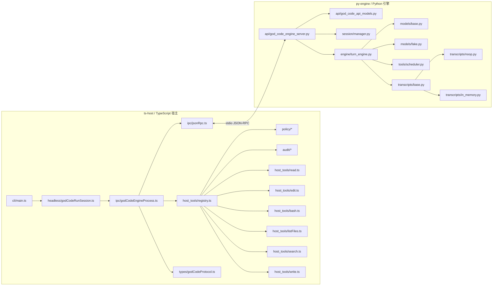
```mermaid
flowchart LR
  subgraph TS["ts-host / TypeScript 宿主"]
    CLI["cli/main.ts"]
    RUN["headless/godCodeRunSession.ts"]
    EP["ipc/godCodeEngineProcess.ts"]
    RPC_TS["ipc/jsonRpc.ts"]
    REG["host_tools/registry.ts"]
    POLICY["policy/*"]
    AUDIT["audit/*"]
    READ["host_tools/read.ts"]
    EDIT["host_tools/edit.ts"]
    BASH["host_tools/bash.ts"]
    LIST["host_tools/listFiles.ts"]
    SEARCH["host_tools/search.ts"]
    WRITE["host_tools/write.ts"]
    TYPES_TS["types/godCodeProtocol.ts"]
  end

  subgraph PY["py-engine / Python 引擎"]
    SERVER["api/god_code_engine_server.py"]
    MODELS_API["api/god_code_api_models.py"]
    SESSION["session/manager.py"]
    TURN["engine/turn_engine.py"]
    MODEL_BASE["models/base.py"]
    MODEL_FAKE["models/fake.py"]
    SCHED["tools/scheduler.py"]
    TBASE["transcripts/base.py"]
    TNOOP["transcripts/noop.py"]
    TMEM["transcripts/in_memory.py"]
  end

  CLI --> RUN
  RUN --> EP
  EP --> RPC_TS
  EP --> REG
  REG --> POLICY
  REG --> AUDIT
  REG --> READ
  REG --> EDIT
  REG --> BASH
  REG --> LIST
  REG --> SEARCH
  REG --> WRITE
  EP --> TYPES_TS

  RPC_TS <-->|stdio JSON-RPC| SERVER
  SERVER --> MODELS_API
  SERVER --> SESSION
  SERVER --> TURN
  TURN --> MODEL_BASE
  TURN --> MODEL_FAKE
  TURN --> SCHED
  TURN --> TBASE
  TBASE --> TNOOP
  TBASE --> TMEM
```

---

## 2. 分层边界

可以先把当前系统理解成三层：

### 2.1 宿主层：TS 宿主

职责：

- 提供 CLI
- 拉起 Python 引擎进程
- 维护双向 JSON-RPC 连接
- 实际执行宿主工具
- 接收引擎事件并输出最终结果

你可以直接记一句话：

- **所有本地文件和 shell 能力都只在这一层**

### 2.2 引擎层：Python 引擎

职责：

- 管理 session
- 管理 turn
- 调用模型适配器决定下一步动作
- 调度宿主工具执行
- 产出 `god_code_event`

你也可以直接记一句话：

- **这一层不直接碰文件系统和 shell**

### 2.3 协议层：protocol

职责：

- 定义 host 和 engine 的交互契约
- 固化 wire example
- 固化 turn 级 golden event sequence

关键原则：

- **TS 和 Python 分别有本地类型，但协议语义必须在这里收敛**

---

## 3. TS 宿主模块调用链

## 3.1 CLI 主入口调用链

文件：

- `ts-host/src/cli/main.ts`
- `ts-host/src/headless/godCodeRunSession.ts`

大致流程：

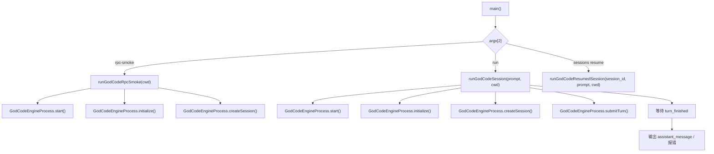
```mermaid
flowchart TD
  A["main()"] --> B{"argv[2]"}
  B -->|rpc-smoke| C["runGodCodeRpcSmoke(cwd)"]
  B -->|run <prompt>| D["runGodCodeSession(prompt, cwd)"]
  B -->|sessions resume| R["runGodCodeResumedSession(session_id, prompt, cwd)"]
  C --> E["GodCodeEngineProcess.start()"]
  C --> F["GodCodeEngineProcess.initialize()"]
  C --> G["GodCodeEngineProcess.createSession()"]
  D --> E2["GodCodeEngineProcess.start()"]
  D --> F2["GodCodeEngineProcess.initialize()"]
  D --> G2["GodCodeEngineProcess.createSession()"]
  D --> H["GodCodeEngineProcess.submitTurn()"]
  D --> I["等待 turn_finished"]
  I --> J["输出 assistant_message / 报错"]
```

当前 CLI 的核心 runtime 路径包括：

- 最小协议连通性验证：`rpc-smoke`
- 一次性无交互回合执行：`run`
- transcript-based session resume：`sessions resume`

它现在很轻，不缓存 live 会话状态；`sessions resume` 也是读取旧 transcript 后创建新的 engine session。

## 3.2 `runGodCodeSession()` 调用链

文件：

- `ts-host/src/headless/godCodeRunSession.ts`

主流程大概就是这样：

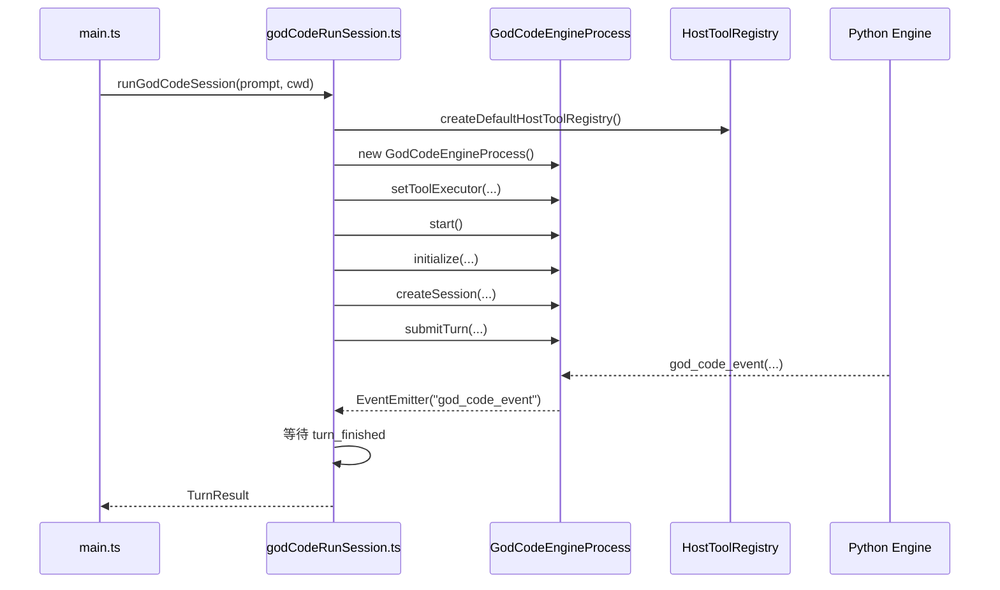
```mermaid
sequenceDiagram
  participant CLI as main.ts
  participant RUN as godCodeRunSession.ts
  participant EP as GodCodeEngineProcess
  participant REG as HostToolRegistry
  participant PY as Python Engine

  CLI->>RUN: runGodCodeSession(prompt, cwd)
  RUN->>REG: createDefaultHostToolRegistry()
  RUN->>EP: new GodCodeEngineProcess()
  RUN->>EP: setToolExecutor(...)
  RUN->>EP: start()
  RUN->>EP: initialize(...)
  RUN->>EP: createSession(...)
  RUN->>EP: submitTurn(...)
  PY-->>EP: god_code_event(...)
  EP-->>RUN: EventEmitter("god_code_event")
  RUN->>RUN: 等待 turn_finished
  RUN-->>CLI: TurnResult
```

你可以把 `runGodCodeSession()` 理解成“总控”：

- 它负责把几块拼起来
- 但它自己不实现协议
- 也不实现工具
- 更不负责模型和回合状态机

换句话说，它主要负责“串流程”，不负责“做具体活”。

---

## 4. `GodCodeEngineProcess` 内部调用链

文件：

- `ts-host/src/ipc/godCodeEngineProcess.ts`

`GodCodeEngineProcess` 可以直接理解成 TS 和 Python 之间那座桥。

## 4.1 启动链

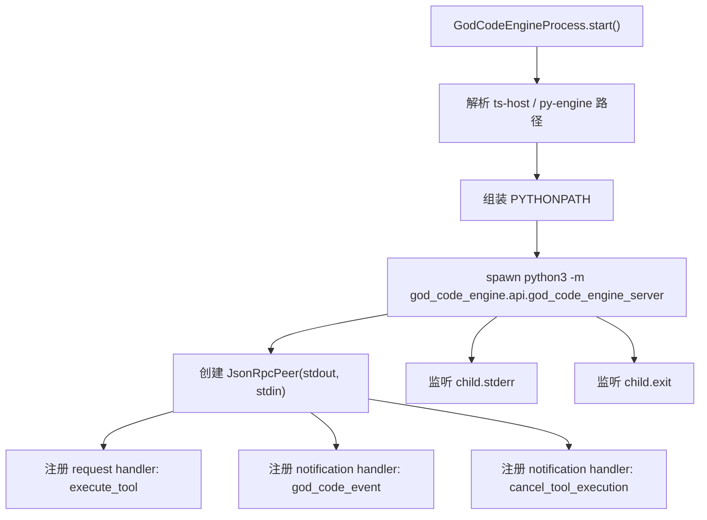
```mermaid
flowchart TD
  A["GodCodeEngineProcess.start()"] --> B["解析 ts-host / py-engine 路径"]
  B --> C["组装 PYTHONPATH"]
  C --> D["spawn python3 -m god_code_engine.api.god_code_engine_server"]
  D --> E["创建 JsonRpcPeer(stdout, stdin)"]
  E --> F["注册 request handler: execute_tool"]
  E --> G["注册 notification handler: god_code_event"]
  E --> G2["注册 notification handler: cancel_tool_execution"]
  D --> H["监听 child.stderr"]
  D --> I["监听 child.exit"]
```

这里最好记住的就是分工：

- **子进程生命周期**：`GodCodeEngineProcess`
- **协议编解码**：`JsonRpcPeer`
- **工具业务逻辑**：外部注入的 `toolExecutor`

## 4.2 宿主 -> 引擎类型化请求链

`GodCodeEngineProcess` 当前提供的方法：

- `initialize()`
- `createSession()`
- `submitTurn()`
- `cancelTurn()`
- `shutdown()`

这些方法本身都不复杂，基本就是：

1. 调用 `rpc().request(...)`
2. 发送 JSON-RPC
3. 等待 Python 返回结果

简单说就是：

- `GodCodeEngineProcess` 是类型化门面
- 真正的传输层在 `JsonRpcPeer`

## 4.3 引擎 -> 宿主工具调用链

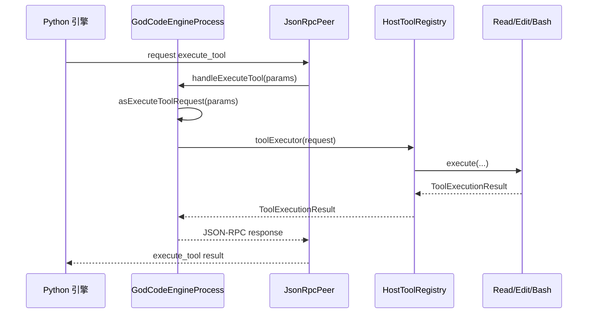
```mermaid
sequenceDiagram
  participant PY as Python 引擎
  participant EP as GodCodeEngineProcess
  participant RPC as JsonRpcPeer
  participant REG as HostToolRegistry
  participant TOOL as Read/Edit/Bash

  PY->>RPC: request execute_tool
  RPC->>EP: handleExecuteTool(params)
  EP->>EP: asExecuteToolRequest(params)
  EP->>REG: toolExecutor(request)
  REG->>TOOL: execute(...)
  TOOL-->>REG: ToolExecutionResult
  REG-->>EP: ToolExecutionResult
  EP-->>RPC: JSON-RPC response
  RPC-->>PY: execute_tool result
```

这条链想表达的其实很简单：

- Python 引擎并不知道工具怎么实现
- Python 引擎通过 `execute_tool` 执行单个或 serial-only call，通过 `execute_tools` 执行 parallel-safe chunk
- 宿主如何做文件访问或 shell 执行，完全在 TS 侧决定

## 4.4 引擎 -> 宿主事件上浮链

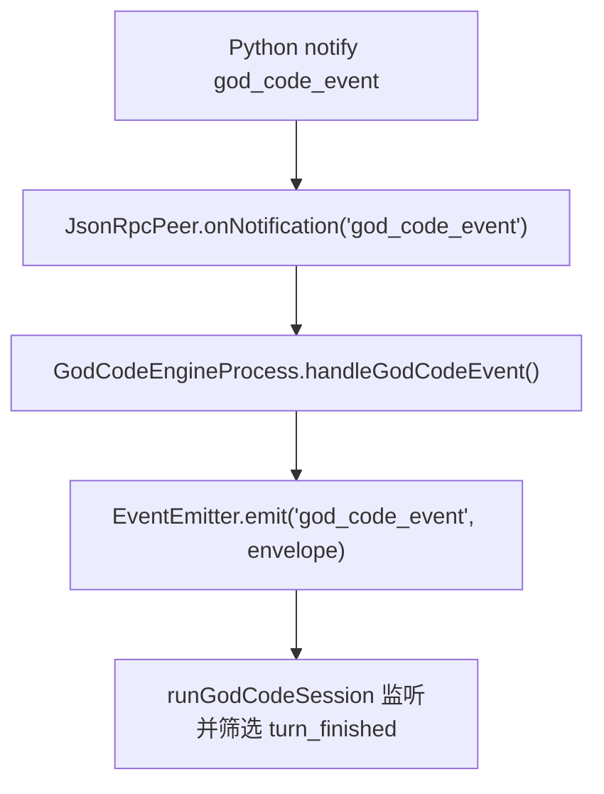
```mermaid
flowchart TD
  A["Python notify god_code_event"] --> B["JsonRpcPeer.onNotification('god_code_event')"]
  B --> C["GodCodeEngineProcess.handleGodCodeEvent()"]
  C --> D["EventEmitter.emit('god_code_event', envelope)"]
  D --> E["runGodCodeSession 监听并筛选 turn_finished"]
```

当前宿主不会把所有事件都拿来处理，只是在 `runGodCodeSession()` 里重点等：

- `turn_finished`

不过从设计上看，`god_code_event` 已经给后面的能力留好了口子，比如：

- REPL 渲染
- streaming UI
- structured logs
- telemetry

---

## 5. `JsonRpcPeer` 调用链

文件：

- `ts-host/src/ipc/jsonRpc.ts`

## 5.1 发送请求链

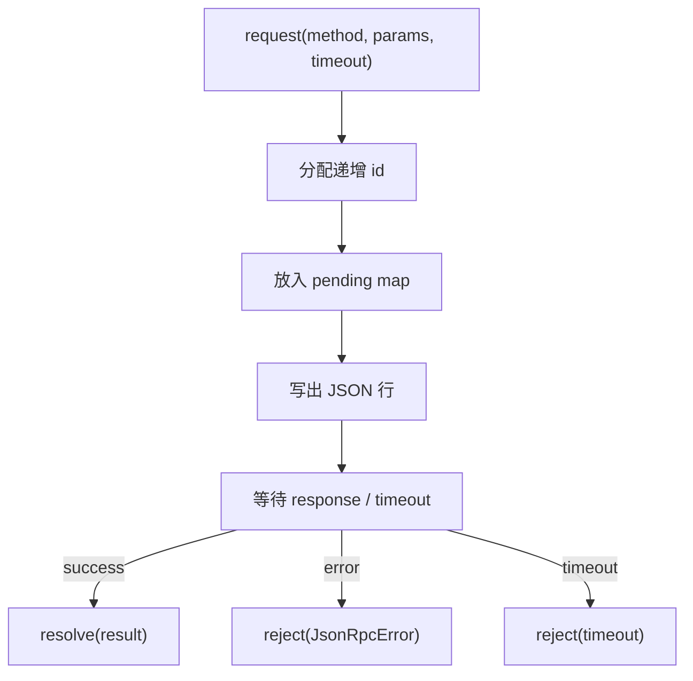
```mermaid
flowchart TD
  A["request(method, params, timeout)"] --> B["分配递增 id"]
  B --> C["放入 pending map"]
  C --> D["写出 JSON 行"]
  D --> E["等待 response / timeout"]
  E -->|success| F["resolve(result)"]
  E -->|error| G["reject(JsonRpcError)"]
  E -->|timeout| H["reject(timeout)"]
```

## 5.2 接收消息链

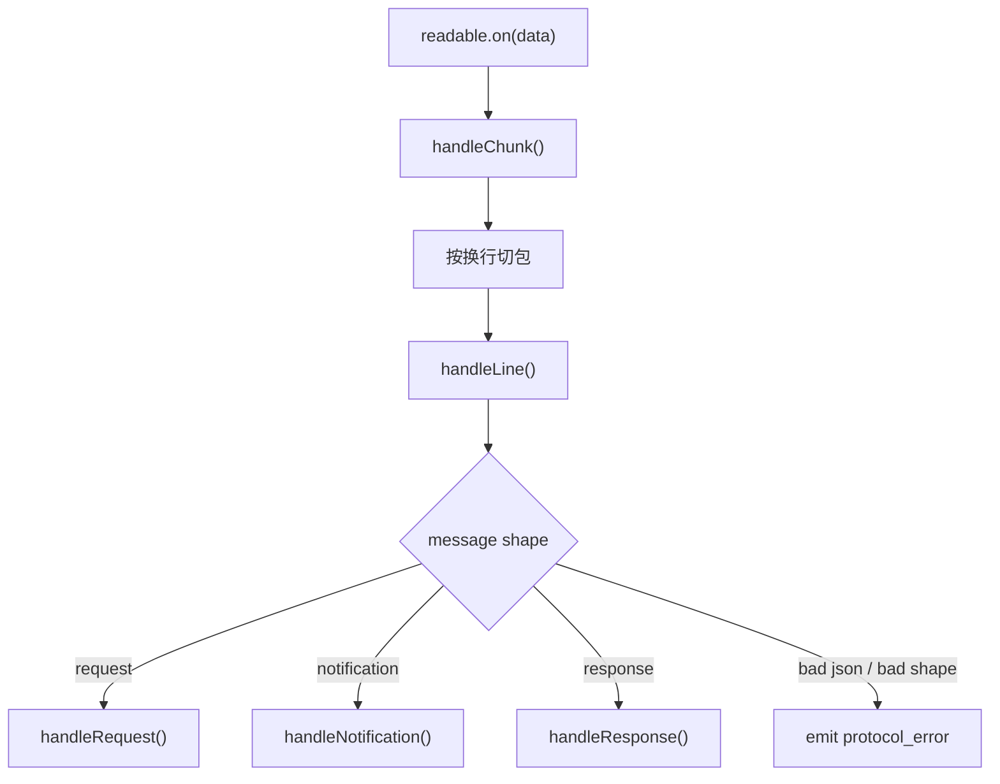
```mermaid
flowchart TD
  A["readable.on(data)"] --> B["handleChunk()"]
  B --> C["按换行切包"]
  C --> D["handleLine()"]
  D --> E{"message shape"}
  E -->|request| F["handleRequest()"]
  E -->|notification| G["handleNotification()"]
  E -->|response| H["handleResponse()"]
  E -->|bad json / bad shape| I["emit protocol_error"]
```

## 5.3 关闭链

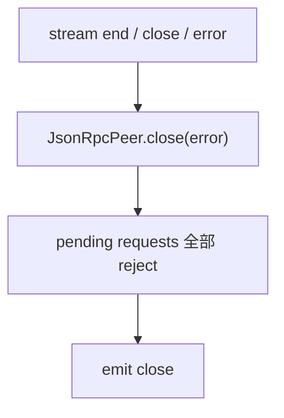
```mermaid
flowchart TD
  A["stream end / close / error"] --> B["JsonRpcPeer.close(error)"]
  B --> C["pending requests 全部 reject"]
  C --> D["emit close"]
```

这一层的价值很直接：

- 它和业务无关
- 可以被 REPL、MCP transport、测试 harness 复用

---

## 6. 宿主工具模块调用链

## 6.1 Registry 调度链

文件：

- `ts-host/src/host_tools/registry.ts`

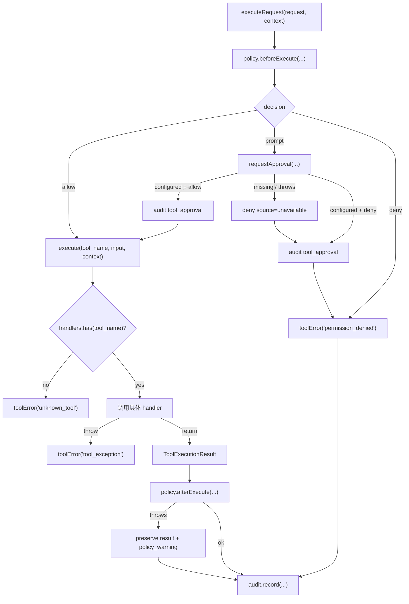
```mermaid
flowchart TD
  A["executeRequest(request, context)"] --> B["policy.beforeExecute(...)"]
  B --> C{"decision"}
  C -->|deny| D["toolError('permission_denied')"]
  C -->|prompt| E["requestApproval(...)"]
  E -->|configured + allow| P["audit tool_approval"]
  E -->|configured + deny| Q["audit tool_approval"]
  E -->|missing / throws| N["deny source=unavailable"]
  N --> Q
  P --> F
  Q --> D
  C -->|allow| F["execute(tool_name, input, context)"]
  F --> G{"handlers.has(tool_name)?"}
  G -->|no| H["toolError('unknown_tool')"]
  G -->|yes| I["调用具体 handler"]
  I -->|throw| J["toolError('tool_exception')"]
  I -->|return| K["ToolExecutionResult"]
  D --> L["audit.record(...)"]
  K --> M["policy.afterExecute(...)"]
  M -->|ok| L
  M -->|throws| W["preserve result + policy_warning"]
  W --> L
```

这一层更像工具总路由，它不关心：

- RPC 来源
- model 来源
- turn 逻辑

它只关心两件事：

- 工具名 -> handler
- 执行错误统一包装

现在它还多承担一件事：

- 把权限策略和审计统一挂在工具执行前后

## 6.2 `Read` 调用链

文件：

- `ts-host/src/host_tools/read.ts`
- `ts-host/src/host_tools/common.ts`

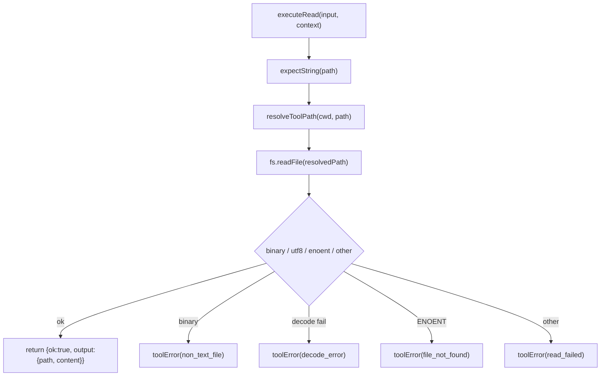
```mermaid
flowchart TD
  A["executeRead(input, context)"] --> B["expectString(path)"]
  B --> C["resolveToolPath(cwd, path)"]
  C --> D["fs.readFile(resolvedPath)"]
  D --> E{"binary / utf8 / enoent / other"}
  E -->|ok| F["return {ok:true, output:{path, content}}"]
  E -->|binary| G["toolError(non_text_file)"]
  E -->|decode fail| H["toolError(decode_error)"]
  E -->|ENOENT| I["toolError(file_not_found)"]
  E -->|other| J["toolError(read_failed)"]
```

## 6.3 `Edit` 调用链

文件：

- `ts-host/src/host_tools/edit.ts`

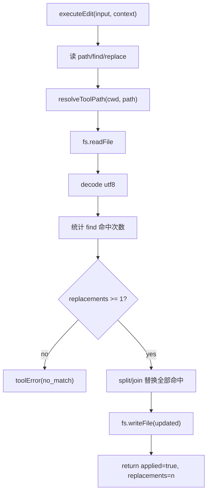
```mermaid
flowchart TD
  A["executeEdit(input, context)"] --> B["读 path/find/replace"]
  B --> C["resolveToolPath(cwd, path)"]
  C --> D["fs.readFile"]
  D --> E["decode utf8"]
  E --> F["统计 find 命中次数"]
  F --> G{"replacements >= 1?"}
  G -->|no| H["toolError(no_match)"]
  G -->|yes| I["split/join 替换全部命中"]
  I --> J["fs.writeFile(updated)"]
  J --> K["return applied=true, replacements=n"]
```

当前 `Edit` 的行为比较朴素：

- literal replacement
- replace all
- 无 patch 语义
- 无上下文校验
- 无 diff 冲突检查

## 6.4 `Bash` 调用链

文件：

- `ts-host/src/host_tools/bash.ts`

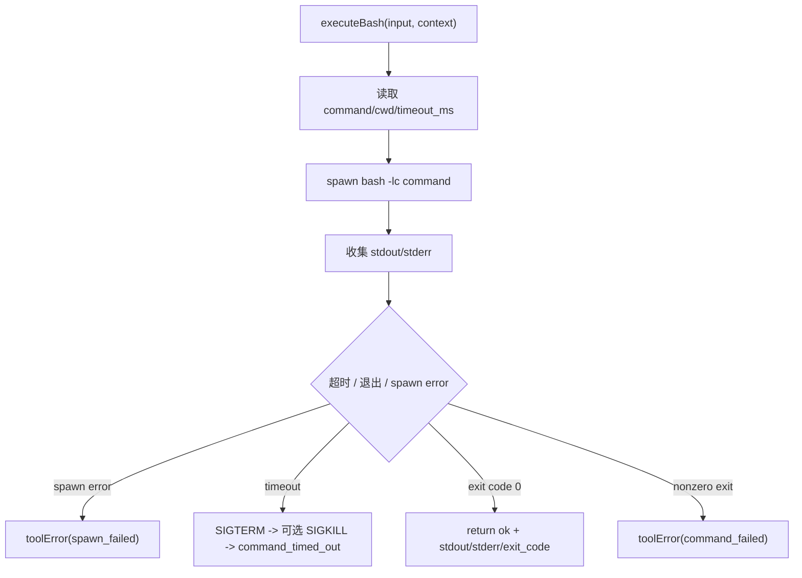
```mermaid
flowchart TD
  A["executeBash(input, context)"] --> B["读取 command/cwd/timeout_ms"]
  B --> C["spawn bash -lc command"]
  C --> D["收集 stdout/stderr"]
  D --> E{"超时 / 退出 / spawn error"}
  E -->|spawn error| F["toolError(spawn_failed)"]
  E -->|timeout| G["SIGTERM -> 可选 SIGKILL -> command_timed_out"]
  E -->|exit code 0| H["return ok + stdout/stderr/exit_code"]
  E -->|nonzero exit| I["toolError(command_failed)"]
```

这里要注意一点：`Bash` 已经接入 turn cancel。

也就是：

- `cancel_turn` 会让 Python 设置 cancel flag
- Python 会通知 TS 宿主 `cancel_tool_execution`
- TS 宿主会 abort 当前 turn 的 `AbortSignal`
- `Bash` 收到 abort 后会先发 `SIGTERM`，必要时再 `SIGKILL`

## 6.5 新增工具目录

第二步新增了三个宿主工具：

- `ListFiles`：列出目录内容，默认不递归，默认最多 200 条
- `Search`：按普通字符串搜索 UTF-8 文本，跳过二进制文件
- `Write`：写 UTF-8 文本文件，默认不覆盖已有文件

它们和旧工具一样统一走：

```text
execute_tool RPC
  -> HostToolRegistry
  -> permission policy
  -> concrete host tool
  -> audit sink
```

路径类策略现在覆盖：

- `Read`
- `Edit`
- `ListFiles`
- `Search`
- `Write`

---

## 7. Python 引擎模块调用链

## 7.1 Python 入口链

文件：

- `py-engine/src/god_code_engine/api/god_code_engine_server.py`

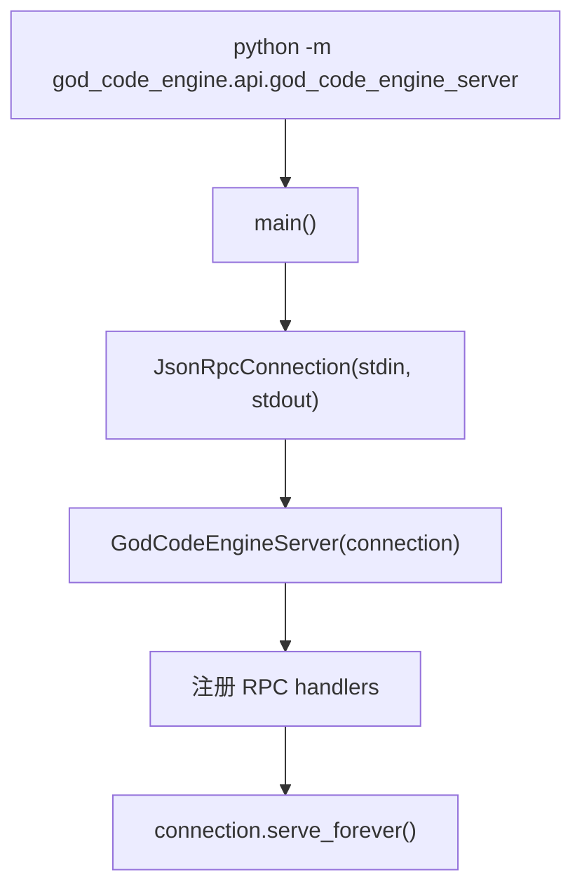
```mermaid
flowchart TD
  A["python -m god_code_engine.api.god_code_engine_server"] --> B["main()"]
  B --> C["JsonRpcConnection(stdin, stdout)"]
  C --> D["GodCodeEngineServer(connection)"]
  D --> E["注册 RPC handlers"]
  E --> F["connection.serve_forever()"]
```

## 7.2 `GodCodeEngineServer` 调用链

这个类可以看成 Python 侧最上面的总入口。

它主要做这几件事：

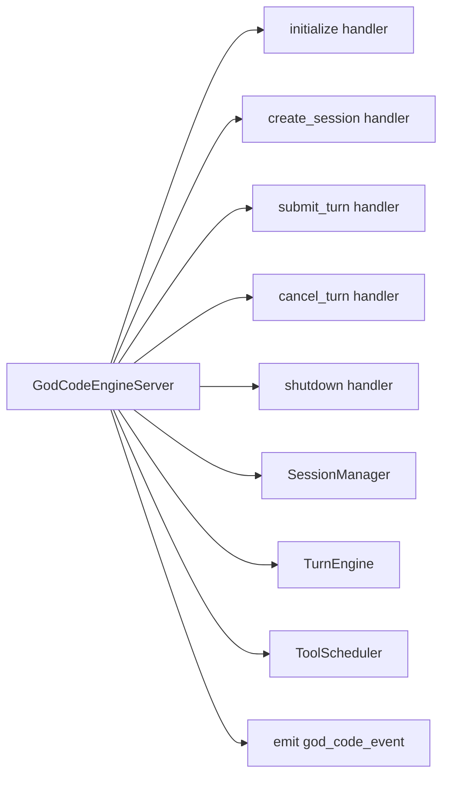
```mermaid
flowchart LR
  A["GodCodeEngineServer"] --> B["initialize handler"]
  A --> C["create_session handler"]
  A --> D["submit_turn handler"]
  A --> E["cancel_turn handler"]
  A --> F["shutdown handler"]
  A --> G["SessionManager"]
  A --> H["TurnEngine"]
  A --> I["ToolScheduler"]
  A --> J["emit god_code_event"]
```

它不直接做：

- 模型推理细节
- transcript 实现细节
- 工具业务逻辑

它真正负责的是：

- 协议接入
- session/turn orchestration
- turn thread 启动

---

## 8. Python 请求处理调用链

## 8.1 `initialize`

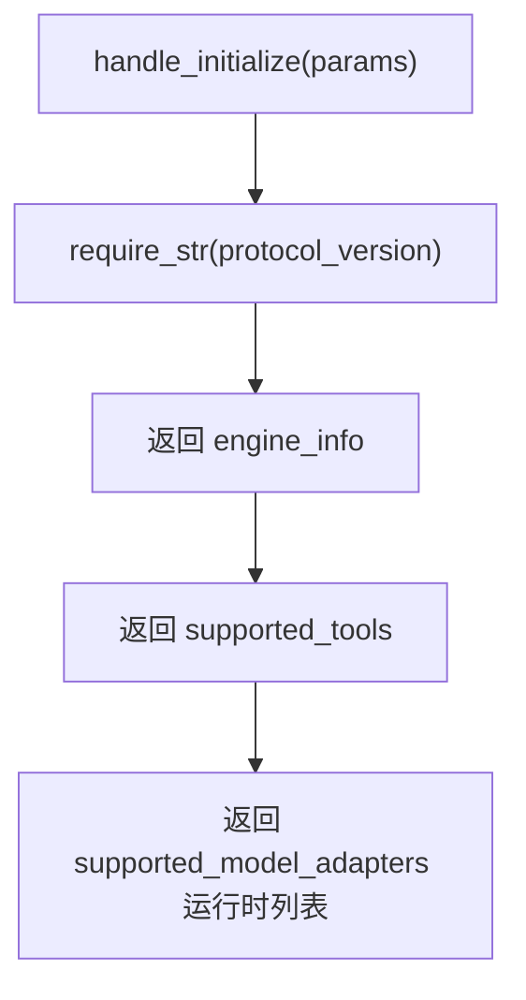
```mermaid
flowchart TD
  A["handle_initialize(params)"] --> B["require_str(protocol_version)"]
  B --> C["返回 engine_info"]
  C --> D["返回 supported_tools"]
  D --> E["返回 supported_model_adapters 运行时列表"]
```

这是纯能力宣告，不修改任何 session 状态。默认列表是 `["fake"]`；如果 Phase4 provider 环境变量配置完整，会额外出现对应 provider 名，例如 `["demo", "fake"]`。

## 8.2 `create_session`

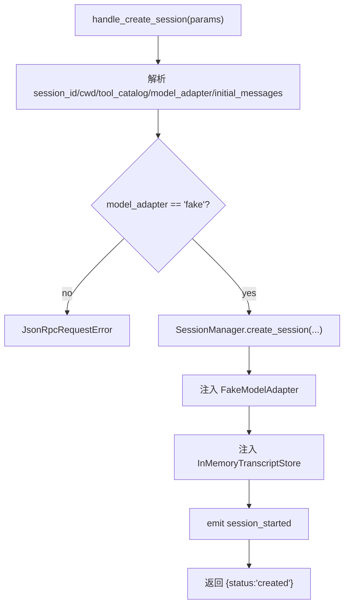
```mermaid
flowchart TD
  A["handle_create_session(params)"] --> B["解析 session_id/cwd/tool_catalog/model_adapter/initial_messages"]
  B --> C{"model_adapter == 'fake'?"}
  C -->|no| D["JsonRpcRequestError"]
  C -->|yes| E["SessionManager.create_session(...)"]
  E --> F["注入 FakeModelAdapter"]
  F --> G["注入 InMemoryTranscriptStore"]
  G --> H["emit session_started"]
  H --> I["返回 {status:'created'}"]
```

这里其实已经把后面的扩展口露出来了：

- `model_adapter` 是可替换的
- `transcript_store` 是可替换的
- `initial_messages` 是可选的 resume seed，旧调用不传时行为不变

## 8.3 `submit_turn`

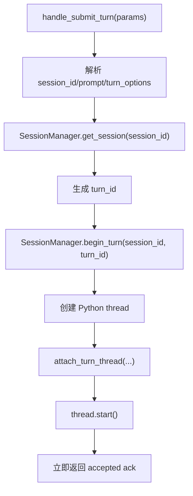
```mermaid
flowchart TD
  A["handle_submit_turn(params)"] --> B["解析 session_id/prompt/turn_options"]
  B --> C["SessionManager.get_session(session_id)"]
  C --> D["生成 turn_id"]
  D --> E["SessionManager.begin_turn(session_id, turn_id)"]
  E --> F["创建 Python thread"]
  F --> G["attach_turn_thread(...)"]
  G --> H["thread.start()"]
  H --> I["立即返回 accepted ack"]
```

这里最容易看漏的一点是：

- `submit_turn` 先回的是 **ACK**
- 真正的回合结果不在这个 response 里
- 最后结果要等 `god_code_event(turn_finished)` 异步回来

## 8.4 `cancel_turn`

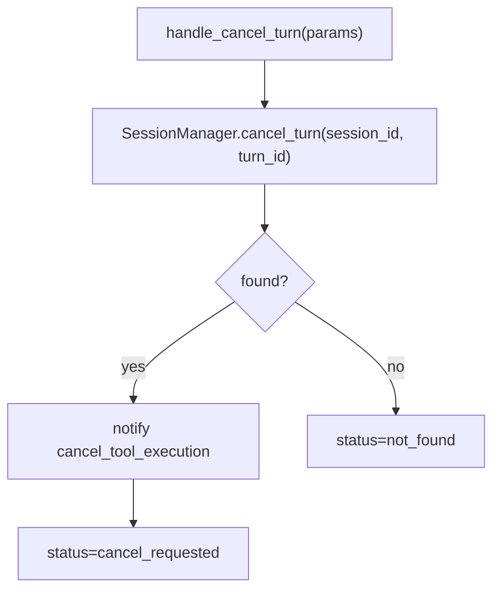
```mermaid
flowchart TD
  A["handle_cancel_turn(params)"] --> B["SessionManager.cancel_turn(session_id, turn_id)"]
  B --> C{"found?"}
  C -->|yes| D["notify cancel_tool_execution"]
  D --> E["status=cancel_requested"]
  C -->|no| F["status=not_found"]
```

## 8.5 `shutdown`

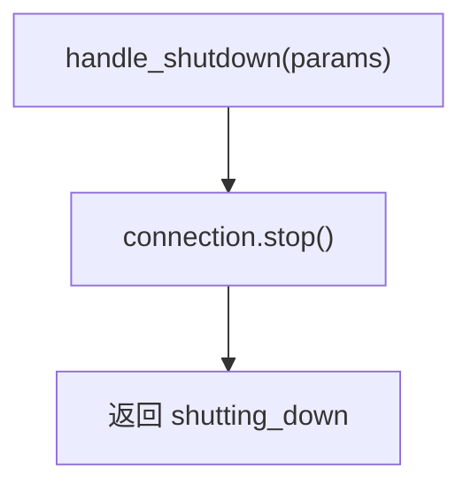
```mermaid
flowchart TD
  A["handle_shutdown(params)"] --> B["connection.stop()"]
  B --> C["返回 shutting_down"]
```

---

## 9. 会话管理器（`SessionManager`）调用链

文件：

- `py-engine/src/god_code_engine/session/manager.py`

## 9.1 状态拥有关系

```mermaid
classDiagram
  class SessionState {
    +session_id: str
    +cwd: str
    +tool_catalog: list[ToolCatalogEntry]
    +model_adapter_name: str
    +model_adapter: ModelAdapter
    +transcript_store: TranscriptStore
    +messages: list[dict]
  }

  class ActiveTurn {
    +turn_id: str
    +cancel_event: threading.Event
    +thread: threading.Thread | None
  }

  class SessionManager {
    -_sessions: dict[str, SessionState]
    -_active_turns: dict[str, ActiveTurn]
    +create_session()
    +get_session()
    +begin_turn()
    +attach_turn_thread()
    +finish_turn()
    +cancel_turn()
    +get_active_turn()
  }
```

## 9.2 状态流转

```mermaid
stateDiagram-v2
  [*] --> NoSession
  NoSession --> SessionReady: create_session
  SessionReady --> SessionReady: create another session
  SessionReady --> TurnRunning: begin_turn
  TurnRunning --> SessionReady: finish_turn
  TurnRunning --> TurnRunning: cancel_turn sets cancel_event
```

这一层故意写得很保守：

- 多个 `_sessions`
- 每个 session 最多一个 `_active_turns[session_id]`
- 全部通过锁保护

这样做的好处是把“状态门禁”单独拎出来，不让它和 `TurnEngine` 的执行逻辑搅在一起。

Phase81 已补 multi session runtime 基础实现：`_session` / `_active_turn` 已扩展为按 `session_id` 索引的 map，让一个 Python Engine process 可以拥有多个 active sessions，同时继续保持“同一 session 只能有一个 active turn”的门禁。该实现不新增 JSON-RPC 方法，也不引入 multi-session CLI/TUI。

---

## 10. 回合引擎（`TurnEngine`）详细调用链

文件：

- `py-engine/src/god_code_engine/engine/turn_engine.py`

这里就是当前系统里最核心的执行状态机。

## 10.1 正常回合调用链

```mermaid
  sequenceDiagram
  participant S as SessionState
  participant T as TurnEngine
  participant P as PromptBuilder
  participant M as ModelAdapter
  participant SCH as ToolScheduler
  participant HOST as TS 宿主

  T->>S: append user message
  T->>S: transcript.append(user)
  T->>HOST: god_code_event(turn_started)

  loop max_steps
    T->>P: build(session, turn_options)
    P-->>T: ModelRequest
    T->>M: next_action(request)
    alt assistant message
      T->>S: append assistant message
      T->>S: transcript.append(assistant)
      T->>HOST: god_code_event(assistant_message)
      T->>HOST: god_code_event(turn_finished: success)
    else tool call
      T->>S: append tool_call
      T->>S: transcript.append(tool_call)
      T->>HOST: god_code_event(tool_call_requested)
      T->>SCH: execute(session_id, turn_id, tool_call)
      SCH->>HOST: execute_tool RPC
      HOST-->>SCH: ToolExecutionResult
      SCH-->>T: ToolExecutionResult
      T->>S: append tool_result
      T->>S: transcript.append(tool_result)
      T->>HOST: god_code_event(tool_result_received)
    end
  end
```

## 10.2 `messages` 内部状态形态

当前 `SessionState.messages` 里混合保存多种记录：

- user:

```python
{"kind": "user", "role": "user", "content": "..."}
```

- tool_call:

```python
{"kind": "tool_call", "tool_call": {...}}
```

- tool_result:

```python
{"kind": "tool_result", "tool_name": "Read", "result": {...}}
```

- assistant:

```python
{"kind": "assistant", "role": "assistant", "content": "..."}
```

所以这里的 `messages` 不只是聊天记录，它其实是在保存整条执行历史。

## 10.3 transcript 记录点

当前 `TurnEngine` 会记录这些节点：

- user
- tool_call
- tool_result
- assistant

所以 transcript 现在更像执行日志，不只是聊天内容备份。

## 10.4 `max_steps` 限制

当前 `TurnEngine` 在 while loop 上加了 `max_steps=8`。

这里加这个限制，主要是为了：

- 避免模型/调度逻辑失控进入无限循环
- 给未来真实模型接入保留 safety stop

## 11. 模型适配器（`ModelAdapter`）调用链

文件：

- `py-engine/src/god_code_engine/models/base.py`
- `py-engine/src/god_code_engine/models/fake.py`

## 11.1 抽象边界

```mermaid
flowchart LR
  A["TurnEngine"] --> B["PromptBuilder.build(...)"]
  B --> C["ModelRequest"]
  C --> D["ModelAdapter.next_action(request)"]
  D --> E["AssistantMessageAction"]
  D --> F["ToolCallAction"]
```

这一层的边界其实很清楚：

- `TurnEngine` 不知道模型内部怎么推理
- 模型只需要返回“下一步动作”
- prompt / context / tool catalog 先统一收进 `ModelRequest`
- Phase56 已把 context budget / deterministic compaction 放在 `PromptBuilder -> CompactionStrategy` 边界，不进入 provider client 或 transcript store
- Phase60 已把 system prompt builder 放在 `PromptBuilder -> ModelRequest.system_prompt` 边界，不写入 transcript history
- Phase61 已把 token budget manager 放在 `PromptBuilder -> ModelRequest.budget` 边界，不做 provider billing 或精确 tokenizer
- Phase62 已把 summary compaction strategy 放在 `PromptBuilder -> CompactionStrategy -> ModelRequest.messages` 边界，不重写 transcript 或新增 JSON-RPC
- Phase63 已把 prompt injection guard 放在 `PromptBuilder -> ModelRequest.prompt_injection_report` 边界，不默认阻断 provider call 或改变工具权限

这种“先决定下一步动作”的接口，比“直接吐最终文本”更适合做工具调用系统。

如果 `turn_options.stream=true` 且 adapter 支持 `StreamingModelAdapter`，`TurnEngine` 会消费 `stream_actions(request)`，中间的 `AssistantDelta` 会发成 `assistant_delta` 事件，最后仍然要落到一个完整 action。

## 11.2 `FakeModelAdapter` 内部调用链

```mermaid
flowchart TD
  A["next_action(request)"] --> B["读取 request.messages[-1]"]
  B --> C{"kind"}
  C -->|user| D["_action_from_prompt(content)"]
  C -->|tool_result| E["_summarize_tool_result(message)"]
  C -->|other| F["return unsupported flow assistant message"]
```

### 用户 prompt -> tool call

```mermaid
flowchart TD
  A["user content"] --> B{"startsWith('read ')"}
  B -->|yes| C["return ToolCallAction(Read)"]
  B -->|no| D{"startsWith('edit ')"}
  D -->|yes| E["parse path/find/replace"]
  E --> F["return ToolCallAction(Edit)"]
  D -->|no| G{"startsWith('bash ')"}
  G -->|yes| H["return ToolCallAction(Bash)"]
  G -->|no| I{"startsWith('list ')"}
  I -->|yes| J["return ToolCallAction(ListFiles)"]
  I -->|no| K{"startsWith('search ')"}
  K -->|yes| L["return ToolCallAction(Search)"]
  K -->|no| M{"startsWith('write ')"}
  M -->|yes| N["return ToolCallAction(Write)"]
  M -->|no| O["return unsupported prompt assistant message"]
```

### tool result -> assistant final message

```mermaid
flowchart TD
  A["tool_result"] --> B{"tool_name"}
  B -->|Read| C["输出 path + content"]
  B -->|Edit| D["输出 replacements 数"]
  B -->|Bash| E["输出 exit_code/stdout/stderr"]
  B -->|ListFiles| F["输出 entry 数"]
  B -->|Search| G["输出 match 数"]
  B -->|Write| H["输出写入字节数"]
  B -->|other| I["输出 generic completion"]
```

---

## 12. 工具调度器（`ToolScheduler`）调用链

文件：

- `py-engine/src/god_code_engine/tools/scheduler.py`

当前 `ToolScheduler` 很薄，几乎就是一层转发：

```mermaid
flowchart TD
  A["execute(session_id, turn_id, tool_call)"] --> B["组装 execute_tool params"]
  B --> C["connection.request('execute_tool', params, timeout)"]
  C --> D["parse_tool_execution_result(response)"]
  D --> E["返回 ToolExecutionResult"]
```

虽然它现在很简单，但已经把两个关键问题拆开了：

1. `TurnEngine` 不需要知道 RPC 细节  
2. 未来并发策略可以只改 scheduler，不用改回合循环

Phase82 已补 [multi tool concurrent scheduling 基础实现](design/PHASE_82_MULTI_TOOL_CONCURRENT_SCHEDULING.md)：Python 内部新增 `ToolCallBatchAction` 和 `ToolScheduler.execute_many(...)`，优先只让 `Read` / `ListFiles` / `Search` 进入 bounded parallel waves，mutating、shell、MCP、plugin 和未知工具保持 serial-only。Phase394 已将 parallel-safe chunk 升级为 `execute_tools` TS Host batch API，serial-only wave 仍使用 `execute_tool`。

Phase84 已完成 [provider-native parallel tool calls 基础实现](design/PHASE_84_PROVIDER_NATIVE_PARALLEL_TOOL_CALLS.md)：provider adapter 可在显式 `GOD_CODE_PROVIDER_PARALLEL_TOOL_CALLS=true` 时把多个 provider-native tool calls 归一化为 Python `ToolCallBatchAction`；不改变 JSON-RPC、TS Host batch API、transcript schema 或 `ToolScheduler` 的执行安全边界。

Phase85 已完成 [tool dependency graph scheduling 基础实现](design/PHASE_85_TOOL_DEPENDENCY_GRAPH_SCHEDULING.md)：`ToolScheduler` 已把线性 contiguous waves 演进为 Python 内部 deterministic dependency graph plan；仍不新增 JSON-RPC、TS Host batch API 或 transcript schema。

---

## 13. 协议对象和验证链

## 13.1 TS 侧协议类型

文件：

- `ts-host/src/types/godCodeProtocol.ts`

TS 侧职责：

- compile-time type shape
- runtime 的少量轻量校验

例如：

- `isRecord()`
- `asToolExecutionResult()`

## 13.2 Python 侧协议对象

文件：

- `py-engine/src/god_code_engine/api/god_code_api_models.py`

Python 侧职责：

- dataclass wire objects
- runtime validation helpers
- parse helpers

主要函数链：

```mermaid
flowchart TD
  A["原始 params / result"] --> B["require_mapping / require_str / require_dict"]
  B --> C["parse_prompt_message"]
  B --> D["parse_tool_catalog"]
  B --> E["parse_tool_execution_result"]
  C --> F["PromptMessage"]
  D --> G["ToolCatalogEntry[]"]
  E --> H["ToolExecutionResult"]
```

这层的意义很实际：

- server handler 不直接手搓字段访问
- tool result 回灌有明确 parse 点
- 为未来 schema 扩展保留集中入口

---

## 14. 事件流调用链

当前 `god_code_event` 可以看成系统里最重要的异步出口。

## 14.1 正常成功路径的事件序列

以 `read README.md` 为例：

```mermaid
flowchart TD
  A["session_started"] --> B["turn_started"]
  B --> C["tool_call_requested"]
  C --> D["tool_result_received"]
  D --> E["assistant_message"]
  E --> F["turn_finished(status=success)"]
```

## 14.2 失败路径的事件序列

例如 `Read` 文件不存在：

```mermaid
flowchart TD
  A["turn_started"] --> B["tool_call_requested"]
  B --> C["tool_result_received(ok=false)"]
  C --> D["god_code_error"]
  D --> E["turn_finished(status=error)"]
```

## 14.3 取消路径的事件序列

```mermaid
flowchart TD
  A["turn_started"] --> B["cancel_turn -> cancel_event.set()"]
  B --> C["TurnEngine 下一检查点发现已取消"]
  C --> D["turn_finished(status=cancelled)"]
```

当前没有单独的 `turn_cancelled` 事件，取消是靠这两样东西一起表达的：

- `cancel_turn` 的 RPC ACK
- `turn_finished(status=cancelled)`

也就是“单独没有一个事件名，但意思已经能表达清楚”。

---

## 15. 错误传播链

## 15.1 Host tool 失败 -> Python turn 失败

```mermaid
sequenceDiagram
  participant TOOL as Host Tool
  participant REG as HostToolRegistry
  participant EP as GodCodeEngineProcess
  participant SCH as ToolScheduler
  participant TURN as TurnEngine
  participant HOST as Event Consumer

  TOOL-->>REG: {ok:false,error:{...}}
  REG-->>EP: ToolExecutionResult
  EP-->>SCH: execute_tool response
  SCH-->>TURN: ToolExecutionResult(ok=false)
  TURN->>HOST: god_code_event(tool_result_received)
  TURN->>HOST: god_code_event(god_code_error)
  TURN->>HOST: god_code_event(turn_finished:error)
```

## 15.2 RPC 层失败

TS `JsonRpcPeer` 侧：

- bad JSON -> `protocol_error`
- unexpected response id -> `protocol_error`
- timeout -> reject request
- stream close -> reject all pending

Python `JsonRpcConnection` 侧：

- malformed JSON -> 直接忽略
- method not found -> JSON-RPC error
- validation/session error -> JSON-RPC `-32602`
- other exception -> JSON-RPC `-32000`

## 15.3 Child process 退出

```mermaid
flowchart TD
  A["Python child exit"] --> B["GodCodeEngineProcess child.on('exit')"]
  B --> C["peer.close(error)"]
  C --> D["reject pending RPCs"]
  D --> E["emit('exit', exitInfo)"]
  E --> F["runGodCodeSession final promise reject / cleanup"]
```

---

## 16. 取消传播链

当前取消已经从 Python 引擎传到了 TS 宿主工具层。

## 16.1 当前实现

```mermaid
sequenceDiagram
  participant HOST as TS 宿主
  participant SERVER as GodCodeEngineServer
  participant SM as SessionManager
  participant TURN as TurnEngine
  participant TOOL as HostToolRegistry/Bash

  HOST->>SERVER: cancel_turn(session_id, turn_id)
  SERVER->>SM: cancel_turn(...)
  SM->>SM: active_turn.cancel_event.set()
  SERVER-->>HOST: notify cancel_tool_execution(turn_id)
  HOST->>TOOL: AbortController.abort()
  TOOL->>TOOL: Bash SIGTERM -> SIGKILL fallback
  SERVER-->>HOST: {status: cancel_requested}
  TURN->>TURN: 下一检查点检测 cancel_event
  TURN-->>HOST: god_code_event(turn_finished: cancelled)
```

## 16.2 当前仍然保守的地方

当前仍然没有做成“所有底层动作都强抢占”：

- `Read` / `Edit` 只在执行前后做协作式检查
- 已经进入内核的短文件 IO 不强行打断
- 对正在等待的 RPC request 不做底层抢占中断

所以更准确地说，现在实现的是：

- **turn-state cancellation**
- **Bash subprocess cancellation**
- 但还不是所有工具的 full preemptive cancellation

---

## 17. 状态归属图

如果想看“状态到底放在哪”，可以简单理解成：

```mermaid
flowchart LR
  subgraph TS["TS 宿主"]
    A["CLI args"]
    B["GodCodeEngineProcess child handle"]
    C["JsonRpc pending requests"]
    D["HostToolRegistry handlers"]
  end

  subgraph PY["Python 引擎"]
    E["SessionManager._session"]
    F["SessionManager._active_turn"]
    G["SessionState.messages"]
    H["TranscriptStore entries"]
  end
```

更细一点：

- `CLI`
  - 当前命令参数
  - 当前一次 run 的 promise 生命周期

- `GodCodeEngineProcess`
  - child handle
  - stderrBuffer
  - toolExecutor

- `JsonRpcPeer`
  - pending map
  - request handlers
  - notification handlers

- `SessionManager`
  - `_session`
  - `_active_turn`

- `SessionState`
  - `messages`
  - `provider_context`
  - `model_adapter`
  - `transcript_store`

换句话说：

- TS 宿主主要持有“进程与协议状态”
- Python 引擎主要持有“会话与推理状态”

---

## 18. 未来扩展点放在哪

这一部分不是单纯列“还有什么没做”，而是告诉你：以后要加功能，优先该改哪一层。

## 18.1 接真实模型

Phase4 真实 provider 接入骨架已经落地，设计见：

- `design/PHASE_4_REAL_PROVIDER.md`

Phase5 OpenAI-compatible provider client 已落地，设计见：

- `design/PHASE_5_OPENAI_COMPAT_PROVIDER.md`

Phase 6 SSE streaming 和 CLI 增量渲染已落地，设计见：

- `design/PHASE_6_STREAMING_RENDERING.md`

Phase 7 OpenAI Responses API provider 已落地，设计与实现边界见：

- `design/PHASE_7_OPENAI_RESPONSES_PROVIDER.md`

Phase53 provider retry policy 已落地，设计见：

- `design/PHASE_53_PROVIDER_RETRY_POLICY.md`

Phase54 provider fallback chain 已落地基础实现，设计见：

- `design/PHASE_54_PROVIDER_FALLBACK_CHAIN.md`

Phase55 Anthropic Messages provider 已落地基础实现，设计见：

- `design/PHASE_55_ANTHROPIC_MESSAGES_PROVIDER.md`

Phase56 context budget and deterministic compaction 已落地基础实现，设计见：

- `design/PHASE_56_CONTEXT_BUDGET_COMPACTION.md`

Phase57 local OpenAI-compatible provider 已落地基础实现，设计见：

- `design/PHASE_57_LOCAL_OPENAI_COMPAT_PROVIDER.md`

Phase58 provider usage accounting and budget guard 已落地基础实现，设计见：

- `design/PHASE_58_PROVIDER_USAGE_BUDGET_GUARD.md`

Phase59 provider-specific error mapping 已落地基础实现，设计见：

- `design/PHASE_59_PROVIDER_ERROR_MAPPING.md`

Phase60 system prompt builder 已落地基础实现，设计见：

- `design/PHASE_60_SYSTEM_PROMPT_BUILDER.md`

Phase61 token budget manager 已落地基础实现，设计见：

- `design/PHASE_61_TOKEN_BUDGET_MANAGER.md`

Phase62 summary compaction strategy 已落地基础实现，设计见：

- `design/PHASE_62_SUMMARY_COMPACTION_STRATEGY.md`

Phase63 prompt injection guard 已落地基础实现，设计见：

- `design/PHASE_63_PROMPT_INJECTION_GUARD.md`

Phase64 provider rate limit policy 已落地基础实现，把本地 request throttle 放在 Python providers wrapper / `RealProviderModelAdapter` 边界，不进入 `TurnEngine` 或 JSON-RPC，设计见：

- `design/PHASE_64_PROVIDER_RATE_LIMIT_POLICY.md`

Phase65 local provider daemon lifecycle 已落地基础实现，把本地 daemon 状态、dry-run start / stop 和显式确认生命周期命令放在 TS Host CLI 诊断边界，不进入 Python Engine、`TurnEngine` 或 JSON-RPC，设计见：

- `design/PHASE_65_LOCAL_PROVIDER_DAEMON_LIFECYCLE.md`

Phase66 local provider model discovery 已落地基础实现，把本地 `GET /models` 模型列表查询放在 TS Host CLI provider diagnostics 边界，不自动启动 daemon、不修改 `GOD_CODE_MODEL`、不进入 Python Engine、`TurnEngine` 或 JSON-RPC，设计见：

- `design/PHASE_66_LOCAL_PROVIDER_MODEL_DISCOVERY.md`

Phase67 local provider model pull command 已落地基础实现，把本地模型 pull/install 放在 TS Host CLI 显式进程执行边界，用用户配置的命令模板、dry-run 和 `--yes` 确认，不进入 Python Engine、provider HTTP client、`TurnEngine` 或 JSON-RPC，设计见：

- `design/PHASE_67_LOCAL_PROVIDER_MODEL_PULL.md`

Phase68 local provider model remove command 已落地基础实现，把本地模型 remove/delete 放在 TS Host CLI 显式进程执行边界，用用户配置的命令模板、dry-run 和 `--yes` 确认，不进入 Python Engine、provider HTTP client、`TurnEngine` 或 JSON-RPC，也不做自动缓存 prune，设计见：

- `design/PHASE_68_LOCAL_PROVIDER_MODEL_REMOVE.md`

Phase69 local provider model prune command 已落地基础实现，把本地模型/cache prune 继续放在 TS Host CLI 显式进程执行边界，用用户配置的命令模板、显式 `--target`、dry-run / `--yes` 确认和 target allowlist 控制，不进入 Python Engine、provider HTTP client、`TurnEngine` 或 JSON-RPC，也不做 runtime-native prune API 或自动缓存配额管理，设计见：

- `design/PHASE_69_LOCAL_PROVIDER_MODEL_PRUNE.md`

当前落点：

- `py-engine/src/god_code_engine/providers/config.py`
- `py-engine/src/god_code_engine/providers/http_client.py`
- `py-engine/src/god_code_engine/providers/transport.py`
- `py-engine/src/god_code_engine/providers/anthropic_messages.py`
- `py-engine/src/god_code_engine/providers/openai_compatible.py`
- `py-engine/src/god_code_engine/providers/openai_responses.py`
- `py-engine/src/god_code_engine/providers/real_adapter.py`
- `py-engine/src/god_code_engine/providers/registry.py`

后续扩展 provider budget、provider error mapping、provider rate limit policy 或 fallback 策略时，优先新增 provider client、厂商 adapter 或 provider 层 wrapper，不要把 SDK / HTTP / retry / fallback / usage accounting / error mapping / rate limiting 细节放进 `TurnEngine`。local provider daemon lifecycle、local provider model discovery、local provider model pull command、local provider model remove command 和 local provider model prune command 属于 TS Host CLI 诊断 / 进程管理边界，不进入 Python Engine。

Phase5 的 OpenAI-compatible 请求格式化、响应映射和 HTTP transport 已放在 providers 层，不进入 `TurnEngine`，也不改 TS 宿主工具执行边界。

Phase 7 已继续沿这个边界扩：Responses API client、item formatter、item mapper 和 streaming 聚合都在 `providers/` 层，不进入 `TurnEngine`，也不改工具执行边界。

不应该先改：

- 宿主工具
- JsonRpc transport

## 18.2 做 streaming

Phase 6 已经把这条链路打通：

```text
OpenAI-compatible SSE
  -> providers/openai_compatible.py
  -> assistant_delta
  -> TS Host renderer
  -> CLI 增量输出
```

当前落点：

- `py-engine/src/god_code_engine/providers/transport.py`
- `py-engine/src/god_code_engine/providers/openai_compatible.py`
- `ts-host/src/rendering/terminalRenderer.ts`
- `ts-host/src/headless/godCodeRunSession.ts`
- `ts-host/src/cli/main.ts`

## 18.3 做 REPL / 会话 UX

Phase 10 基础 REPL 已落地，设计见：

- `design/PHASE_10_REPL_SESSION_UX.md`

当前链路：

```text
god-code repl
  -> ts-host/src/cli/repl.ts
  -> GodCodeReplSession
  -> GodCodeEngineProcess
  -> Python Engine session
```

当前落点：

- `ts-host/src/cli/repl.ts`
- `ts-host/src/headless/godCodeHostSetup.ts`
- `ts-host/src/cli/main.ts`
- `ts-host/test/repl.test.ts`

REPL 复用现有工具执行和 renderer，不新增 JSON-RPC 方法，也不改变 Python Engine 的职责。当前只支持单 session、单 running turn 和基础 slash commands。

Phase86 已完成 [TUI session dashboard 基础实现](design/PHASE_86_TUI_SESSION_DASHBOARD.md)：TS Host 侧新增最小 `god-code tui` shell，当前实现位于 `ts-host/src/cli/tui*.ts` 并复用 REPL/session/history/approval 现有边界；不新增 JSON-RPC 方法，也不让 Python Engine 感知 TUI。

Phase87 已完成 [TUI interaction polish 基础实现](design/PHASE_87_TUI_INTERACTION_POLISH.md)：已增强 Phase86 TUI 的 raw-mode 原地刷新、history timeline detail panel、approval suspend/redraw bridge 和 terminal control tests；其中 approval bridge 已在 Phase88 进一步升级为 TUI modal approval。仍不新增 JSON-RPC 方法，也不让 Python Engine 感知 TUI。

Phase88 已完成 [TUI modal approval 基础实现](design/PHASE_88_TUI_MODAL_APPROVAL.md)：`god-code tui` 在 raw-mode terminal 内使用 `TuiModalApprovalPrompt` 渲染 approval modal，并通过 `y/n/Esc` 产出既有 `ToolApprovalDecision`；仍不新增 JSON-RPC 方法，也不让 Python Engine 感知 TUI。

Phase89 已完成 [TUI pane scrolling 基础实现](design/PHASE_89_TUI_PANE_SCROLLING.md)：`god-code tui` 为 events / history / timeline 增加独立滚动 offset、PageUp/PageDown 和 pane-aware Up/Down 行为；仍不新增 JSON-RPC 方法，也不让 Python Engine 感知 TUI。

Phase90 已完成 [TUI assistant stream coalescing 基础实现](design/PHASE_90_TUI_ASSISTANT_STREAM_COALESCING.md)：`god-code tui` 将连续 `assistant_delta` 合并为一条 streaming assistant event，并用最终 `assistant_message` finalize / 去重；仍不新增 JSON-RPC 方法，也不让 Python Engine 感知 TUI。

Phase91 已完成 [TUI keyboard help overlay 基础实现](design/PHASE_91_TUI_KEYBOARD_HELP_OVERLAY.md)：`god-code tui` 使用 `buildTuiHelpLines(...)` 生成 pane-aware / modal-aware / running-aware help lines，并由 renderer 展示；仍不新增 JSON-RPC 方法，也不让 Python Engine 感知 TUI。

Phase92 已完成 [TUI adaptive layout 基础实现](design/PHASE_92_TUI_ADAPTIVE_LAYOUT.md)：`god-code tui` 在小终端下切换到 compact layout，优先展示 approval/help/active pane 并保留 footer；仍不新增 JSON-RPC 方法，也不让 Python Engine 感知 TUI。

Phase93 已完成 [TUI debug diagnostics 基础实现](design/PHASE_93_TUI_DEBUG_DIAGNOSTICS.md)：`god-code tui` 可通过 `Ctrl-G` 展示 bounded state snapshot，用于排查 pane、scroll、modal、turn flag 等 TUI 状态；仍不新增 JSON-RPC 方法，也不让 Python Engine 感知 TUI。

Phase94 已完成 [TUI pane focus style 基础实现](design/PHASE_94_TUI_PANE_FOCUS_STYLE.md)：`god-code tui` 在 full / compact renderer 中使用 `* ` 标记当前 active pane section title，帮助用户确认键盘焦点；仍不新增 JSON-RPC 方法，也不让 Python Engine 感知 TUI。

Phase95 已完成 [TUI PTY smoke harness 基础实现](design/PHASE_95_TUI_PTY_SMOKE_HARNESS.md)：TS Host 新增 `runTuiPtySmoke(...)`，用 deterministic TUI state 覆盖 alternate-screen start/render/stop lifecycle，并在非 TTY 环境 structured skip；仍不新增 JSON-RPC 方法，也不让 Python Engine 感知 TUI。

Phase96 已完成 [TUI session switcher 基础实现](design/PHASE_96_TUI_SESSION_SWITCHER.md)：`god-code tui` 在 history pane 中支持 `Enter` 将选中 transcript session 激活为 viewed session，renderer 区分 live engine session 与 viewed transcript session；仍不新增 JSON-RPC 方法，也不让 Python Engine 感知 TUI。

Phase97 已完成 [TUI live session switching 基础实现](design/PHASE_97_TUI_LIVE_SESSION_SWITCHING.md)：`god-code tui` 可通过 `Ctrl-N` 创建新的 live session、通过 `Ctrl-P` 切换 active live session，并继续让 prompt/cancel 作用于当前 active session；仍不新增 JSON-RPC 方法，也不改变 Python Engine protocol shape。

Phase98 已完成 [TUI live session list pane 基础实现](design/PHASE_98_TUI_LIVE_SESSION_LIST_PANE.md)：`god-code tui` 新增 live pane，用 `>` 标记 selected live session、`*` 标记 active live session，并支持 Up/Down/Enter 选择与激活；仍不新增 JSON-RPC 方法，也不改变 Python Engine protocol shape。

Phase99 已完成 [TUI per-session event buffers 基础实现](design/PHASE_99_TUI_PER_SESSION_EVENT_BUFFERS.md)：`god-code tui` 为每个 live session 维护独立 event buffer，runtime events 按 `session_id` 路由，切换 live session 时 events pane 会恢复对应 session 的事件；仍不新增 JSON-RPC 方法，也不改变 Python Engine protocol shape。

Phase100 已完成 [TUI per-session status indicators 基础实现](design/PHASE_100_TUI_PER_SESSION_STATUS_INDICATORS.md)：`god-code tui` 在 live session list pane 中为每个 live session 显示 `[idle]` / `[running]` / `[stopping]` / `[stopped]` / `[error]` 状态，并随 submit / finish / cancel / error flow 更新；仍不新增 JSON-RPC 方法，也不改变 Python Engine protocol shape。

Phase101 已完成 [TUI per-session unread counters 基础实现](design/PHASE_101_TUI_PER_SESSION_UNREAD_COUNTERS.md)：`god-code tui` 在 background live session 收到新事件时增加 unread counter，并在切换 / 激活该 session 时清零；仍不新增 JSON-RPC 方法，也不改变 Python Engine protocol shape。

Phase102 已完成 [TUI live session close command 基础实现](design/PHASE_102_TUI_LIVE_SESSION_CLOSE_COMMAND.md)：`god-code tui` 支持用 `Ctrl-W` 关闭 selected idle live session，controller 会 stop 并移除对应 `TuiSessionLike`，关闭 active session 时回落到剩余 live session；仍不新增 JSON-RPC 方法，也不改变 Python Engine protocol shape。

Phase103 已完成 [TUI live session pin command 基础实现](design/PHASE_103_TUI_LIVE_SESSION_PIN_COMMAND.md)：`god-code tui` 支持在 live pane 中用 `p` pin / unpin selected live session，pinned session 排在列表顶部且 active / selected identity 按 session id 保持；仍不新增 JSON-RPC 方法，也不改变 Python Engine protocol shape。

Phase104 已完成 [TUI live session rename command 基础实现](design/PHASE_104_TUI_LIVE_SESSION_RENAME_COMMAND.md)：`god-code tui` 支持在 live pane 中用 `r` 从 prompt buffer 重命名 selected live session 的本地 display name，底层 `sessionId` 仍保持不变并继续可见；仍不新增 JSON-RPC 方法，也不改变 Python Engine protocol shape。

Phase105 已完成 [TUI live session filter 基础实现](design/PHASE_105_TUI_LIVE_SESSION_FILTER.md)：`god-code tui` 支持在 live pane 中用 `f` 从 prompt buffer 设置 live session filter，并用 `u` 清除；filter 只影响 TUI 本地列表渲染和 visible-row selection，不改变 live session identity 或 controller session objects；仍不新增 JSON-RPC 方法，也不改变 Python Engine protocol shape。

Phase106 已完成 [TUI live session sort modes 基础实现](design/PHASE_106_TUI_LIVE_SESSION_SORT_MODES.md)：`god-code tui` 支持在 live pane 中用 `s` 循环 `manual` / `name` / `status` / `unread` sort modes；sort 只影响 TUI 本地列表渲染和 visible-row selection，不改变 live session identity 或 controller session objects；仍不新增 JSON-RPC 方法，也不改变 Python Engine protocol shape。

Phase107 已完成 [TUI live session quick actions 基础实现](design/PHASE_107_TUI_LIVE_SESSION_QUICK_ACTIONS.md)：`god-code tui` 支持在 live pane 中用数字快捷键触发 selected live session 的 activate / pin / close / sort / filter / unfilter；quick actions 复用既有 TUI actions 和 controller 边界，不改变 live session identity 或 controller session objects；仍不新增 JSON-RPC 方法，也不改变 Python Engine protocol shape。

Phase108 已完成 [TUI live session bulk actions 基础实现](design/PHASE_108_TUI_LIVE_SESSION_BULK_ACTIONS.md)：`god-code tui` 支持在 live pane 中用 `x` close inactive、`P` unpin all、`A` mark read；bulk close 保留 active live session 并跳过 running / stopping sessions，controller 会 stop 并移除被关闭的 `TuiSessionLike`；仍不新增 JSON-RPC 方法，也不改变 Python Engine protocol shape。

Phase109 已完成 [TUI live session command palette 基础实现](design/PHASE_109_TUI_LIVE_SESSION_COMMAND_PALETTE.md)：`god-code tui` 支持在 live pane 中用 `:` 打开本地 command palette，通过 Up / Down 选择、Enter 执行、Esc 关闭；palette 将命令映射到既有 TUI actions，close / bulk close 仍沿用 controller side-effect 边界；仍不新增 JSON-RPC 方法，也不改变 Python Engine protocol shape。

Phase110 已完成 [TUI live session command search 基础实现](design/PHASE_110_TUI_LIVE_SESSION_COMMAND_SEARCH.md)：`god-code tui` 的 live command palette 支持本地 command search，printable input 过滤 command rows，Backspace 编辑，`/` 清空，Enter 执行当前过滤结果中的选中命令；仍不新增 JSON-RPC 方法，也不改变 Python Engine protocol shape。

Phase111 已完成 [TUI live session command categories 基础实现](design/PHASE_111_TUI_LIVE_SESSION_COMMAND_CATEGORIES.md)：`god-code tui` 的 live command palette 支持 `all` / `session` / `view` / `bulk` category filter，并用 Tab 在 palette 内循环 category；category filter 与 command search 组合工作，仍不新增 JSON-RPC 方法，也不改变 Python Engine protocol shape。

Phase112 已完成 [TUI live session command grouping UI 基础实现](design/PHASE_112_TUI_LIVE_SESSION_COMMAND_GROUPING_UI.md)：`god-code tui` 的 live command palette 基于既有 command category metadata 渲染 category group headers，grouping 与 command search / category filter 组合工作且 selection 仍只作用于 command rows；仍不新增 JSON-RPC 方法，也不改变 Python Engine protocol shape。

Phase113 已完成 [TUI live session command favorites 基础实现](design/PHASE_113_TUI_LIVE_SESSION_COMMAND_FAVORITES.md)：`god-code tui` 的 live command palette 为 command metadata 增加 favorite 标记，并在渲染时用 `-- favorite commands --` 将高频 command 置于常规 category group 之前；favorite grouping 与 command search / category filter 组合工作且 selection 仍只作用于 command rows；仍不新增 JSON-RPC 方法，也不改变 Python Engine protocol shape。

Phase114 已完成 [TUI live session command history 基础实现](design/PHASE_114_TUI_LIVE_SESSION_COMMAND_HISTORY.md)：`god-code tui` 的 live command palette 会记录从 palette 执行过的 bounded recent command ids，并在 palette 中显示 `Recent commands: ...`；history display 与 command search / category filter 组合工作且不新增 selectable rows；仍不新增 JSON-RPC 方法，也不改变 Python Engine protocol shape。

Phase115 已完成 [TUI live session command pinned history 基础实现](design/PHASE_115_TUI_LIVE_SESSION_COMMAND_PINNED_HISTORY.md)：`god-code tui` 的 live command palette 支持用 `!` pin / unpin selected visible command，并在 palette 中显示 `Pinned commands: ...`；pinned history display 与 command search / category filter 组合工作且不新增 selectable rows；仍不新增 JSON-RPC 方法，也不改变 Python Engine protocol shape。

Phase116 已完成 [TUI live session command history clear 基础实现](design/PHASE_116_TUI_LIVE_SESSION_COMMAND_HISTORY_CLEAR.md)：`god-code tui` 的 live command palette 支持用 `@` 清空本地 recent / pinned command history；clear 只影响 TUI 本地状态，palette 保持打开且不改变 selection / search；仍不新增 JSON-RPC 方法，也不改变 Python Engine protocol shape。

Phase117 已完成 [TUI live session command usage counts 基础实现](design/PHASE_117_TUI_LIVE_SESSION_COMMAND_USAGE_COUNTS.md)：`god-code tui` 的 live command palette 会按 command id 统计 palette-sourced execution 次数，并在 command rows 中显示非零 `uses:<count>`；Phase116 history clear 同时重置 usage counts；仍不新增 JSON-RPC 方法，也不改变 Python Engine protocol shape。

Phase118 已完成 [TUI live session command usage sorting 基础实现](design/PHASE_118_TUI_LIVE_SESSION_COMMAND_USAGE_SORTING.md)：`god-code tui` 的 live command palette 支持用 `^` 在 `catalog` / `usage` order 之间显式切换；usage order 保持 favorite 和 category group 连续，仅在组内按使用次数降序并以 catalog index 稳定回退；仍不新增 JSON-RPC 方法，也不改变 Python Engine protocol shape。

Phase119 已完成 [TUI live session command usage ranking summary 基础实现](design/PHASE_119_TUI_LIVE_SESSION_COMMAND_USAGE_RANKING_SUMMARY.md)：`god-code tui` 的 live command palette 会从当前 search / category 可见范围派生非零 usage Top-3，并渲染非 selectable `Usage ranking: ...` 摘要；renderer 与 debug diagnostics 共享按 usage 降序、catalog index 稳定回退的 ranking derivation；仍不新增 JSON-RPC 方法，也不改变 Python Engine protocol shape。

Phase120 已完成 [TUI live session command usage ranking visibility 基础实现](design/PHASE_120_TUI_LIVE_SESSION_COMMAND_USAGE_RANKING_VISIBILITY.md)：`god-code tui` 的 live command palette 支持用 `%` 显式切换 ranking summary visibility，并在 header / debug 中暴露 `ranking:on` / `ranking:off`；visibility 跨 palette close / reopen 保持，hidden 模式不清空 usage counts 或改变 usage sorting；仍不新增 JSON-RPC 方法，也不改变 Python Engine protocol shape。

Phase121 已完成 [TUI live session command usage ranking size 基础实现](design/PHASE_121_TUI_LIVE_SESSION_COMMAND_USAGE_RANKING_SIZE.md)：`god-code tui` 的 live command palette 支持用 `+` 在 Top-1 / Top-3 / Top-5 ranking limit 之间循环，并通过 `ranking:on/3` 一类 header diagnostics 暴露 visibility 和 size；renderer / debug 使用同一 current limit，limit 跨 palette close / reopen 保持；仍不新增 JSON-RPC 方法，也不改变 Python Engine protocol shape。

Phase122 已完成 [TUI live session command usage ranking adaptive layout 基础实现](design/PHASE_122_TUI_LIVE_SESSION_COMMAND_USAGE_RANKING_ADAPTIVE_LAYOUT.md)：`god-code tui` renderer 会将 full / compact live-pane content width 传入 command palette，并以 configured Top-N 为上限选择能完整放入单行的稳定 ranking prefix；窄终端至少保留 Top-1，宽终端保留完整 configured ranking，且 adaptive render 不修改 TUI state；仍不新增 JSON-RPC 方法，也不改变 Python Engine protocol shape。

Phase123 已完成 [TUI live session command usage ranking overflow indicator 基础实现](design/PHASE_123_TUI_LIVE_SESSION_COMMAND_USAGE_RANKING_OVERFLOW.md)：width-aware ranking fitting 会同时返回 visible prefix 和 hidden configured-entry count，并在可容纳时追加 `| +N more`；overflow suffix 自身参与 fitting，窄/中/宽布局分别验证 accurate overflow 和 no-overflow behavior，且不新增 TUI state；仍不新增 JSON-RPC 方法，也不改变 Python Engine protocol shape。

Phase124 已完成 [TUI live session command usage ranking multi-line layout 基础实现](design/PHASE_124_TUI_LIVE_SESSION_COMMAND_USAGE_RANKING_MULTI_LINE.md)：`god-code tui` command palette 支持用 `=` 在 `single` / `multi` ranking layout 之间切换；multi mode 将 ranking entry 与 overflow tokens 按当前 content width 打包到最多两行，并通过 `ranking:on/5/multi` 暴露状态，layout 跨 palette close / reopen 保持；仍不新增 JSON-RPC 方法，也不改变 Python Engine protocol shape。

Phase125 已完成 [TUI live session command usage ranking line-count controls 基础实现](design/PHASE_125_TUI_LIVE_SESSION_COMMAND_USAGE_RANKING_LINE_LIMIT.md)：`god-code tui` command palette 支持用 `]` 在 two-line / three-line multi ranking limit 之间循环，并通过 `ranking:on/5/multi/3` 暴露状态；single layout 始终使用一行，stored multi line limit 跨 palette close / reopen 保持；仍不新增 JSON-RPC 方法，也不改变 Python Engine protocol shape。

Phase126 已完成 [TUI live session command usage ranking row-budget safeguards 基础实现](design/PHASE_126_TUI_LIVE_SESSION_COMMAND_USAGE_RANKING_ROW_BUDGET.md)：command palette renderer 会先扣除 header、pinned/recent summaries，并固定为首个 command group heading 和至少一个 executable command row 预留两行，再将剩余行数作为 ranking summary 的有效上限；受限布局会减少或隐藏 ranking rows，但不会修改 configured Top-N、layout 或 line limit；仍不新增 JSON-RPC 方法，也不改变 Python Engine protocol shape。

Phase127 已完成 [TUI live session command summary priority controls 基础实现](design/PHASE_127_TUI_LIVE_SESSION_COMMAND_SUMMARY_PRIORITY.md)：command palette 支持用 `[` 在 `history` / `ranking` summary priority 之间切换；history-first 先分配 pinned/recent rows，ranking-first 先分配 usage ranking rows，再将剩余预算交给另一类摘要，两种模式都保持 Phase126 的 group heading 和 executable command 两行预留；priority 跨 palette close / reopen 保持，且仍不新增 JSON-RPC 方法或改变 Python Engine protocol shape。

Phase128 已完成 [TUI live session command summary visibility profiles 基础实现](design/PHASE_128_TUI_LIVE_SESSION_COMMAND_SUMMARY_VISIBILITY_PROFILES.md)：command palette 支持用 `\` 在 `all / history / ranking / minimal` profiles 之间循环；profile 先过滤允许参与 Phase126 row budget 的 summary families，`all` 再使用 Phase127 priority 分配，`minimal` 将所有可选行留给 command groups / commands；profile 跨 palette close / reopen 保持，且仍不新增 JSON-RPC 方法或改变 Python Engine protocol shape。

Phase129 已完成 [TUI live session command palette scrolling 基础实现](design/PHASE_129_TUI_LIVE_SESSION_COMMAND_PALETTE_SCROLLING.md)：command palette state 增加 visible-command scroll anchor，PageUp/PageDown 按五个命令分页；renderer 在 summary rows 之后按剩余行预算渲染 grouped command blocks，并派生能包含 selected command 的 effective start，窗口首项会重新显示 group heading；header 暴露 `command:N/total`，debug 暴露 `scroll=N`，且仍不新增 JSON-RPC 方法或改变 Python Engine protocol shape。

Phase130 已完成 [TUI live session command palette scroll position indicators 基础实现](design/PHASE_130_TUI_LIVE_SESSION_COMMAND_PALETTE_SCROLL_INDICATORS.md)：Phase129 command-window renderer 现在返回实际 first/last visible command positions，header 用 `scroll:1-3/9>`、`scroll:<3-4/9>`、`scroll:<9-9/9` 一类 compact range 暴露 below/both/above hidden commands；indicator 放在 header 前部且不占用 summary/command rows，仍不新增 JSON-RPC 方法或改变 Python Engine protocol shape。

Phase131 已完成 [TUI live session command palette page-size controls 基础实现](design/PHASE_131_TUI_LIVE_SESSION_COMMAND_PALETTE_PAGE_SIZE.md)：command palette state 增加 `3 / 5 / 7` page size，`;` 在三档之间循环；PageUp/PageDown input 只发送方向，scroll reducer 在未提供 explicit amount 时读取 current page size，header/debug 暴露 `page:3` / `page=3`，配置跨 palette close / reopen 保持，且仍不新增 JSON-RPC 方法或改变 Python Engine protocol shape。

Phase132 已完成 [TUI live session command palette Home/End navigation 基础实现](design/PHASE_132_TUI_LIVE_SESSION_COMMAND_PALETTE_HOME_END.md)：live palette 内 Home/End 分别跳到 current visible command scope 的 first/last position，并同步 absolute selected command index 与 visible-command scroll anchor；search/category/sort ordering 继续由 `visibleLiveSessionCommands(...)` 统一决定，Phase129 renderer following 与 Phase130 indicators 直接复用，且仍不新增 JSON-RPC 方法或改变 Python Engine protocol shape。

Phase133 已完成 [TUI live session command palette selection wrapping controls 基础实现](design/PHASE_133_TUI_LIVE_SESSION_COMMAND_PALETTE_SELECTION_WRAP.md)：command palette state 增加 default-off wrapping preference，`~` 切换 bounded/cyclic Up/Down navigation；enabled 时 visible scope 首项向上回绕到末项、末项向下回绕到首项，并在真实边界跨越时同步 scroll anchor，header/debug 暴露 `wrap:on` / `wrap=on`，且仍不新增 JSON-RPC 方法或改变 Python Engine protocol shape。

Phase134 已完成 [TUI live session command palette group navigation 基础实现](design/PHASE_134_TUI_LIVE_SESSION_COMMAND_PALETTE_GROUP_NAVIGATION.md)：state 与 renderer 统一复用 `liveSessionCommandGroupKey(...)` 定义 favorite/category group boundaries，`{` / `}` 跳到 previous/next group first command 并同步 scroll anchor；group boundary 在 `wrap:off` 时 clamp、`wrap:on` 时 cycle，且仍不新增 JSON-RPC 方法或改变 Python Engine protocol shape。

Phase135 已完成 [TUI live session command palette group position indicators 基础实现](design/PHASE_135_TUI_LIVE_SESSION_COMMAND_PALETTE_GROUP_INDICATORS.md)：state 导出 `liveSessionCommandGroups(...)` 统一派生 current visible ordering 的 contiguous group list，Phase134 navigation、renderer header 和 debug diagnostics 共同消费该结果；header 暴露 `group:3/4:view`，debug 暴露 `group=3/4:view`，empty scope 使用 `group:0/0:-`，且仍不新增 JSON-RPC 方法或改变 Python Engine protocol shape。

Phase136 已完成 [TUI live session command palette group size indicators 基础实现](design/PHASE_136_TUI_LIVE_SESSION_COMMAND_PALETTE_GROUP_SIZE_INDICATORS.md)：shared group descriptor 增加 `size` 并在 group derivation 单次遍历内累计，renderer header 与 debug diagnostics 使用 `group:3/4:view(3)` 暴露 current visible group command count，search/category/favorite scope 自动反映对应尺寸，empty scope 使用 `group:0/0:-(0)`，且仍不新增 JSON-RPC 方法或改变 Python Engine protocol shape。

Phase137 已完成 [TUI live session command palette in-group position indicators 基础实现](design/PHASE_137_TUI_LIVE_SESSION_COMMAND_PALETTE_IN_GROUP_POSITION_INDICATORS.md)：renderer 与 debug 从 selected visible command position 和 shared group `startPosition` 派生 current item index，指标扩展为 `group:3/4:view(2/3)`；group jump 落点显示 `1/size`，普通选择、paging、Home/End、search/category scope 自动更新 numerator，empty scope 使用 `group:0/0:-(0/0)`，且仍不新增 JSON-RPC 方法或改变 Python Engine protocol shape。

Phase138 已完成 [TUI live session command palette group neighbor indicators 基础实现](design/PHASE_138_TUI_LIVE_SESSION_COMMAND_PALETTE_GROUP_NEIGHBOR_INDICATORS.md)：state 导出 `liveSessionCommandGroupNeighbors(...)` 统一派生 previous/next visible group names，renderer header 使用 `neighbors:session/bulk`，debug 使用 `neighbors=session/bulk`；first/last boundary 在 `wrap:off` 时显示 `-`，在 `wrap:on` 时暴露真实回绕目标，single-group 与 empty scope 使用 `neighbors:-/-`，且仍不新增 JSON-RPC 方法或改变 Python Engine protocol shape。

Phase139 已完成 [TUI live session command palette group neighbor size indicators 基础实现](design/PHASE_139_TUI_LIVE_SESSION_COMMAND_PALETTE_GROUP_NEIGHBOR_SIZE_INDICATORS.md)：`liveSessionCommandGroupNeighbors(...)` 改为返回完整 shared group descriptors，renderer 与 debug 直接复用 `key` 和 `size` 输出 `neighbors:session(2)/bulk(3)`；wrap-aware target、single-group/empty `-/-` 与 current visible scope 语义保持不变，且仍不新增 JSON-RPC 方法或改变 Python Engine protocol shape。

Phase140 已完成 [TUI live session command palette group neighbor command-key indicators 基础实现](design/PHASE_140_TUI_LIVE_SESSION_COMMAND_PALETTE_GROUP_NEIGHBOR_COMMAND_KEY_INDICATORS.md)：shared group descriptor 增加 `firstCommandKey`，group derivation 在创建 group 时捕获 actual visible start command key，renderer/debug 输出 `neighbors:session(2)@2/bulk(3)@x`；usage sorting 改变 group start 时 key 会同步变化，例如 view neighbor 可从 `@4` 变为 `@5`，且仍不新增 JSON-RPC 方法或改变 Python Engine protocol shape。

Phase141 已完成 [TUI live session command palette group neighbor command-position indicators 基础实现](design/PHASE_141_TUI_LIVE_SESSION_COMMAND_PALETTE_GROUP_NEIGHBOR_COMMAND_POSITION_INDICATORS.md)：renderer/debug 直接复用 shared group `startPosition + 1` 输出 1-based visible command destination，例如 `neighbors:session(2)@2#2/bulk(3)@x#7`；category/search/usage ordering 改变 group boundaries 时 position 自动同步，未增加额外 position state 或 descriptor field，且仍不新增 JSON-RPC 方法或改变 Python Engine protocol shape。

Phase142 已完成 [TUI live session command palette group neighbor command-id indicators 基础实现](design/PHASE_142_TUI_LIVE_SESSION_COMMAND_PALETTE_GROUP_NEIGHBOR_COMMAND_ID_INDICATORS.md)：shared group descriptor 增加强类型 `firstCommandId` 并在 group creation 时从 actual visible start command 捕获，renderer/debug 输出 `neighbors:session(2)@2#2:pin/bulk(3)@x#7:close_inactive`；usage sorting 可同步改变 key 与 ID，例如 view target 变为 `@5#4:filter`，且仍不新增 JSON-RPC 方法或改变 Python Engine protocol shape。

Phase143 已完成 [TUI live session command palette group neighbor visibility profiles 基础实现](design/PHASE_143_TUI_LIVE_SESSION_COMMAND_PALETTE_GROUP_NEIGHBOR_VISIBILITY_PROFILES.md)：TUI state 增加 default-full 的 `compact / standard / full` profile，`'` 在 palette 内循环，shared `liveSessionCommandGroupNeighborLabel(...)` 统一 renderer/debug 格式；compact 仅显示 group names，standard 显示 name/size/key，full 保留 Phase142 position/ID，选择跨 close/reopen 保持，且仍不新增 JSON-RPC 方法或改变 Python Engine protocol shape。

Phase144 已完成 [TUI live session command palette group neighbor adaptive visibility 基础实现](design/PHASE_144_TUI_LIVE_SESSION_COMMAND_PALETTE_GROUP_NEIGHBOR_ADAPTIVE_VISIBILITY.md)：renderer 使用 `resolveLiveSessionCommandNeighborVisibilityProfile(...)` 按 `maxWidth` 将用户 profile 作为详情上限，在 `<88 / <128 / >=128` 三档宽度下最多显示 compact / standard / full；降档通过 `neighbors(full>standard):...` 等 header 显式呈现，不修改持久 state，debug 继续报告用户偏好，且仍不新增 JSON-RPC 方法或改变 Python Engine protocol shape。

Phase145 已完成 [TUI live session command palette group neighbor adaptive threshold controls 基础实现](design/PHASE_145_TUI_LIVE_SESSION_COMMAND_PALETTE_GROUP_NEIGHBOR_ADAPTIVE_THRESHOLD_CONTROLS.md)：TUI state 增加 default-balanced 的 `dense / balanced / spacious` threshold profile，`"` 在 palette 内循环；resolver 分别使用 `72/112`、`88/128`、`104/144` 宽度边界，非默认 renderer 标记当前 threshold profile，debug 输出 `neighbor_threshold=...`，选择跨 close/reopen 保持，且仍不新增 JSON-RPC 方法或改变 Python Engine protocol shape。

Phase146 已完成 [TUI live session command palette group neighbor adaptive threshold indicators 基础实现](design/PHASE_146_TUI_LIVE_SESSION_COMMAND_PALETTE_GROUP_NEIGHBOR_ADAPTIVE_THRESHOLD_INDICATORS.md)：`liveSessionCommandNeighborAdaptiveThresholds(...)` 成为 resolver/renderer/debug 的统一阈值来源；非默认 renderer 直接输出 `@72/112` 或 `@104/144`，默认 balanced 保持原 header 长度，debug 输出 `neighbor_threshold=balanced[88/128]` 等完整标签，且仍不新增 JSON-RPC 方法或改变 Python Engine protocol shape。

Phase147 已完成 [TUI live session command palette group neighbor adaptive threshold distance indicators 基础实现](design/PHASE_147_TUI_LIVE_SESSION_COMMAND_PALETTE_GROUP_NEIGHBOR_ADAPTIVE_THRESHOLD_DISTANCE_INDICATORS.md)：`liveSessionCommandNeighborAdaptiveThresholdDistance(...)` 基于 shared thresholds 计算距离下一详情档所需列数；仅在 preferred profile 被降档时输出 `full>compact+2` 或 `full>standard+20`，非默认 profile 可组合为 `full>compact+2@104/144`，未降档 header 保持不变，且仍不新增 JSON-RPC 方法或改变 Python Engine protocol shape。

Phase148 已完成 [TUI live session command palette group neighbor adaptive threshold target indicators 基础实现](design/PHASE_148_TUI_LIVE_SESSION_COMMAND_PALETTE_GROUP_NEIGHBOR_ADAPTIVE_THRESHOLD_TARGET_INDICATORS.md)：`liveSessionCommandNeighborAdaptiveThresholdTarget(...)` 明确下一档为 standard 或 full；renderer 将距离扩展为 `+S2` 或 `+F20`，并可与 `@104/144` 组合，未降档状态不显示 target，且仍不新增 JSON-RPC 方法或改变 Python Engine protocol shape。

Phase149 已完成 [TUI live session command palette group neighbor adaptive threshold progress indicators 基础实现](design/PHASE_149_TUI_LIVE_SESSION_COMMAND_PALETTE_GROUP_NEIGHBOR_ADAPTIVE_THRESHOLD_PROGRESS_INDICATORS.md)：`liveSessionCommandNeighborAdaptiveThresholdProgress(...)` 计算 compact-to-standard 或 standard-to-full 的区间百分比；renderer 输出 `+S2/97%`、`+F20/50%`，并可与 `@104/144` 组合，达到阈值后由 profile 切换替代 `100%`，且仍不新增 JSON-RPC 方法或改变 Python Engine protocol shape。

Phase150 已完成 [TUI live session command palette group neighbor adaptive threshold progress buckets 基础实现](design/PHASE_150_TUI_LIVE_SESSION_COMMAND_PALETTE_GROUP_NEIGHBOR_ADAPTIVE_THRESHOLD_PROGRESS_BUCKETS.md)：`liveSessionCommandNeighborAdaptiveThresholdProgressBucket(...)` 将 `0..32 / 33..65 / 66..99` 映射为 `L / M / H`；renderer 输出 `25%L`、`50%M`、`97%H`，保留 target、distance、exact percentage 与 non-default threshold values，且仍不新增 JSON-RPC 方法或改变 Python Engine protocol shape。

Phase151 已完成 [TUI live session command palette group neighbor adaptive threshold progress bucket labels 基础实现](design/PHASE_151_TUI_LIVE_SESSION_COMMAND_PALETTE_GROUP_NEIGHBOR_ADAPTIVE_THRESHOLD_PROGRESS_BUCKET_LABELS.md)：`liveSessionCommandNeighborAdaptiveThresholdProgressBucketLabel(...)` 将 `L/M/H` 统一映射为 `low/mid/high`；renderer 为保护 header 宽度继续使用单字符，help 增加 `L=low/M=mid/H=high` 图例，且仍不新增 JSON-RPC 方法或改变 Python Engine protocol shape。

Phase152 已完成 [TUI live session command palette group neighbor adaptive threshold progress bucket help visibility 基础实现](design/PHASE_152_TUI_LIVE_SESSION_COMMAND_PALETTE_GROUP_NEIGHBOR_ADAPTIVE_THRESHOLD_PROGRESS_BUCKET_HELP_VISIBILITY.md)：TUI state 增加 default-on 的 bucket help visibility，`|` 在 palette 内切换；help 隐藏图例时仍保留恢复控制，debug 输出 `bucket_help=on/off`，选择跨 close/reopen 保持，且仍不新增 JSON-RPC 方法或改变 Python Engine protocol shape。

Phase153 已完成 [TUI live session command palette group neighbor adaptive threshold progress bucket help status indicators 基础实现](design/PHASE_153_TUI_LIVE_SESSION_COMMAND_PALETTE_GROUP_NEIGHBOR_ADAPTIVE_THRESHOLD_PROGRESS_BUCKET_HELP_STATUS_INDICATORS.md)：`liveSessionCommandNeighborProgressBucketHelpStatusLabel(...)` 统一 help/debug 的 `on/off` 术语；help 控制显示 `bucket legend:on/off`，关闭时仍可发现恢复入口，且仍不新增 JSON-RPC 方法或改变 Python Engine protocol shape。

Phase154 已完成 [TUI live session command palette group neighbor adaptive threshold progress bucket help shortcut indicators 基础实现](design/PHASE_154_TUI_LIVE_SESSION_COMMAND_PALETTE_GROUP_NEIGHBOR_ADAPTIVE_THRESHOLD_PROGRESS_BUCKET_HELP_SHORTCUT_INDICATORS.md)：共享 `|` shortcut constant 和 `liveSessionCommandNeighborProgressBucketHelpIndicator(...)` 让 help/debug 统一显示 `on@|` / `off@|`，input mapping 同步复用该常量，且仍不新增 JSON-RPC 方法或改变 Python Engine protocol shape。

Phase155 已完成 [TUI live session command palette group neighbor adaptive threshold progress bucket help compact indicators 基础实现](design/PHASE_155_TUI_LIVE_SESSION_COMMAND_PALETTE_GROUP_NEIGHBOR_ADAPTIVE_THRESHOLD_PROGRESS_BUCKET_HELP_COMPACT_INDICATORS.md)：`liveSessionCommandNeighborProgressBucketHelpCompactIndicator(...)` 将 help 控制缩短为 `bucket:on@|` / `bucket:off@|`，同时保留稳定的 `bucket_help` debug 字段和现有输入行为，且仍不新增 JSON-RPC 方法或改变 Python Engine protocol shape。

Phase156 已完成 [TUI live session command palette group neighbor adaptive threshold progress bucket help compact legend indicators 基础实现](design/PHASE_156_TUI_LIVE_SESSION_COMMAND_PALETTE_GROUP_NEIGHBOR_ADAPTIVE_THRESHOLD_PROGRESS_BUCKET_HELP_COMPACT_LEGEND_INDICATORS.md)：`liveSessionCommandNeighborProgressBucketHelpCompactLegend()` 复用 Phase151 label mapping 输出 `bucket:L/M/H=low/mid/high`，在保留语义和显隐行为的同时缩短 help，且仍不新增 JSON-RPC 方法或改变 Python Engine protocol shape。

Phase157 已完成 [TUI live session command palette group neighbor adaptive threshold progress bucket help legend display profiles 基础实现](design/PHASE_157_TUI_LIVE_SESSION_COMMAND_PALETTE_GROUP_NEIGHBOR_ADAPTIVE_THRESHOLD_PROGRESS_BUCKET_HELP_LEGEND_DISPLAY_PROFILES.md)：TUI state 增加 default-compact 的 compact/full legend profile，backtick 在 palette 内循环；help/debug 通过 shared renderer 和 profile indicator 显示当前选择，且仍不新增 JSON-RPC 方法或改变 Python Engine protocol shape。

Phase158 已完成 [TUI live session command palette group neighbor adaptive threshold progress bucket help adaptive legend profiles 基础实现](design/PHASE_158_TUI_LIVE_SESSION_COMMAND_PALETTE_GROUP_NEIGHBOR_ADAPTIVE_THRESHOLD_PROGRESS_BUCKET_HELP_ADAPTIVE_LEGEND_PROFILES.md)：legend profile 增加 adaptive，`resolveLiveSessionCommandNeighborProgressBucketHelpLegendProfile(...)` 以 120-column threshold 选择 compact/full；renderer 将真实 content width 传入 help builder，且仍不新增 JSON-RPC 方法或改变 Python Engine protocol shape。

Phase159 已完成 [TUI live session command palette group neighbor adaptive threshold progress bucket help adaptive legend effective-profile indicators 基础实现](design/PHASE_159_TUI_LIVE_SESSION_COMMAND_PALETTE_GROUP_NEIGHBOR_ADAPTIVE_THRESHOLD_PROGRESS_BUCKET_HELP_ADAPTIVE_LEGEND_EFFECTIVE_PROFILE_INDICATORS.md)：width-aware profile indicator 在 adaptive 模式输出 `adaptive>compact` / `adaptive>full`，help/debug 均由 renderer 注入真实 content width 并共享 resolver，且仍不新增 JSON-RPC 方法或改变 Python Engine protocol shape。

Phase160 已完成 [TUI live session command palette group neighbor adaptive threshold progress bucket help adaptive legend threshold indicators 基础实现](design/PHASE_160_TUI_LIVE_SESSION_COMMAND_PALETTE_GROUP_NEIGHBOR_ADAPTIVE_THRESHOLD_PROGRESS_BUCKET_HELP_ADAPTIVE_LEGEND_THRESHOLD_INDICATORS.md)：adaptive profile indicator 复用 shared 120-column constant 输出 `adaptive>compact[120]` / `adaptive>full[120]`，显式 profile 保持紧凑，且仍不新增 JSON-RPC 方法或改变 Python Engine protocol shape。

Phase161 已完成 [TUI live session command palette group neighbor adaptive threshold progress bucket help adaptive legend threshold distance indicators 基础实现](design/PHASE_161_TUI_LIVE_SESSION_COMMAND_PALETTE_GROUP_NEIGHBOR_ADAPTIVE_THRESHOLD_PROGRESS_BUCKET_HELP_ADAPTIVE_LEGEND_THRESHOLD_DISTANCE_INDICATORS.md)：`liveSessionCommandNeighborProgressBucketHelpLegendThresholdDistance(...)` 沿用 `+N` 语义，在 adaptive compact 状态显示到 120-column threshold 的剩余距离，满足阈值后省略，且仍不新增 JSON-RPC 方法或改变 Python Engine protocol shape。

Phase162 已完成 [TUI live session command palette group neighbor adaptive threshold progress bucket help adaptive legend width indicators 基础实现](design/PHASE_162_TUI_LIVE_SESSION_COMMAND_PALETTE_GROUP_NEIGHBOR_ADAPTIVE_THRESHOLD_PROGRESS_BUCKET_HELP_ADAPTIVE_LEGEND_WIDTH_INDICATORS.md)：`liveSessionCommandNeighborProgressBucketHelpLegendWidthIndicator(...)` 输出实际 `current/threshold`，adaptive help/debug 组合 effective profile、distance 与 `[119/120]` 等宽度信息，且仍不新增 JSON-RPC 方法或改变 Python Engine protocol shape。

Phase163 已完成 [TUI live session command palette group neighbor adaptive threshold progress bucket help adaptive legend width percentage indicators 基础实现](design/PHASE_163_TUI_LIVE_SESSION_COMMAND_PALETTE_GROUP_NEIGHBOR_ADAPTIVE_THRESHOLD_PROGRESS_BUCKET_HELP_ADAPTIVE_LEGEND_WIDTH_PERCENTAGE_INDICATORS.md)：`liveSessionCommandNeighborProgressBucketHelpLegendWidthPercentage(...)` 将 current/threshold 转换为 floor 后的 0..100 百分比，help/debug 输出 `[119/120=99%]` 等组合信息，且仍不新增 JSON-RPC 方法或改变 Python Engine protocol shape。

Phase164 已完成 [TUI live session command palette group neighbor adaptive threshold progress bucket help adaptive legend width percentage buckets 基础实现](design/PHASE_164_TUI_LIVE_SESSION_COMMAND_PALETTE_GROUP_NEIGHBOR_ADAPTIVE_THRESHOLD_PROGRESS_BUCKET_HELP_ADAPTIVE_LEGEND_WIDTH_PERCENTAGE_BUCKETS.md)：`liveSessionCommandNeighborProgressBucketHelpLegendWidthPercentageBucket(...)` 复用 Phase150 L/M/H mapper，help/debug 在百分比后追加单字符 bucket，例如 `[119/120=99%H]`，且仍不新增 JSON-RPC 方法或改变 Python Engine protocol shape。

Phase165 已完成 [TUI live session command palette group neighbor adaptive threshold progress bucket help adaptive legend width percentage bucket labels 基础实现](design/PHASE_165_TUI_LIVE_SESSION_COMMAND_PALETTE_GROUP_NEIGHBOR_ADAPTIVE_THRESHOLD_PROGRESS_BUCKET_HELP_ADAPTIVE_LEGEND_WIDTH_PERCENTAGE_BUCKET_LABELS.md)：`liveSessionCommandNeighborProgressBucketHelpLegendWidthPercentageBucketLabel(...)` 复用 Phase151 label mapper，在单字符 bucket 后增加 `H(high)` 等语义标签，且仍不新增 JSON-RPC 方法或改变 Python Engine protocol shape。

Phase166 已完成 [TUI live session command palette group neighbor adaptive threshold progress bucket help adaptive legend width percentage bucket label visibility controls 基础实现](design/PHASE_166_TUI_LIVE_SESSION_COMMAND_PALETTE_GROUP_NEIGHBOR_ADAPTIVE_THRESHOLD_PROGRESS_BUCKET_HELP_ADAPTIVE_LEGEND_WIDTH_PERCENTAGE_BUCKET_LABEL_VISIBILITY_CONTROLS.md)：TUI state 增加 default-on label visibility，`_` 在 palette 内切换；help/debug 显示 `labels:on@_` / `labels:off@_`，关闭时保留 L/M/H bucket 和数值信息，且仍不新增 JSON-RPC 方法或改变 Python Engine protocol shape。

Phase167 已完成 [TUI live session command palette group neighbor adaptive threshold progress bucket help adaptive legend width percentage bucket label visibility profiles 基础实现](design/PHASE_167_TUI_LIVE_SESSION_COMMAND_PALETTE_GROUP_NEIGHBOR_ADAPTIVE_THRESHOLD_PROGRESS_BUCKET_HELP_ADAPTIVE_LEGEND_WIDTH_PERCENTAGE_BUCKET_LABEL_VISIBILITY_PROFILES.md)：boolean label visibility 升级为 shown/hidden/adaptive profiles，`_` 三档循环；adaptive resolver 在 120-column boundary 输出 `adaptive>hidden` / `adaptive>shown` 并控制实际 label，且仍不新增 JSON-RPC 方法或改变 Python Engine protocol shape。

Phase168 已完成 [TUI live session command palette group neighbor adaptive threshold progress bucket help adaptive legend width percentage bucket label visibility threshold indicators 基础实现](design/PHASE_168_TUI_LIVE_SESSION_COMMAND_PALETTE_GROUP_NEIGHBOR_ADAPTIVE_THRESHOLD_PROGRESS_BUCKET_HELP_ADAPTIVE_LEGEND_WIDTH_PERCENTAGE_BUCKET_LABEL_VISIBILITY_THRESHOLD_INDICATORS.md)：adaptive label indicator 复用 shared 120-column constant 输出 `adaptive>hidden[120]` / `adaptive>shown[120]`，显式 profile 保持紧凑，且仍不新增 JSON-RPC 方法或改变 Python Engine protocol shape。

Phase169 已完成 [TUI live session command palette group neighbor adaptive threshold progress bucket help adaptive legend width percentage bucket label visibility threshold distance indicators 基础实现](design/PHASE_169_TUI_LIVE_SESSION_COMMAND_PALETTE_GROUP_NEIGHBOR_ADAPTIVE_THRESHOLD_PROGRESS_BUCKET_HELP_ADAPTIVE_LEGEND_WIDTH_PERCENTAGE_BUCKET_LABEL_VISIBILITY_THRESHOLD_DISTANCE_INDICATORS.md)：shared distance helper 在 adaptive hidden 状态显示到 120-column threshold 的剩余 `+N`，满足阈值后省略，且仍不新增 JSON-RPC 方法或改变 Python Engine protocol shape。

Phase170 已完成 [TUI live session command palette group neighbor adaptive threshold progress bucket help adaptive legend width percentage bucket label visibility width indicators 基础实现](design/PHASE_170_TUI_LIVE_SESSION_COMMAND_PALETTE_GROUP_NEIGHBOR_ADAPTIVE_THRESHOLD_PROGRESS_BUCKET_HELP_ADAPTIVE_LEGEND_WIDTH_PERCENTAGE_BUCKET_LABEL_VISIBILITY_WIDTH_INDICATORS.md)：shared width helper 将 adaptive label indicator 扩展为 `current/120`，同时保留 hidden `+N` distance、explicit profile 紧凑输出和既有 protocol 边界。

Phase171 已完成 [TUI live session command palette group neighbor adaptive threshold progress bucket help adaptive legend width percentage bucket label visibility width percentage indicators 基础实现](design/PHASE_171_TUI_LIVE_SESSION_COMMAND_PALETTE_GROUP_NEIGHBOR_ADAPTIVE_THRESHOLD_PROGRESS_BUCKET_HELP_ADAPTIVE_LEGEND_WIDTH_PERCENTAGE_BUCKET_LABEL_VISIBILITY_WIDTH_PERCENTAGE_INDICATORS.md)：label width helper 复用 shared clamped percentage 算法，将 adaptive indicator 扩展为 `current/120=percentage%`，且不改变状态、输入或跨进程接口。

Phase172 已完成 [TUI live session command palette group neighbor adaptive threshold progress bucket help adaptive legend width percentage bucket label visibility width percentage buckets 基础实现](design/PHASE_172_TUI_LIVE_SESSION_COMMAND_PALETTE_GROUP_NEIGHBOR_ADAPTIVE_THRESHOLD_PROGRESS_BUCKET_HELP_ADAPTIVE_LEGEND_WIDTH_PERCENTAGE_BUCKET_LABEL_VISIBILITY_WIDTH_PERCENTAGE_BUCKETS.md)：label bucket helper 委托 shared legend percentage bucket 规则，将 adaptive indicator 扩展为 `current/120=percentage%bucket`，继续保持纯 TUI 派生语义和既有跨层边界。

Phase173 已完成 [TUI live session command palette group neighbor adaptive threshold progress bucket help adaptive legend width percentage bucket label visibility width percentage bucket labels 基础实现](design/PHASE_173_TUI_LIVE_SESSION_COMMAND_PALETTE_GROUP_NEIGHBOR_ADAPTIVE_THRESHOLD_PROGRESS_BUCKET_HELP_ADAPTIVE_LEGEND_WIDTH_PERCENTAGE_BUCKET_LABEL_VISIBILITY_WIDTH_PERCENTAGE_BUCKET_LABELS.md)：label bucket-label helper 委托 shared `low/mid/high` 映射，将 adaptive indicator 扩展为 `current/120=percentage%bucket(label)`，且 legend 与 label visibility 的显示职责保持独立。

Phase174 已完成 [TUI live session command palette group neighbor adaptive threshold progress bucket help adaptive legend width percentage bucket label visibility width percentage bucket label visibility controls 基础实现](design/PHASE_174_TUI_LIVE_SESSION_COMMAND_PALETTE_GROUP_NEIGHBOR_ADAPTIVE_THRESHOLD_PROGRESS_BUCKET_HELP_ADAPTIVE_LEGEND_WIDTH_PERCENTAGE_BUCKET_LABEL_VISIBILITY_WIDTH_PERCENTAGE_BUCKET_LABEL_VISIBILITY_CONTROLS.md)：新增 palette-local `*` toggle、default-on nested label state 和 `bucket_labels:on/off` indicator，可独立隐藏 `low/mid/high` 而保留 L/M/H bucket，并继续限制在 TUI 内部状态边界。

Phase175 已完成 [TUI live session command palette group neighbor adaptive threshold progress bucket help adaptive legend width percentage bucket label visibility width percentage bucket label visibility profiles 基础实现](design/PHASE_175_TUI_LIVE_SESSION_COMMAND_PALETTE_GROUP_NEIGHBOR_ADAPTIVE_THRESHOLD_PROGRESS_BUCKET_HELP_ADAPTIVE_LEGEND_WIDTH_PERCENTAGE_BUCKET_LABEL_VISIBILITY_WIDTH_PERCENTAGE_BUCKET_LABEL_VISIBILITY_PROFILES.md)：nested label state 升级为 shown/hidden/adaptive profile，`*` 循环配置并按 shared 120-column boundary 派生 effective visibility，仍不进入 protocol 或持久化配置边界。

Phase176 已完成 [TUI live session command palette group neighbor adaptive threshold progress bucket help adaptive legend width percentage bucket label visibility width percentage bucket label visibility threshold indicators 基础实现](design/PHASE_176_TUI_LIVE_SESSION_COMMAND_PALETTE_GROUP_NEIGHBOR_ADAPTIVE_THRESHOLD_PROGRESS_BUCKET_HELP_ADAPTIVE_LEGEND_WIDTH_PERCENTAGE_BUCKET_LABEL_VISIBILITY_WIDTH_PERCENTAGE_BUCKET_LABEL_VISIBILITY_THRESHOLD_INDICATORS.md)：adaptive nested-label indicator 显示 shared `[120]` boundary，显式 profile 保持紧凑格式，且 resolver、Help 与 Debug 继续共享同一阈值来源。

Phase177 已完成 [TUI live session command palette group neighbor adaptive threshold progress bucket help adaptive legend width percentage bucket label visibility width percentage bucket label visibility threshold distance indicators 基础实现](design/PHASE_177_TUI_LIVE_SESSION_COMMAND_PALETTE_GROUP_NEIGHBOR_ADAPTIVE_THRESHOLD_PROGRESS_BUCKET_HELP_ADAPTIVE_LEGEND_WIDTH_PERCENTAGE_BUCKET_LABEL_VISIBILITY_WIDTH_PERCENTAGE_BUCKET_LABEL_VISIBILITY_THRESHOLD_DISTANCE_INDICATORS.md)：shared distance helper 在 adaptive hidden 状态显示到 120-column threshold 的剩余 `+N`，满足阈值后省略，并保持纯 TUI 派生语义。

Phase178 已完成 [TUI live session command palette group neighbor adaptive threshold progress bucket help adaptive legend width percentage bucket label visibility width percentage bucket label visibility width indicators 基础实现](design/PHASE_178_TUI_LIVE_SESSION_COMMAND_PALETTE_GROUP_NEIGHBOR_ADAPTIVE_THRESHOLD_PROGRESS_BUCKET_HELP_ADAPTIVE_LEGEND_WIDTH_PERCENTAGE_BUCKET_LABEL_VISIBILITY_WIDTH_PERCENTAGE_BUCKET_LABEL_VISIBILITY_WIDTH_INDICATORS.md)：shared width helper 将 adaptive nested-label indicator 扩展为 `current/120`，同时保留 hidden `+N` distance、显式 profile 紧凑输出和既有跨层边界。

Phase179 已完成 [TUI live session command palette group neighbor adaptive threshold progress bucket help adaptive legend width percentage bucket label visibility width percentage bucket label visibility width percentage indicators 基础实现](design/PHASE_179_TUI_LIVE_SESSION_COMMAND_PALETTE_GROUP_NEIGHBOR_ADAPTIVE_THRESHOLD_PROGRESS_BUCKET_HELP_ADAPTIVE_LEGEND_WIDTH_PERCENTAGE_BUCKET_LABEL_VISIBILITY_WIDTH_PERCENTAGE_BUCKET_LABEL_VISIBILITY_WIDTH_PERCENTAGE_INDICATORS.md)：nested visibility width helper 复用 shared clamped percentage 算法，将 adaptive indicator 扩展为 `current/120=percentage%`，且不改变状态、输入或跨进程接口。

Phase180 已完成 [TUI live session command palette group neighbor adaptive threshold progress bucket help adaptive legend width percentage bucket label visibility width percentage bucket label visibility width percentage buckets 基础实现](design/PHASE_180_TUI_LIVE_SESSION_COMMAND_PALETTE_GROUP_NEIGHBOR_ADAPTIVE_THRESHOLD_PROGRESS_BUCKET_HELP_ADAPTIVE_LEGEND_WIDTH_PERCENTAGE_BUCKET_LABEL_VISIBILITY_WIDTH_PERCENTAGE_BUCKET_LABEL_VISIBILITY_WIDTH_PERCENTAGE_BUCKETS.md)：nested visibility bucket helper 委托 shared legend percentage bucket 规则，将 adaptive indicator 扩展为 `current/120=percentage%bucket`，继续保持纯 TUI 派生语义和既有跨层边界。

Phase181 已完成 [TUI live session command palette group neighbor adaptive threshold progress bucket help adaptive legend width percentage bucket label visibility width percentage bucket label visibility width percentage bucket labels 基础实现](design/PHASE_181_TUI_LIVE_SESSION_COMMAND_PALETTE_GROUP_NEIGHBOR_ADAPTIVE_THRESHOLD_PROGRESS_BUCKET_HELP_ADAPTIVE_LEGEND_WIDTH_PERCENTAGE_BUCKET_LABEL_VISIBILITY_WIDTH_PERCENTAGE_BUCKET_LABEL_VISIBILITY_WIDTH_PERCENTAGE_BUCKET_LABELS.md)：nested bucket-label helper 委托 shared `low/mid/high` 映射，将 adaptive indicator 扩展为 `current/120=percentage%bucket(label)`，继续保持 Help/Debug 和 resolver 一致。

Phase182 已完成 [TUI live session command palette group neighbor adaptive threshold progress bucket help adaptive legend width percentage bucket label visibility width percentage bucket label visibility width percentage bucket label visibility controls 基础实现](design/PHASE_182_TUI_LIVE_SESSION_COMMAND_PALETTE_GROUP_NEIGHBOR_ADAPTIVE_THRESHOLD_PROGRESS_BUCKET_HELP_ADAPTIVE_LEGEND_WIDTH_PERCENTAGE_BUCKET_LABEL_VISIBILITY_WIDTH_PERCENTAGE_BUCKET_LABEL_VISIBILITY_WIDTH_PERCENTAGE_BUCKET_LABEL_VISIBILITY_CONTROLS.md)：新增 `&` toggle 和 innermost label state，可隐藏 `low/mid/high` 而保留 L/M/H，并继续限制在 TUI 内部状态边界。

Phase183 已完成 [TUI live session command palette group neighbor adaptive threshold progress bucket help adaptive legend width percentage bucket label visibility width percentage bucket label visibility width percentage bucket label visibility profiles 基础实现](design/PHASE_183_TUI_LIVE_SESSION_COMMAND_PALETTE_GROUP_NEIGHBOR_ADAPTIVE_THRESHOLD_PROGRESS_BUCKET_HELP_ADAPTIVE_LEGEND_WIDTH_PERCENTAGE_BUCKET_LABEL_VISIBILITY_WIDTH_PERCENTAGE_BUCKET_LABEL_VISIBILITY_WIDTH_PERCENTAGE_BUCKET_LABEL_VISIBILITY_PROFILES.md)：将 innermost label boolean state 升级为 shown/hidden/adaptive profile，`&` 循环配置并按 shared 120-column boundary 派生 effective visibility，仍不进入 protocol 或持久化配置边界。

Phase184 已完成 [TUI innermost bucket label visibility threshold indicators 基础实现](design/PHASE_184_TUI_INNERMOST_BUCKET_LABEL_VISIBILITY_THRESHOLD_INDICATORS.md)：innermost adaptive profile indicator 直接复用 shared 120-column constant，显示 configured/effective profile 和阈值，同时保持状态与跨进程边界不变。

Phase185 已完成 [TUI innermost bucket label visibility threshold distance indicators 基础实现](design/PHASE_185_TUI_INNERMOST_BUCKET_LABEL_VISIBILITY_THRESHOLD_DISTANCE_INDICATORS.md)：新增纯派生 distance helper，在 innermost adaptive profile 低于 shared 120-column boundary 时显示 `+N`，不增加状态或跨进程接口。

Phase186 已完成 [TUI innermost bucket label visibility width indicators 基础实现](design/PHASE_186_TUI_INNERMOST_BUCKET_LABEL_VISIBILITY_WIDTH_INDICATORS.md)：新增 current/threshold width helper，将 innermost adaptive profile indicator 扩展为 `[current/120]`，同时保留 distance 和纯 TUI 派生边界。

Phase187 已完成 [TUI innermost bucket label visibility width percentage indicators 基础实现](design/PHASE_187_TUI_INNERMOST_BUCKET_LABEL_VISIBILITY_WIDTH_PERCENTAGE_INDICATORS.md)：innermost width helper 复用 shared clamped percentage 算法，将 adaptive detail 扩展为 `[current/120=percentage%]`，不改变状态或跨进程接口。

Phase188 已完成 [TUI innermost bucket label visibility width percentage buckets 基础实现](design/PHASE_188_TUI_INNERMOST_BUCKET_LABEL_VISIBILITY_WIDTH_PERCENTAGE_BUCKETS.md)：新增 innermost percentage-bucket helper，委托 shared `L/M/H` mapping，将 adaptive detail 扩展为 `[current/120=percentage%bucket]`。

Phase189 已完成 [TUI innermost bucket label visibility width percentage bucket labels 基础实现](design/PHASE_189_TUI_INNERMOST_BUCKET_LABEL_VISIBILITY_WIDTH_PERCENTAGE_BUCKET_LABELS.md)：新增 innermost bucket-label helper，委托 shared `low/mid/high` mapping，将 adaptive detail 扩展为 `[current/120=percentage%bucket(label)]`。

Phase190 已完成 [TUI deepest bucket label visibility controls 基础实现](design/PHASE_190_TUI_DEEPEST_BUCKET_LABEL_VISIBILITY_CONTROLS.md)：新增 palette-local `(` toggle 和 deepest label state，可隐藏最深层 `low/mid/high` 而保留 `L/M/H`，继续限制在 TUI 内部状态边界。

Phase191 已完成 [TUI deepest bucket label visibility profiles 基础实现](design/PHASE_191_TUI_DEEPEST_BUCKET_LABEL_VISIBILITY_PROFILES.md)：将 deepest label boolean state 升级为 shown/hidden/adaptive profile，`(` 循环配置并按 shared 120-column boundary 派生 effective visibility，仍不进入 protocol 或持久化配置边界。

Phase192 已完成 [TUI deepest bucket label visibility threshold indicators 基础实现](design/PHASE_192_TUI_DEEPEST_BUCKET_LABEL_VISIBILITY_THRESHOLD_INDICATORS.md)：deepest adaptive profile indicator 直接复用 shared 120-column constant，显示 configured/effective profile 和阈值，同时保持状态与跨进程边界不变。

Phase193 已完成 [TUI deepest bucket label visibility threshold distance indicators 基础实现](design/PHASE_193_TUI_DEEPEST_BUCKET_LABEL_VISIBILITY_THRESHOLD_DISTANCE_INDICATORS.md)：新增纯派生 distance helper，在 deepest adaptive profile 低于 shared 120-column boundary 时显示 `+N`，不增加状态或跨进程接口。

Phase194 已完成 [TUI deepest bucket label visibility width indicators 基础实现](design/PHASE_194_TUI_DEEPEST_BUCKET_LABEL_VISIBILITY_WIDTH_INDICATORS.md)：新增 current/threshold width helper，将 deepest adaptive profile indicator 扩展为 `[current/120]`，同时保留 distance 和纯 TUI 派生边界。

Phase195 已完成 [TUI deepest bucket label visibility width percentage indicators 基础实现](design/PHASE_195_TUI_DEEPEST_BUCKET_LABEL_VISIBILITY_WIDTH_PERCENTAGE_INDICATORS.md)：复用 shared clamped percentage helper，将 deepest adaptive profile indicator 扩展为 `[current/120=percentage%]`，同时保留 exact width、distance 和纯 TUI 派生边界。

Phase196 已完成 [TUI deepest bucket label visibility width percentage buckets 基础实现](design/PHASE_196_TUI_DEEPEST_BUCKET_LABEL_VISIBILITY_WIDTH_PERCENTAGE_BUCKETS.md)：将 shared `L/M/H` bucket delegate 接入 deepest adaptive width formatter，把 indicator 扩展为 `[current/120=percentage%L|M|H]`，同时保留 percentage clamp、distance 和纯 TUI 派生边界。

Phase197 已完成 [TUI deepest bucket label visibility width percentage bucket labels 基础实现](design/PHASE_197_TUI_DEEPEST_BUCKET_LABEL_VISIBILITY_WIDTH_PERCENTAGE_BUCKET_LABELS.md)：将 shared `low/mid/high` label delegate 接入 deepest adaptive width formatter，把 indicator 扩展为 `[current/120=percentage%L|M|H(low|mid|high)]`，同时保留 bucket、distance 和纯 TUI 派生边界。

Phase198 已完成 [TUI deepest bucket label visibility controls 基础实现](design/PHASE_198_TUI_DEEPEST_BUCKET_LABEL_VISIBILITY_CONTROLS.md)：新增 default-on boolean state、palette-local `)` action/input 和 `visibility_bucket_labels_labels_labels:on|off@)` indicator，使 deepest human-readable label 可独立隐藏，同时保留 `L/M/H` bucket 和纯 TUI 边界。

Phase199 已完成 [TUI deepest bucket label visibility profiles 基础实现](design/PHASE_199_TUI_DEEPEST_BUCKET_LABEL_VISIBILITY_PROFILES.md)：将 Phase198 boolean state 升级为 `shown|hidden|adaptive` profile，复用 `)` 循环入口并在 shared 120-column boundary 解析 effective visibility，同时保持纯 TUI state/input/help/debug 边界。

Phase200 已完成 [TUI deepest bucket label visibility threshold indicators 基础实现](design/PHASE_200_TUI_DEEPEST_BUCKET_LABEL_VISIBILITY_THRESHOLD_INDICATORS.md)：在 deepest adaptive configured/effective indicator 中复用 shared 120-column constant，输出 `adaptive>hidden|shown[120]`，同时保持 profile 状态、formatter 和纯 TUI 边界不变。

Phase201 已完成 [TUI deepest bucket label visibility threshold distance indicators 基础实现](design/PHASE_201_TUI_DEEPEST_BUCKET_LABEL_VISIBILITY_THRESHOLD_DISTANCE_INDICATORS.md)：新增 pure threshold-distance helper，在低于 shared 120-column boundary 时输出 `adaptive>hidden+N[120]`，同时保持 threshold 以上、explicit profiles 和纯 TUI 边界不变。

Phase202 已完成 [TUI deepest bucket label visibility width indicators 基础实现](design/PHASE_202_TUI_DEEPEST_BUCKET_LABEL_VISIBILITY_WIDTH_INDICATORS.md)：新增 current/threshold width helper，将 deepest adaptive profile indicator 扩展为 `[current/120]`，同时保留 distance、explicit profiles 和纯 TUI 派生边界。

Phase203 已完成 [TUI deepest bucket label visibility width percentage indicators 基础实现](design/PHASE_203_TUI_DEEPEST_BUCKET_LABEL_VISIBILITY_WIDTH_PERCENTAGE_INDICATORS.md)：复用 shared clamped percentage helper，将 deepest adaptive profile indicator 扩展为 `[current/120=percentage%]`，同时保留 exact width、distance 和纯 TUI 派生边界。

Phase204 已完成 [TUI deepest bucket label visibility width percentage buckets 基础实现](design/PHASE_204_TUI_DEEPEST_BUCKET_LABEL_VISIBILITY_WIDTH_PERCENTAGE_BUCKETS.md)：新增 current-level `L/M/H` bucket delegate 并接入 deepest adaptive width formatter，把 indicator 扩展为 `[current/120=percentage%L|M|H]`，同时保留 percentage clamp、distance 和纯 TUI 派生边界。

Phase205 已完成 [TUI deepest bucket label visibility width percentage bucket labels 基础实现](design/PHASE_205_TUI_DEEPEST_BUCKET_LABEL_VISIBILITY_WIDTH_PERCENTAGE_BUCKET_LABELS.md)：新增 current-level `low/mid/high` label delegate 并接入 deepest adaptive width formatter，把 indicator 扩展为 `[current/120=percentage%L|M|H(low|mid|high)]`，同时保留 bucket、distance 和纯 TUI 派生边界。

Phase206 已完成 [TUI deepest bucket label visibility controls 基础实现](design/PHASE_206_TUI_DEEPEST_BUCKET_LABEL_VISIBILITY_CONTROLS.md)：新增 default-on boolean state、palette-local `<` action/input 和 `visibility_bucket_labels_labels_labels_labels:on|off@<` indicator，使 current-level deepest human-readable label 可独立隐藏，同时保留 `L/M/H` bucket 和纯 TUI 边界。

Phase207 已完成 [TUI deepest bucket label visibility profiles 基础实现](design/PHASE_207_TUI_DEEPEST_BUCKET_LABEL_VISIBILITY_PROFILES.md)：将 Phase206 boolean state 升级为 `shown`、`hidden`、`adaptive` profiles，复用 palette-local `<` 循环，并在共享 120-column boundary 输出 configured/effective indicator；Help、Debug 与 formatter 使用同一解析结果，跨进程接口保持不变。

Phase208 已完成 [TUI deepest bucket label visibility threshold indicators 基础实现](design/PHASE_208_TUI_DEEPEST_BUCKET_LABEL_VISIBILITY_THRESHOLD_INDICATORS.md)：在 Phase207 current-level deepest adaptive indicator 中直接展示共享 120-column threshold，形成 `adaptive>hidden[120]@<` / `adaptive>shown[120]@<` 输出；显式 profile、快捷键和跨进程边界保持不变。

Phase209 已完成 [TUI deepest bucket label visibility threshold distance indicators 基础实现](design/PHASE_209_TUI_DEEPEST_BUCKET_LABEL_VISIBILITY_THRESHOLD_DISTANCE_INDICATORS.md)：新增 current-level deepest pure threshold-distance helper，并在阈值以下输出 `adaptive>hidden+distance[120]@<`；阈值处及以上和 explicit profiles 不携带 distance，接口仍保持在纯 TUI 派生层。

Phase210 已完成 [TUI deepest bucket label visibility width indicators 基础实现](design/PHASE_210_TUI_DEEPEST_BUCKET_LABEL_VISIBILITY_WIDTH_INDICATORS.md)：新增 current-level deepest `current/120` width helper，并将 adaptive indicator 扩展为 `adaptive>effective+distance[current/120]@<`；Help、Debug 和 formatter 共享相同派生值，跨进程边界不变。

Phase211 已完成 [TUI deepest bucket label visibility width percentage indicators 基础实现](design/PHASE_211_TUI_DEEPEST_BUCKET_LABEL_VISIBILITY_WIDTH_PERCENTAGE_INDICATORS.md)：复用共享 clamped percentage helper，将 current-level deepest adaptive width detail 扩展为 `current/120=percentage%`，同时保留 exact width、distance、explicit profiles 和纯 TUI 边界。

Phase212 已完成 [TUI deepest bucket label visibility width percentage buckets 基础实现](design/PHASE_212_TUI_DEEPEST_BUCKET_LABEL_VISIBILITY_WIDTH_PERCENTAGE_BUCKETS.md)：将共享 `L/M/H` percentage bucket 接入 current-level deepest adaptive width formatter，形成 `current/120=percentage%L|M|H`；精确宽度、clamped percentage、distance 和跨进程边界保持不变。

Phase213 已完成 [TUI deepest bucket label visibility width percentage bucket labels 基础实现](design/PHASE_213_TUI_DEEPEST_BUCKET_LABEL_VISIBILITY_WIDTH_PERCENTAGE_BUCKET_LABELS.md)：将共享 `low/mid/high` label mapping 接入 current-level deepest adaptive width formatter，形成 `current/120=percentage%L|M|H(low|mid|high)`；其余 profile 行为和纯 TUI 边界保持不变。

Phase214 已完成 [TUI deepest bucket label visibility controls 基础实现](design/PHASE_214_TUI_DEEPEST_BUCKET_LABEL_VISIBILITY_CONTROLS.md)：新增 default-on nested label state、palette-local `>` action/input 和 `visibility_bucket_labels_labels_labels_labels_labels:on|off@>` indicator，使 Phase213 新增的 human-readable label 可独立隐藏，同时保留 `L/M/H` bucket 和纯 TUI 边界。

Phase215 已完成 [TUI deepest bucket label visibility profiles 基础实现](design/PHASE_215_TUI_DEEPEST_BUCKET_LABEL_VISIBILITY_PROFILES.md)：将 Phase214 boolean state 升级为 `shown`、`hidden`、`adaptive` profiles，复用 palette-local `>` 循环，并在共享 120-column boundary 输出 configured/effective indicator；Help、Debug 与 formatter 使用同一解析结果，跨进程接口保持不变。

Phase216 已完成 [TUI deepest bucket label visibility threshold indicators 基础实现](design/PHASE_216_TUI_DEEPEST_BUCKET_LABEL_VISIBILITY_THRESHOLD_INDICATORS.md)：在 Phase215 nested adaptive indicator 中直接展示共享 120-column threshold，形成 `adaptive>hidden[120]@>` / `adaptive>shown[120]@>` 输出；显式 profile、快捷键和跨进程边界保持不变。

Phase217 已完成 [TUI deepest bucket label visibility threshold distance indicators 基础实现](design/PHASE_217_TUI_DEEPEST_BUCKET_LABEL_VISIBILITY_THRESHOLD_DISTANCE_INDICATORS.md)：新增 nested pure threshold-distance helper，并在阈值以下输出 `adaptive>hidden+distance[120]@>`；阈值处及以上和 explicit profiles 不携带 distance，接口仍保持在纯 TUI 派生层。

Phase218 已完成 [TUI deepest bucket label visibility width indicators 基础实现](design/PHASE_218_TUI_DEEPEST_BUCKET_LABEL_VISIBILITY_WIDTH_INDICATORS.md)：新增 nested `current/120` width helper，并将 adaptive indicator 扩展为 `adaptive>effective+distance[current/120]@>`；Help、Debug 和 formatter 共享相同派生值，跨进程边界不变。

Phase219 已完成 [TUI deepest bucket label visibility width percentage indicators 基础实现](design/PHASE_219_TUI_DEEPEST_BUCKET_LABEL_VISIBILITY_WIDTH_PERCENTAGE_INDICATORS.md)：复用共享 clamped percentage helper，将 nested adaptive width detail 扩展为 `current/120=percentage%`，同时保留 exact width、distance、explicit profiles 和纯 TUI 边界。

Phase220 已完成 [TUI deepest bucket label visibility width percentage buckets 基础实现](design/PHASE_220_TUI_DEEPEST_BUCKET_LABEL_VISIBILITY_WIDTH_PERCENTAGE_BUCKETS.md)：复用共享 `L/M/H` percentage-bucket helper，将 nested adaptive width detail 扩展为 `current/120=percentage%bucket`，同时保留 clamped percentage、distance、explicit profiles 和纯 TUI 边界。

Phase221 已完成 [TUI deepest bucket label visibility width percentage bucket labels 基础实现](design/PHASE_221_TUI_DEEPEST_BUCKET_LABEL_VISIBILITY_WIDTH_PERCENTAGE_BUCKET_LABELS.md)：复用共享 `low/mid/high` bucket-label helper，将 nested adaptive width detail 扩展为 `current/120=percentage%bucket(label)`，同时保留 clamped percentage、distance、explicit profiles 和纯 TUI 边界。

Phase222 已完成 [TUI deepest bucket label visibility controls 基础实现](design/PHASE_222_TUI_DEEPEST_BUCKET_LABEL_VISIBILITY_CONTROLS.md)：新增 palette-local `?` boolean control，使最深层 nested adaptive detail 可在 `percentage%bucket(label)` 与 `percentage%bucket` 之间切换；该状态仅停留在 TUI state/input/help/debug 边界，不进入跨进程协议。

Phase223 已完成 [TUI deepest bucket label visibility profiles 基础实现](design/PHASE_223_TUI_DEEPEST_BUCKET_LABEL_VISIBILITY_PROFILES.md)：将 palette-local `?` boolean control 升级为 `shown/hidden/adaptive` profile，并在共享 120-column 边界解析 effective visibility；profile 仍仅停留在 TUI state/input/help/debug 边界。

Phase224 已完成 [TUI deepest bucket label visibility threshold indicators 基础实现](design/PHASE_224_TUI_DEEPEST_BUCKET_LABEL_VISIBILITY_THRESHOLD_INDICATORS.md)：在最深层 `?` adaptive profile indicator 中直接展示共享 `[120]` 阈值，使 configured profile、effective visibility 与解析边界保持同源，同时不增加新的状态或跨进程接口。

Phase225 已完成 [TUI deepest bucket label visibility threshold distance indicators 基础实现](design/PHASE_225_TUI_DEEPEST_BUCKET_LABEL_VISIBILITY_THRESHOLD_DISTANCE_INDICATORS.md)：为最深层 `?` adaptive profile 增加 pure threshold-distance helper，在阈值以下输出 `hidden+distance[120]`，并保持阈值处及以上和 explicit profiles 的紧凑格式。

Phase226 已完成 [TUI deepest bucket label visibility width indicators 基础实现](design/PHASE_226_TUI_DEEPEST_BUCKET_LABEL_VISIBILITY_WIDTH_INDICATORS.md)：为最深层 `?` adaptive profile 增加 `current/120` width helper，使 indicator 同时展示当前宽度、共享阈值和阈值距离，并保持 explicit profiles 与纯 TUI 边界不变。

Phase227 已完成 [TUI deepest bucket label visibility width percentage indicators 基础实现](design/PHASE_227_TUI_DEEPEST_BUCKET_LABEL_VISIBILITY_WIDTH_PERCENTAGE_INDICATORS.md)：复用共享 clamped percentage helper，将最深层 `?` adaptive profile detail 扩展为 `current/120=percentage%`，同时保留 exact width、distance、explicit profiles 和纯 TUI 边界。

Phase228 已完成 [TUI deepest bucket label visibility width percentage buckets 基础实现](design/PHASE_228_TUI_DEEPEST_BUCKET_LABEL_VISIBILITY_WIDTH_PERCENTAGE_BUCKETS.md)：复用共享 `L/M/H` percentage-bucket helper，将最深层 `?` adaptive profile detail 扩展为 `current/120=percentage%bucket`，同时保留 clamped percentage、distance、explicit profiles 和纯 TUI 边界。

Phase229 已完成 [TUI deepest bucket label visibility width percentage bucket labels 基础实现](design/PHASE_229_TUI_DEEPEST_BUCKET_LABEL_VISIBILITY_WIDTH_PERCENTAGE_BUCKET_LABELS.md)：复用共享 `low/mid/high` bucket-label helper，将最深层 `?` adaptive profile detail 扩展为 `current/120=percentage%bucket(label)`，同时保留 clamped percentage、distance、explicit profiles 和纯 TUI 边界。

继续扩 streaming 时，优先改：

- TS 宿主的事件消费者 / renderer
- 真实 provider 的 token/delta normalizer

可复用：

- `StreamingModelAdapter`
- `TurnEngine` 的 `assistant_delta` 发射逻辑
- `assistant_delta` 事件名

不要把 SSE parsing 或终端渲染逻辑塞回 `TurnEngine`。

## 18.4 做 session history / replay / management

Phase 11 基础 session history、Phase 16 history management、Phase 21 resume、Phase 22 retention、Phase 23 archived session management、Phase 24 archived search/delete、Phase 30 archived gzip、Phase 31 search index、Phase 32 incremental index refresh、Phase70 transcript timeline diagnostics、Phase75 global transcript search、Phase76 transcript root discovery diagnostics、Phase77 discovery-backed global transcript search、Phase78 transcript watch diagnostics、Phase79 session index watch-refresh diagnostics 和 Phase83 session advanced recovery 已落地。设计见：

- `design/PHASE_11_SESSION_HISTORY_REPLAY.md`
- `design/PHASE_16_SESSION_HISTORY_MANAGEMENT.md`
- `design/PHASE_21_SESSION_RESUME.md`
- `design/PHASE_22_SESSION_HISTORY_RETENTION.md`
- `design/PHASE_23_ARCHIVED_SESSION_MANAGEMENT.md`
- `design/PHASE_24_ARCHIVED_SESSION_SEARCH_DELETE.md`
- `design/PHASE_30_SESSION_HISTORY_GZIP.md`
- `design/PHASE_31_SESSION_HISTORY_INDEX.md`
- `design/PHASE_32_SESSION_HISTORY_INDEX_REFRESH.md`
- `design/PHASE_70_SESSION_TRANSCRIPT_TIMELINE.md`
- `design/PHASE_75_SESSION_GLOBAL_TRANSCRIPT_SEARCH.md`
- `design/PHASE_76_SESSION_TRANSCRIPT_ROOT_DISCOVERY.md`
- `design/PHASE_77_DISCOVERY_BACKED_GLOBAL_TRANSCRIPT_SEARCH.md`
- `design/PHASE_78_SESSION_TRANSCRIPT_WATCH_DIAGNOSTICS.md`
- `design/PHASE_79_SESSION_INDEX_WATCH_REFRESH.md`
- `design/PHASE_83_SESSION_ADVANCED_RECOVERY.md`

当前链路：

```text
god-code run / repl
  -> JsonlTranscriptStore
  -> .god-code/transcripts/*.jsonl
  -> god-code sessions list / replay / resume / search / cleanup / index / archive / delete
  -> god-code sessions timeline
```

当前落点：

- `ts-host/src/transcripts/history.ts`
- `ts-host/src/cli/main.ts`
- `ts-host/test/transcriptHistory.test.ts`

Replay 是离线查看，不启动 Python Engine、不执行工具、不恢复 provider 连接。Timeline 是离线结构诊断，只读取单个 active / archived transcript 并渲染紧凑事件时间线，不修改 transcript、不刷新 index、不启动 Python Engine。Resume 会读取旧 transcript 中的 user / assistant / tool_call / tool_result，作为 `create_session.initial_messages` 注入新的 engine session；旧 transcript 不覆盖，也不恢复 live process 或 provider opaque context。Recover 会先构造 transcript recovery plan，可 dry-run 查看，也可用 `strict` / `best-effort` / `compact` 策略生成 recovered session；它仍复用 TS Host transcript history 和 `create_session.initial_messages`，不新增 Python replay RPC、不重放历史工具、不修改源 transcript。Cleanup 只扫描 active `*.jsonl`，默认 dry-run，显式 `--archive --yes` 才移动到 `archive/`，显式 `--delete --yes` 才永久删除。Archive 子命令只访问 `archive/*.jsonl` / `archive/*.jsonl.gz`，支持 list / replay / timeline / search / restore / compress / delete；restore 会把归档 JSONL 或 gzip 解压后的 JSONL 移回 active transcript 目录。Index 子命令会写入 `<transcriptDir>/search-index.json`，支持 active transcript 和显式 `--include-archive` 的 archived JSONL / gzip indexed search；`index refresh` 按 source file path / scope / mtime / size 增量复用未变化 session，`index search --refresh` 可在搜索前刷新，`index watch-refresh` 只在显式短生命周期命令内根据 watch 事件或 `--refresh-on-timeout` 触发 refresh。普通 `sessions search` 不会隐式使用或更新 index。默认 transcript 目录是 `<cwd>/.god-code/transcripts`，也可以用 `GOD_CODE_TRANSCRIPT_DIR` 覆盖。Phase75 的 global transcript search 只搜索显式 roots，不做自动 root discovery、后台 watcher、persistent global index 或跨 root mutation。Phase76 的 transcript root discovery 只在显式 `--search-root` 下做受限诊断，不读取 transcript payload、不跟随 symlink、不启动 Python Engine。Phase77 让 `sessions global-search` 显式接收 discovery search roots，并在 bounded discovery 后搜索发现到的 transcript roots，但仍不做无界扫描、后台 watcher、persistent cache/index、Python Engine 或 JSON-RPC 变更。Phase78 的 `sessions watch` 是短生命周期文件变化诊断，只观察 transcript 文件名和 metadata，不读取 payload、不自动刷新 index、不启动后台 daemon。Phase79 的 `sessions index watch-refresh` 只在显式命令内组合短生命周期 watch 与本地 incremental index refresh，不改变普通 search/index/watch 语义。

## 18.5 做 CLI diagnostics / tools UX

Phase 12 基础 CLI 诊断、Phase 17 provider health diagnostics、Phase 18 MCP / Plugin diagnostics、Phase 19 provider contract tests、Phase 20 provider config inspection、Phase 25 MCP config file、Phase 26 MCP tool schema display、Phase 27 MCP runtime error diagnostics、Phase 33 MCP Streamable HTTP config diagnostics、Phase 34 MCP Streamable HTTP runtime、Phase 38 MCP resources / prompts diagnostics、Phase 39 MCP resource read / prompt get diagnostics、Phase 40 MCP resource templates diagnostics、Phase 41 MCP resource subscription diagnostics、Phase 42 MCP completion diagnostics、Phase 43 MCP resource update wait diagnostics、Phase 44 MCP resource update watch diagnostics、Phase 45 MCP completion candidate output、Phase 46 MCP completion shell hook script、Phase 47 MCP completion guarded rc installer、Phase 48 MCP resource update loop diagnostics、Phase 49 MCP context injection、Phase 50 MCP Streamable HTTP auth env diagnostics、Phase 51 MCP context limits 和 Phase 52 MCP legacy SSE transport 已落地，设计见：

- `design/PHASE_12_CLI_DIAGNOSTICS.md`
- `design/PHASE_17_PROVIDER_HEALTH_DIAGNOSTICS.md`
- `design/PHASE_18_MCP_PLUGIN_DIAGNOSTICS.md`
- `design/PHASE_19_PROVIDER_CONTRACT_TESTS.md`
- `design/PHASE_20_PROVIDER_CONFIG_INSPECTION.md`
- `design/PHASE_25_MCP_CONFIG_FILE.md`
- `design/PHASE_26_MCP_TOOL_SCHEMA_DISPLAY.md`
- `design/PHASE_27_MCP_RUNTIME_ERROR_DIAGNOSTICS.md`
- `design/PHASE_33_MCP_STREAMABLE_HTTP_CONFIG.md`
- `design/PHASE_34_MCP_STREAMABLE_HTTP_RUNTIME.md`
- `design/PHASE_38_MCP_RESOURCES_PROMPTS_DIAGNOSTICS.md`
- `design/PHASE_39_MCP_RESOURCE_READ_PROMPT_GET.md`
- `design/PHASE_40_MCP_RESOURCE_TEMPLATES_DIAGNOSTICS.md`
- `design/PHASE_41_MCP_RESOURCE_SUBSCRIPTION_DIAGNOSTICS.md`
- `design/PHASE_42_MCP_COMPLETION_DIAGNOSTICS.md`
- `design/PHASE_43_MCP_RESOURCE_UPDATE_DIAGNOSTICS.md`
- `design/PHASE_44_MCP_RESOURCE_UPDATE_WATCH_DIAGNOSTICS.md`
- `design/PHASE_45_MCP_COMPLETION_CANDIDATE_OUTPUT.md`
- `design/PHASE_46_MCP_COMPLETION_SHELL_HOOK.md`
- `design/PHASE_47_MCP_COMPLETION_INSTALLER.md`
- `design/PHASE_48_MCP_RESOURCE_UPDATE_LOOP.md`
- `design/PHASE_49_MCP_CONTEXT_INJECTION.md`
- `design/PHASE_50_MCP_HTTP_AUTH_ENV.md`
- `design/PHASE_51_MCP_CONTEXT_LIMITS.md`
- `design/PHASE_52_MCP_LEGACY_SSE_TRANSPORT.md`

当前链路：

```text
god-code run --json
god-code tools list
god-code doctor
god-code doctor provider-health
god-code provider inspect-config
god-code provider contract-test
god-code mcp inspect-config
god-code mcp inspect-context
god-code plugins schema / validate
  -> TS CLI helpers
  -> prepareGodCodeHost / GodCodeEngineProcess initialize/create_session/submit_turn
```

当前落点：

- `ts-host/src/cli/tools.ts`
- `ts-host/src/cli/doctor.ts`
- `ts-host/src/cli/provider.ts`
- `ts-host/src/cli/mcp.ts`
- `ts-host/src/mcp/context.ts`
- `ts-host/src/cli/plugins.ts`
- `ts-host/test/cliDiagnostics.test.ts`
- `ts-host/test/cliProviderContract.test.ts`
- `ts-host/test/cliMcpPlugins.test.ts`

Diagnostics 仍然属于 TS Host CLI UX，不新增 JSON-RPC 方法，也不改变 Python Engine 的职责。默认 `doctor` 不调用真实 provider HTTP；只有显式 `doctor provider-health` 会发起最小 provider turn。`provider inspect-config` 只做离线 env shape 检查并输出 sanitized metadata，包括 provider retry metadata、usage budget guard metadata 和 `GOD_CODE_PROVIDER_FALLBACKS` 的 fallback provider/model/API-key env presence/timeout/retry metadata；`provider contract-test` 使用离线 fixtures 和 recording transport，不访问真实 provider HTTP；`provider local-daemon status/start/stop` 只在 TS Host CLI 层处理本地 daemon config、dry-run、marker/log 文件和显式 `--yes` 生命周期动作，不进入 Python Engine。默认 `mcp inspect-config` 只解析 `GOD_CODE_MCP_SERVERS` 或 `GOD_CODE_MCP_CONFIG_FILE`；stdio、Streamable HTTP 和 legacy SSE server 只有在 `--connect`、`--resources`、`--resource-templates`、`--prompts`、`inspect-context` 且配置了 context entries、`read-resource`、`get-prompt`、`subscribe-resource`、`unsubscribe-resource`、`wait-resource-update`、`watch-resource-updates`、`loop-resource-updates`、`complete-prompt`、`complete-resource-template` 或 headless setup 需要 tool catalog / MCP context 时才会连接。`--connect` 展示 MCP tool input schema，`--resources` / `--resource-templates` / `--prompts` 列出 MCP resources / resource templates / prompts metadata，`read-resource` / `get-prompt` 显式调用 `resources/read` / `prompts/get`，`inspect-context` 显式读取配置列出的 resource / prompt 并展示将传入 `create_session.initial_messages` 的消息、去重统计和字符级截断统计，`subscribe-resource` / `unsubscribe-resource` 显式调用 `resources/subscribe` / `resources/unsubscribe`，`wait-resource-update` 显式等待一次 `notifications/resources/updated`，`watch-resource-updates` 显式收集多次 `notifications/resources/updated`，`loop-resource-updates` 在一个连接生命周期内订阅一个或多个 resource 并收集 update notification，`complete-prompt` / `complete-resource-template` 显式调用 `completion/complete`，并可用 `--values-only` / `--jsonl` 输出外部 shell/readline wrapper 可消费的 completion candidate；`completion-script bash|zsh` 输出可 source 的 shell hook，并复用 `--values-only` 候选输出；`completion-install bash|zsh` 默认 dry-run，只有显式 `--yes` 才会写入受管理的 shell rc block。这些 MCP diagnostics 不维护跨命令长生命周期订阅，也不做自动发现式 context 注入。Streamable HTTP 和 legacy SSE 支持 literal `headers`、`headers_env` 和 `bearer_token_env`，但 header/token values 不进入 diagnostics 输出；legacy SSE 通过 MCP SDK `SSEClientTransport` 作为显式兼容路径，不自动 fallback。MCP runtime 连接失败会返回结构化、脱敏的 `mcp_connect.details`。

## 18.6 接 MCP stdio runtime

Phase 8 MCP stdio runtime 和 Phase 25 MCP config file 基础实现边界见：

- `design/PHASE_8_MCP_STDIO_RUNTIME.md`
- `design/PHASE_25_MCP_CONFIG_FILE.md`

建议调用链：

```text
MCP stdio server
  -> TS MCP client
  -> McpToolRegistry
  -> HostToolRegistry.executeRequest(...)
  -> Python Engine execute_tool flow
```

MCP 仍然属于宿主能力，不进入 Python Engine。当前 MCP server lifecycle、stdio / Streamable HTTP / legacy SSE transport、env-backed HTTP auth headers、tool discovery、tool call、resources / prompts / resource templates 列表诊断、resource read / prompt get 诊断、显式 context 注入、context 去重/限额/截断、resource subscription 请求诊断、resource update wait/watch/loop 诊断、completion 请求诊断、completion candidate 输出、shell hook 生成以及 guarded rc install 都放在 `ts-host/src/mcp/` / `ts-host/src/mcp/context.ts` / `ts-host/src/cli/mcp.ts` / `ts-host/src/cli/mcpCompletionScript.ts`，Python 只通过标准 tool catalog、`execute_tool` 和可选 `create_session.initial_messages` 感知 MCP tools / context。

## 18.7 接 Plugin / Skill runtime

Phase 9 Plugin / Skill runtime、Phase 28 manifest schema、Phase 29 plugin package example、Phase35 sandbox runtime、Phase36 config entry、Phase37 local registry、Phase71 local registry install command、Phase72 local registry uninstall command、Phase73 local registry enable / disable command 和 Phase74 local registry tags command 基础实现见：

- `design/PHASE_9_PLUGIN_SKILL_RUNTIME.md`
- `design/PHASE_28_PLUGIN_SKILL_MANIFEST_SCHEMA.md`
- `design/PHASE_29_PLUGIN_PACKAGE_EXAMPLE.md`
- `design/PHASE_35_PLUGIN_SANDBOX_RUNTIME.md`
- `design/PHASE_36_PLUGIN_CONFIG_ENTRY.md`
- `design/PHASE_37_PLUGIN_LOCAL_REGISTRY.md`
- `design/PHASE_71_PLUGIN_LOCAL_REGISTRY_INSTALL.md`
- `design/PHASE_72_PLUGIN_LOCAL_REGISTRY_UNINSTALL.md`
- `design/PHASE_73_PLUGIN_LOCAL_REGISTRY_ENABLE_DISABLE.md`
- `design/PHASE_74_PLUGIN_LOCAL_REGISTRY_TAGS.md`

建议调用链：

```text
GOD_CODE_PLUGIN_DIRS / GOD_CODE_PLUGIN_CONFIG_FILE / GOD_CODE_PLUGIN_REGISTRY_FILE
  -> Local plugin / skill directory
  -> TS PluginSkillRuntime
  -> PluginRegistry
  -> HostToolRegistry.executeRequest(...)
  -> Python Engine execute_tool flow
```

plugin / skill 仍然属于宿主能力，不进入 Python Engine。当前本地 manifest schema、manifest 加载、tool handler 绑定、prompt fragments 汇总和 `node-subprocess` sandbox runtime 都放在 `ts-host/src/plugins/`，Python 只通过标准 tool catalog 和 `execute_tool` 感知 plugin / skill tools。`examples/plugins/demo-plugin/` 是 manifest-only package 示例，`examples/plugins/executable-plugin/` 是 plugin-owned executable code 示例。

Phase35 sandbox runtime 由 TS Host 以受控子进程执行 plugin-owned code，使用 JSON envelope 映射 `ToolExecutionResult`，并继续经过 `HostToolRegistry.executeRequest(...)`、permission、audit 和 cancel 边界。Phase36 把显式配置入口接入 headless setup 和 diagnostics。Phase37 增加本地 registry 文件、`plugins list` 和 `plugins inspect`。Phase71 增加本地 registry install command，只写 registry JSON，不执行 plugin runtime code，不进入 Python Engine。Phase72 增加本地 registry uninstall command，只移除 registry entry，不删除 package directory。Phase73 增加本地 registry enable / disable command，只切换 registry entry enabled 状态，不做 runtime hot-load / unload。Phase74 增加本地 registry tags command，只调整 registry entry tags 元数据。Phase80 已补显式交互式权限确认 UI 基础实现；approval prompt 仍在 `HostToolRegistry.executeRequest(...)` 内处理，不进入 Python Engine。当前不提供远程 marketplace、下载安装、安装脚本、远程 metadata sync、持久 daemon 或系统级 sandbox。

## 18.8 扩权限系统

应该改：

- `ts-host/src/policy/*`
- `ts-host/src/audit/*`
- approval UI / prompt 交互层（Phase80 基础实现，见 `design/PHASE_80_INTERACTIVE_PERMISSION_APPROVAL.md`）

不应该把权限判断塞进 Python 引擎。

## 18.9 做多工具并发

应该改：

- `ToolScheduler`
- `TurnEngine` 的 action/result 聚合语义

Phase82 已完成多工具调度基础实现，Phase84 由 provider / normalizer 产出 `ToolCallBatchAction`，Phase85 在 Python scheduler 内部新增依赖图 plan。Phase394 新增 `execute_tools` TS Host batch API，parallel-safe chunk 使用单个 batch request，serial-only wave仍使用 `execute_tool`。

## Phase394：TS Host batch tool API

Phase394 在 Engine -> Host 工具执行方向新增 `execute_tools`。dependency graph 和 bounded chunk 仍由 Python 决定；Host 校验 batch、并发调用既有 `ToolExecutor`、共享 turn cancellation signal 并保持结果顺序。该接口不绕过 permission、audit、sandbox、MCP/plugin execution boundary，也不改变 transcript/event schema。

## Phase395：Batch tool capability negotiation

Phase395 通过 `initialize.capabilities.execute_tools` 协商 batch transport。Bundled Host 自动声明支持；Python 仅对严格 true 启用 `execute_tools`，否则使用多个并发 `execute_tool`。因此 Phase394 是可协商增强而不是协议硬切换。

## Phase396：Batch size negotiation

Phase396 增加 `initialize.capabilities.execute_tools_max_batch_size`。Bundled Host 声明并强制 4，Engine 将协商 limit 用作 scheduler max parallel，使 Host 容量限制在 dependency plan 阶段生效。

## Phase397：Batch failure isolation

Phase397 将 `execute_tools` 的异常边界从整个 RPC 缩小到单个 result slot。Host 仍并发调用 executor，但每项独立校验并捕获异常，因此一个工具的基础设施失败不会抹去同批其他工具的确定结果。

## Phase398：Batch tool call ID integrity

Phase398 将 batch identity invariant 固化在 Engine 和 Host 两侧。重复 `tool_call_id` 在任何 tool event、transcript mutation 或 executor dispatch 之前被拒绝，避免跨层关联依赖不唯一标识符。

## Phase399：Tool action boundary validation

Phase399 在 provider-specific validation 之后增加 adapter-independent TurnEngine defense。无论 action 来自标准 provider、fake adapter 或第三方自定义 adapter，均必须通过统一 identity 和 catalog 检查；Host wire parser 再执行非空 request identity 校验。

## Phase400：Tool result schema boundary

Phase400 在 Host executor 与 JSON-RPC response 之间建立完整 result validator，使 TS 与 Python 对 output/error payload 使用一致 shape contract。Single 和 batch 共享 validator，同时保留各自的 RPC-level 与 per-slot failure semantics。

## Phase401：Tool result null parity

Phase401 消除 result contract 的最后一处 missing/null 分歧。跨 stdio 的 optional object 字段只有省略或 object 两种合法状态，显式 null 在 Host 和 Engine 两侧得到相同拒绝结果。

## Phase402：Tool result state invariant

Phase402 将 result shape contract 提升为状态 contract：成功和失败不再允许矛盾或不可诊断组合。Host 与 Engine 在各自 runtime boundary 使用同一 `ok`/`error` invariant。

## Phase403：Tool result construction invariant

Phase403 将 wire invariant 下沉到 language-native construction boundary。TS 通过 union 在编译期阻止矛盾状态，Python 通过 dataclass post-init 在运行时阻止 parser 外的非法实例。

## Phase404：Tool error construction invariant

Phase404 将相同策略扩展到嵌套 error：Python 在 dataclass constructor 强制，TS 在共享 factory runtime boundary 强制。内置工具和扩展 runtime 生成的错误不再依赖后续 result parser 才发现 shape 漂移。

## Phase405：Tool result JSON safety

Phase405 将 object shape 扩展为递归 transport safety。Host executor 与 Engine internal result 中的语言专属值、非有限数字和循环图在接近生成点被拒绝，不会进入 JSON-RPC、事件或持久 transcript。

## Phase406：Tool input JSON safety

Phase406 将同一 transport invariant 应用于 Engine -> Host 请求方向。Model action boundary 与 Host wire boundary 形成双层校验，非法 input 不会污染 transcript/event，也不会到达工具执行层。

## Phase407：Non-blank protocol text

Phase407 收紧跨层文本身份不变量，消除 length-positive 但视觉为空的 ID、工具名和错误。Host wire boundary、Engine action boundary 与 error construction boundary 使用一致 non-blank 语义。

## Phase408：Session-scoped tool cancellation

Phase408 使 Host cancellation state 与协议多 session model 对齐。AbortController 不再是 process-global turn ID state，而是 session-scoped turn state；cancel 和 lifecycle cleanup 都不能跨 session 命中。

## Phase409：Pre-dispatch cancellation tombstone

Phase409 使 cancellation state 对消息重排安全。Cancel 不再依赖 tool handler 已创建 controller；pre-aborted tombstone 将取消决定跨越 request arrival race 传递给后续执行边界。

## Phase410：Host pre-dispatch cancellation

Phase410 将 cancellation intent 转化为 Host 强制执行语义。Tool dispatch boundary 不再信任各 executor 一定遵守 signal；已知取消的 turn 在进入权限、审计、扩展 runtime 或系统调用前短路。

## Phase411：Batch slot cancellation gate

Phase411 将 Host 强制取消从 batch-level 扩展到 slot-level。共享 turn signal 在每次 executor dispatch 前重新评估，使 mid-dispatch cancellation 能收窄实际启动集合而不破坏正常并发。

## Phase412：Cancellation result precedence

Phase412 在 Host result commit boundary 建立 cancellation precedence。Executor 是否及时停止不再决定 Engine 所见状态；一旦 turn signal aborted，尚未提交的 tool outcome 统一为 cancelled。

## Phase413：Turn controller lease cleanup

Phase413 为 cancellation state 增加显式 Host request lifetime。Controller 不再由 turn_finished 无条件删除，而是在 turn lifecycle finished 且所有 Host RPC leases settle 后回收，消除 cleanup/result race。

## Phase414：Not-found lease cleanup

Phase414 将 Engine not_found response 纳入同一 Host lifecycle model。Engine 缺少 active turn 不代表 Host 没有晚到/in-flight request，controller 回收仍必须服从 lease count。

## Phase415：Finalized turn guard

Phase415 在 active cancellation state 之外增加有界 recent-finalization memory。该层吸收 turn_finished 之后的 message reordering，防止已结束 turn 因晚消息重新进入 active dispatch lifecycle。

## Phase416：Event envelope boundary

Phase416 将 Engine event notification 从 trusted cast 提升为 protocol boundary。Transport shape 与 lifecycle identity 在 Host state mutation/TUI fan-out 前验证，错误事件不能影响 cancellation/finalization state。

## Phase417：Event payload schema boundary

Phase417 将通用 event payload object 提升为 discriminated protocol union。每个 event type 的核心业务字段在 Host fan-out 前验证，同时允许 JSON-safe 扩展 metadata；消费者不再自行猜测 payload shape，turn completion 与 tool/error presentation 共用协议层事实。

## Phase418：Engine event construction invariant

Phase418 把同一事件契约从 Host ingress 扩展到 Engine object construction。事件在 Python 内存模型生成时即验证，Host wire validator 继续作为独立 defense-in-depth；TurnResult 的终态字段组合也在进入 event payload 前封闭。

## Phase419：Cross-language event conformance corpus

Phase419 在两个独立 validator 之上增加共享 contract evidence。Protocol fixture 不依赖 TS 或 Python 实现，双方测试读取相同 valid/invalid events，使 schema drift 在单元测试阶段显式暴露，而不是等待跨进程运行时失败。

## Phase420：Finalized event fan-out guard

Phase420 将 recent-finalization memory 从 request/cancel gate 扩展到 event fan-out gate。Host 只允许每个近期 turn 的首个 terminal transition进入 listener graph；终态后的重排消息被吸收，同时复合 session identity 和有界容量语义保持不变。

## Phase421：Turn event sequence contract

Phase421 为 event stream 增加 Engine-owned causal ordering token。Host 不再仅依赖 stdio arrival order，而是对每个 composite turn 保存 last-seen sequence；该 active state 在 terminal transition 删除，随后由 finalized registry 接管 late-message suppression。

## Phase422：Protocol version lock

Phase422 将 protocol_version 从描述字段提升为 initialization gate。Breaking event schema 与 version 2.0 绑定，双方在 capability/session state 建立前完成 exact confirmation，避免“初始化成功、运行时首事件失败”的延迟错配模式。

## Phase423：Initialization state machine

Phase423 将 initialization gate 扩展为进程 lifecycle state。Capability negotiation 只发生一次；所有 session/turn business methods 都依赖成功 transition，Host 还防止 async initialize race，避免两个请求并发写入同一 Engine negotiation state。

## Phase424：Initialize response schema boundary

Phase424 将 Engine capability advertisement 从 trusted generic object 提升为 commit-before-validation transaction boundary。Host 只在 metadata、catalog、adapter identities、JSON transport shape 和 protocol version全部成立后进入 initialized state。

## Phase425：Initialize request schema boundary

Phase425 补齐 handshake 的 Host-to-Engine 方向。调用方 metadata 与扩展 capability 在 Host wire preflight 和 Engine ingress 两层验证，capability negotiation 只消费已证明 transport-safe 的 object state。

## Phase426：Create session response schema and identity boundary

Phase426 将首个 session business response 纳入 unknown-to-typed trust boundary。Schema validity 与 RPC identity correlation 分开验证：response 必须是 transport-safe created result，同时 session_id 必须属于当前 create request。

## Phase427：Create session request schema boundary

Phase427 补齐 create_session 的 Host-to-Engine 方向。工具目录和恢复历史不再是 compile-time-only 信任对象；它们在 Host wire preflight 与 Engine ingress 经过独立验证，session state 只消费 transport-safe 且 identity-consistent 的请求。

## Phase428：Submit turn response schema and identity boundary

Phase428 将 Engine 生成的 turn identity 纳入 Host trust boundary。Schema converter 证明 accepted response 可安全传输且 identity 合法，session correlation 再证明该 turn 属于当前 submit request，避免错误响应污染事件过滤和取消路径。

## Phase429：Submit turn request schema boundary

Phase429 补齐 submit_turn 的 Host-to-Engine trust direction。Prompt 和 model options 从异步 turn-thread 错误路径前移到同步 ingress transaction，只有 transport-safe 且已验证的请求才能分配 turn identity 和 active-turn lease。

## Phase430：Cancel turn response schema and identity boundary

Phase430 将 cancellation intent 与 response-driven cleanup 分离。本地 abort 在 RPC 前保持即时性，但 tombstone/finalization mutation 只能消费 schema-valid、双 identity-correlated 的 Engine response，防止错误 not_found 破坏 late-dispatch guard。

## Phase431：Cancel turn request schema boundary

Phase431 补齐 cancellation 的 Host-to-Engine trust direction。Cancellation intent 仍然即时，但只能由 transport-safe、双 identity-valid 的 request 建立；无效 payload 不再创建本地 tombstone，也不能触发 Engine cancel_event 或 host notification。

## Phase432：Shutdown response schema boundary

Phase432 将 graceful shutdown acknowledgement 纳入最后一道 Engine-to-Host trust boundary，同时把 protocol validation 与 guaranteed cleanup 明确分层：显式调用验证结果，stop 则无论 acknowledgement 是否可信都继续终止并释放进程资源。

## Phase433：Shutdown request schema boundary

Phase433 将 shutdown 控制面设为 closed request schema。不可逆 connection stop 只能由 exact empty transport object 触发；未来 drain/reason/deadline 语义必须显式版本化，而不能依赖旧 Engine 静默忽略扩展字段。

## Phase434：Host tool response schema boundary

Phase434 在反向 Host RPC 上建立 Engine ingress trust boundary。Host executor 自检与 Engine wire validation 独立存在；serial result 和 batch envelope/slots 都必须 transport-safe，batch 采用 validate-all-then-commit，防止部分 tool result 污染 turn state。

## Phase435：Host tool request construction boundary

Phase435 在反向 RPC 的 Engine egress 建立 construction boundary。Model ToolCall、turn scope 和 batch集合先在本地形成有效不变量，再由集中 builder 生成 transport-safe payload；Host ingress validator 保留为独立防御层。

## Phase436：Tool cancellation notification boundary

Phase436 封闭剩余 Engine-to-Host control notification。Typed Engine construction 与 Host wire converter 独立保证 cancellation identity 和 transport safety，controller lifecycle 只消费通过边界的 notification。

## Phase437：JSON-RPC error response boundary

Phase437 将 trust boundary 下沉到共享 transport error envelope。业务 converter 不再承担 malformed JSON-RPC error 的后果；pending lifecycle、remote error identity 和 protocol diagnostics 由两端 transport 以统一 contract 管理。

## Phase438：JSON-RPC success response boundary

Phase438 补齐 transport response 的成功分支。共享层只放行 JSON-safe object result，业务层再验证 method-specific schema；从而将 envelope validity 与 application validity分层，并消除 Python 的隐式 default/coercion。

## Phase439：JSON-RPC transport identity boundary

Phase439 将 identity validation 前移到 transport routing。handler registration 和 egress 先验证 non-blank method；ingress request/response 在进入业务 handler 或 pending map 前验证正 JSON-safe integer ID，从而阻止非法 identity 影响业务状态和 correlation lifecycle。

## Phase440：JSON-RPC params boundary

Phase440 将 params validation 放在 transport construction 与 dispatch 入口。所有 GOD-code RPC 使用 required JSON-safe object params；业务 converter 不再接收 positional/missing/non-JSON shape，invalid request 由 transport 统一返回 -32602。

## Phase441：JSON-RPC message shape exclusivity

Phase441 在 transport router 建立 request/notification/response 的核心字段互斥层。消息角色不再仅靠第一个匹配字段决定；混合核心字段会在业务 dispatch 和 pending mutation前被拒绝，避免 hostile envelope 改变调用语义。

## Phase442：JSON-RPC handler response construction

Phase442 在 request handler 与 transport writer 之间加入 outbound construction boundary。业务 handler 仍返回 application object 或抛出 typed error，但只有合法 JSON-safe success/error envelope 可以进入 writer；本地 contract violation 被转换为 canonical -32603。

## Phase443：JSON-RPC writer boundary

Phase443 将所有 outbound path 汇聚到最终 transport gate。request、notification 和 response 即使绕过上游 typed builder，也必须通过相同 envelope validator 才能进入 serializer；因此 writer 不再依赖调用点自律，且 invalid payload 保持 zero-byte failure。

## Phase444：JSON-RPC reader resource boundary

Phase444 在 stream framing 与 JSON parser 之间加入资源边界。reader 只保留最多 1 MiB UTF-8 payload；oversized line 被 drain 到 delimiter 后隔离丢弃，下一帧继续进入既有 envelope router，因此内存保护不要求重启 Engine/Host。

## Phase445：JSON-RPC outbound frame size boundary

Phase445 在 serializer 与 stream writer 之间补齐对称 frame size gate。超限 egress 不会进入 pipe；request lifecycle 回滚本地 pending，反向 RPC handler 则发送紧凑 transport error，使双方不会因本地生成注定被 reader 丢弃的 frame 而等待超时。

## Phase446：JSON-RPC pending request capacity

Phase446 在 requester admission 与 pending lifecycle 之间加入容量 gate。单个 peer 最多持有 256 个未完成请求；容量判断先于 ID 和 wire side effect，Python 通过 pending lock 将并发 admission 串行化，既有 response/timeout/send-failure/close cleanup 负责归还容量。

## Phase447：JSON-RPC request timeout boundary

Phase447 在 requester preflight 与 capacity admission 之间加入 timeout gate。TS/Python 将不同时间单位映射到同一 signed-32-bit timer ceiling；runtime 不再接收 NaN、infinity、negative 或隐式截断值，因此 timeout lifecycle 从创建起就是确定性的。

## Phase448：JSON-RPC request ID exhaustion boundary

Phase448 将 requester allocator 从无限数值序列改为有限状态机。active state 保存下一个 safe ID，分配 maximum 后转入 terminal null/None；terminal state 不再变化，也不会通过 wrap/reuse 破坏 delayed response correlation。

## Phase449：JSON-RPC response lifecycle diagnostics

Phase449 在 pending map 之后增加有界 lifecycle history。response correlation miss 不再被统一视为 unknown，而是基于 completed/timed-out evidence 分类；历史容量固定，Python 的 queue delivery 与 settlement 记录也在同一锁内完成。

## Phase450：JSON-RPC notification handler failure boundary

Phase450 在 notification router 与 consumer 之间加入 failure-isolation layer。notification 仍是 one-way message，但 observer/handler failure 被转换为 diagnostics 并继续后续 dispatch；Python transport 从忽略 notification 升级为具备同等 method registry 的 ingress path。

## Phase451：JSON-RPC protocol diagnostic isolation

Phase451 将 diagnostics 从普通 EventEmitter side effect 升级为单向观察边界。所有 transport 分支只提交 Error 给隔离 dispatcher；listener 的同步/异步失败不会沿调用栈返回，因此 diagnostics 不再拥有改变 framing、routing 或 pending lifecycle 的能力。

## Phase452：JSON-RPC close observer failure boundary

Phase452 将 close event 同样降级为不可干预状态转换的观察层。transport 先不可逆地关闭并释放 pending 资源，随后隔离调用 observers；用户 listener 只能观察结果或产生诊断，不能让 close transition 抛错或停在半完成状态。

## Phase453：JSON-RPC async writer backpressure boundary

Phase453 在 serializer 与 Node Writable之间加入串行异步 writer。outbound order由 promise chain拥有，单帧完成由 callback和必要 drain共同确认；任意底层写失败转为 terminal close，不再让调用点误把同步 `write()` 返回当作可靠发送完成。

## Phase454：JSON-RPC outbound queue capacity

Phase454 在 serializer 与 Phase453 write chain之间加入有界 admission。active/queued frame共享 256 frame和 4 MiB UTF-8容量；overflow在排队前 fail fast，不关闭健康 transport。容量所有权随单个 write Promise settlement释放，因此正常完成、terminal failure和closed queued gate都不会泄漏计数。

## Phase455：JSON-RPC transport listener lifecycle

Phase455 明确 peer对 transport listeners的生命周期所有权。close gate建立后立即移除所有捕获 peer的长期 callbacks并清空 framing partial state，从而阻止关闭后的新 dispatch和stream到peer的引用保留。writable close在 idle/active阶段都可触发幂等 terminal close；模块级 late-error guard避免无 listener error且不反向持有 peer。

## Phase456：JSON-RPC inbound request admission

Phase456 在 TS request router与业务handler之间加入 active request ID admission。registry同时承担 duplicate suppression和256项资源上限；拒绝路径返回协议错误但保持transport健康，成功admission则覆盖完整response lifecycle并在finally释放。Python同步reader不创建并发inbound handler，因此保持现有串行架构。

## Phase457：JSON-RPC inbound notification admission

Phase457 在 TS notification router与consumer chain之间加入256项active admission。由于notification无response，overflow采用diagnostic加drop语义；健康transport和既有consumer isolation不受影响。counter所有权覆盖observer与method handler完整链路，并在settlement后释放。

## Phase458：JSON-RPC inbound frame capacity

Phase458 在TS line framer与async router之间加入512 frame / 4 MiB双重in-flight admission，约束一个或多个data chunks可创建和保留的handleLine任务总量。overflow属于无法可靠继续correlation的terminal resource failure；已接纳任务仍在finally归还accounting，closed reader停止继续消费当前remainder。

## Phase459：JSON-RPC queued request cancellation

Phase459 在TS pending lifecycle与serialized writer之间增加pre-write membership gate。request若在queue等待期间失去pending ownership，则frame以non-terminal local cancellation结束，不进入Writable；queue accounting和writeTail连续性保持，只有真实transport write failure继续触发peer close。

## Phase460：JSON-RPC notification registry snapshot

Phase460 将TS method notification registry写入改为immutable replacement，并让每次dispatch拥有独立consumer snapshot。registry mutation与当前consumer chain解耦，registration order和逐consumer failure isolation保持；Python同步server继续使用既有tuple snapshot。

## Phase461：JSON-RPC notification subscription lifecycle

Phase461 为两端method notification registry增加subscription ownership。registry存储registration identity而非裸function，unsubscribe执行精确copy-on-write removal并幂等；snapshot拥有当前dispatch membership。Python以短锁序列化registry mutation/snapshot，handler仍在锁外执行。

## Phase462：JSON-RPC request handler ownership

Phase462 将两端request registry建模为single current registration owner。replacement通过对象identity接管method，stale unregister无法删除新owner；router捕获dispatch-start registration。Python registry ownership变化由短锁序列化，实际业务handler保持锁外。

## Phase463：JSON-RPC handler registry close disposal

Phase463 将handler registry纳入connection terminal ownership。TS close和Python stop清空两类registry并关闭registration入口，避免dead transport继续持有业务图。Python以同一handler lock原子化stopped gate、registration mutation与disposal；已捕获dispatch仍按局部registration完成。

## Phase464：Python JSON-RPC stop pending rejection

Phase464 将Python outbound pending correlations纳入stop ownership。stop和request admission/response routing共享pending lock；terminal transition清空map并通过既有waiter response channel广播-32000错误。writer不做全局stopped gate，从而保留shutdown handler触发stop后的最终response能力。

## Phase465：Python JSON-RPC reader exit terminalization

Phase465 将Python reader loop exit建模为connection terminal transition。serve_forever的正常EOF、explicit stop和exception unwind都通过finally调用stop；资源清理先于函数返回或异常传播，从而不再让dead stdin与live registries/pending状态分离。

## Phase466：Python JSON-RPC post-stop outbound gate

Phase466 将Python writer分为public initiation和internal response两种模式。public request/notify在write lock内检查running，stop event加write barrier形成明确线性化点；internal responses仍可在stop后完成已接纳inbound request，尤其是shutdown acknowledgement。

## Phase467：JSON-RPC event listener close disposal

Phase467 将TS EventEmitter consumers纳入peer terminal ownership。业务notification与close listeners在close dispatch后同步释放；diagnostic listeners跨越async close observer settlement窗口，完成失败报告后释放。listener lifecycle与transport detach、method registry disposal形成分层cleanup。

## Phase468：JSON-RPC post-close observer gate

Phase468 将TS EventEmitter ownership从已知事件扩展为完整event namespace，并封闭terminal state后的全部listener registration surfaces。close通过eventNames自动清理custom/future events，protocol_error保留短暂诊断窗口；closed peer无法重新附着observer closure。

## Phase469：JSON-RPC terminal residual state disposal

Phase469 将live-only correlation metadata纳入terminal disposal：settled history和request ID allocator不再跨越close/stop存活。Python diagnostic callback也在stop后解除。terminal object只保留描述已关闭连接所需的最小状态，不继续持有response classification或外部diagnostic owner。

## Phase470：JSON-RPC active write close abort

Phase470 将TS active writer state纳入peer close ownership。writeFrame暴露幂等fail callback到active abort registry，terminal close无需依赖底层stream acknowledgement即可settlewriter chain；queued closed gates和per-frame settlement accounting完成其余资源释放。

## Phase471：Python JSON-RPC writer failure terminalization

Phase471 将Python TextIO write/flush failure提升为connection terminal transport failure。writer在lock内只capture错误，释放后进入stop lifecycle，保持lock ordering；当前调用方获得原始exception，其他correlations通过统一stopped response结束。

## Phase472：Python JSON-RPC terminal cause propagation

Phase472 为Python terminal lifecycle增加first-cause register。stop lock将cause选择与完整cleanup序列化；reader/writer故障的message成为所有correlations和post-terminal public APIs共享的terminal reason，同时原exception仍沿直接调用栈传播。

## Phase473：TS JSON-RPC terminal cause propagation

Phase473 为TS peer terminal lifecycle增加Error对象级first-cause ownership。closed gates不再各自构造generic错误；correlations、writer chain与registration surfaces共享同一terminal identity，使transport failure reason在当前和后续调用中稳定可关联。

## Phase474：Python JSON-RPC registration terminal cause

Phase474 将Python handler registry control plane纳入first-cause contract。post-stop registration不再使用独立RuntimeError，而是与data plane public APIs共享-32000 terminal reason；handler lock维持stopped observation与registry mutation的原子边界。

## Phase475：Python JSON-RPC structured terminal error

Phase475 将Python terminal cause从文本提升为完整JSON-RPC error value。terminal register拥有code/message/data，stop fan-out在pending wire channel和post-terminal control/data APIs间保持结构化语义；非RPC transport exception通过明确-32000 normalization进入同一模型。

## Phase476：Python JSON-RPC terminal error normalization

Phase476 在Python terminal register入口建立wire-safe normalization boundary。code必须是JSON safe integer，data必须递归JSON-safe；不合法字段分别回退-32000或被移除。合法structured data通过深快照隔离source、pending envelopes和post-stop exceptions，first-cause state不再暴露可变引用。

## Phase477：Python JSON-RPC terminal admission precedence

Phase477 将Python post-stop error precedence统一到connection lifecycle。四类public entry先检查terminal state再验证调用参数，并通过单一helper复制canonical error；request pending-lock gate和writer running gate继续封闭check-to-admit竞态，因此终止前已开始的调用仍按既有并发语义完成或失败。

## Phase478：Python JSON-RPC outbound preparation terminal precedence

Phase478 将terminal precedence推进到Python outbound preparation boundary。running-required send在validation前拒绝已停止连接，并在invalid-frame或size-limit分支提交本地错误前重查stop；write-lock gate仍作为最终admission point，从而覆盖prepare阶段的并发terminal transition。

## Phase479：Python JSON-RPC outbound encoding failure containment

Phase479 为Python JSON serialization与UTF-8 measurement增加protocol containment boundary。pre-write encoding exception被转换为稳定-32603而不是泄漏语言级异常，connection因尚未触碰transport而保持running；concurrent terminal transition在错误转换前重查并保持首因优先。

## Phase480：Python JSON-RPC safe terminal data snapshot

Phase480 将Python canonical terminal data ownership建立在受控JSON tree copy之上。snapshot只使用内建容器实现并输出plain values，不执行对象提供的deepcopy hook；无法验证或复制的data按optional字段降级移除，使first stop transition不会因诊断附加数据失败而失去terminalization。

## Phase481：Python JSON-RPC terminal metadata containment

Phase481 将Python terminal cause normalization扩展为不信任异常对象自身。code/data descriptor访问失败被局部降级，code integer subclass在range检查前归一为plain int；无论structured metadata如何失效，canonical message、stop event、registry cleanup和pending fan-out仍能完成。

## Phase482：TS JSON-RPC outbound encoding failure containment

Phase482 在TS outbound validator与queue admission之间增加serialization containment boundary。JSON.stringify failure成为可恢复的-32603 protocol error，不触碰writer accounting或transport；若serialization side effect触发close，terminal register的first Error identity覆盖本地encoding error。

## Phase483：TS JSON-RPC handler error response preparation fallback

Phase483 在TS handler error normalization与wire writer之间增加最终settlement fallback。动态structured data若在重复schema读取或serialization时失效，不再让inbound request task reject并关闭peer，而是诊断具体preparation failure后发送稳定-32603 contract response；terminalized peer仍跳过fallback。

## Phase484：Python JSON-RPC handler error safe snapshot

Phase484 将Python handler exception到wire error的转换设为单次可信化边界。原始异常metadata在builder内failure-isolated提取，code归一为plain safe int，data验证后复制为plain JSON tree；writer只接收稳定对象，避免动态容器在后续validation/serialization中改变行为。

## Phase485：Python JSON-RPC handler result safe snapshot

Phase485 将同一可信化边界扩展到Python handler success path。result通过单次不可信validation后复制为plain JSON tree，随后outbound validator与encoder只读取owned snapshot；失效result统一进入handler contract error，不再被generic exception mapper或encoding mapper改变语义。

## Phase486：TS JSON-RPC handler result safe snapshot

Phase486 在TS handler return boundary建立validation-and-copy一体化快照。动态getter在单次Object.entries遍历中读取，nested array/object同时执行cycle和JSON scalar检查；成功后writer只接触owned plain tree，失败则稳定产生handler contract error并保持peer running。

## Phase487：Python JSON-RPC outbound params safe snapshot

Phase487 在Python public request/notify admission建立params ownership。validation成功后立即生成deep plain JSON tree，后续request ID allocation、pending registration、size calculation和TextIO write均不再引用调用方容器；动态inspection失败在admission边界稳定收敛为-32602。

## Phase488：TS JSON-RPC outbound params safe snapshot

Phase488 将TS public request/notify params从borrowed caller object转换为owned plain tree。single-pass snapshot在ID allocation、pending timer和writer queue之前完成；失败不产生pending状态，成功后closed recheck封闭getter触发terminal transition的竞态，terminal identity优先于params/timeout错误。

## Phase489：TS JSON snapshot prototype-key preservation

Phase489 修正TS owned tree materialization的property语义。snapshot以explicit data descriptor创建每个JSON key，避免对象字面量原型上的 `__proto__` setter介入；合法prototype-like keys可跨params、notification和handler result wire round-trip，且不会改变snapshot prototype或污染全局对象。

## Phase490：TS JSON-RPC notification payload consumer isolation

Phase490 将TS notification fan-out从shared mutable payload改为per-consumer ownership。dispatcher先生成canonical params并为完整consumer snapshot list预复制payload，再开始顺序callback；consumer mutation、异步await和registration变化因此都无法改变同一notification中其他consumer的输入。

## Phase491：Python JSON-RPC notification payload consumer isolation

Phase491 将Python notification fan-out改为per-handler ownership。connection在handler lock内只读取registration snapshot，随后生成canonical plain params和完整owned snapshot tuple；只有全部snapshot成功后才按注册顺序调用handler，因此payload mutation、unsubscribe和单个handler异常均不会改变其他handler本次接收的数据。

## Phase492：TS JSON-RPC protocol diagnostic observer isolation

Phase492 将TS diagnostic fan-out与transport控制流Error解耦。`emitProtocolError`先捕获稳定的name/message/stack及可选JsonRpcError code/data，再为完整observer列表生成独立Error对象；observer只拥有诊断副本，无法修改pending rejection、reader错误或其他observer接收的内容，原有同步顺序与async rejection containment保持。

## Phase493：TS JSON-RPC close observer Error isolation

Phase493 将close event fan-out与terminal cause ownership解耦。`close()`仍保存并向pending/post-close gates复用原始first terminal Error identity，而 `emitClose()` 只向每个observer传递预生成的独立副本；structured JsonRpcError data同样按observer深复制，close callback mutation不再回写connection terminal state。

## Phase494：Python JSON-RPC inbound response safe snapshot ownership

Phase494 将Python inbound response分成两层ownership。reader settlement先将wire message materialize为connection-owned plain tree后再写入waiter；request thread解析success/error时再建立caller-owned result或error data。pending map mutation、waiter wakeup、schema validation和public return之间不再共享peer-owned nested containers。

## Phase495：TS JSON-RPC inbound response safe snapshot ownership

Phase495 在TS `handleResponse` settlement boundary直接建立caller-owned payload。success result snapshot成功后才resolve pending promise；error object先整体snapshot并在plain tree上验证，再构造JsonRpcError。request caller不再持有reader message nested containers，dynamic getter failure也不会逃逸response control flow。

## Phase496：Host tool approval unavailable audit completeness

Phase496 统一HostToolRegistry的prompt decision路径。无论approval prompt成功返回、用户拒绝、未配置或调用异常，registry都先得到显式ToolApprovalDecision并记录 `tool_approval`；unavailable状态不会执行tool或after-policy，只通过统一permission_denied与tool_finished边界结束，避免审计链缺少关键决策事件。

## Phase497：Host tool post-policy failure committed-result preservation

Phase497 修正after-policy failure与工具事实的优先级。工具handler返回后，文件写入、命令执行或domain failure已经发生，afterExecute throw不能再把该事实替换为policy_error。registry现在保留原始ToolExecutionResult，并将observer failure作为 `output.policy_warning` 附加；tool_finished audit与request caller观察同一个结果，降低误重试已提交副作用的风险。

## Phase498：Host tool opt-in JSONL audit persistence

Phase498 把HostToolRegistry现有AuditSink boundary接到可选持久化实现。`prepareGodCodeHost`优先使用显式注入sink，否则按 `GOD_CODE_AUDIT_FILE` 选择JsonlAuditSink或NoopAuditSink。JSONL sink用serialized promise tail保持并发record调用顺序，每条记录包含UTC timestamp和完整AuditEvent；写入失败仍由registry现有best-effort isolation处理，不改变工具控制流。

## Phase499：Host tool audit failure caller visibility

Phase499 在best-effort audit和silent failure之间增加结果可见性。每个recordAudit返回可选AuditWarning；executeRequest在requested、decision和approval阶段累积warning，并让所有结果路径进入 `finishRequest`。finish先把已有warning写入result再尝试tool_finished，最终写入失败只追加caller-side warning，因此工具事实、已提交副作用和原始domain error始终优先。

## Phase500：Host tool bounded JSONL audit rotation

Phase500 把JSONL sink的promise tail同时作为容量检查与轮换串行化边界。每次append先计算UTF-8 record bytes，再读取current file size；若追加会超限，则删除旧 `.1` 并把current原子rename为单代archive，随后写入新current。单条record超限或配置非法不会破坏现有generation，前者通过Phase499 warning暴露，后者在Host配置阶段直接失败。

## Phase501：Host tool JSONL audit no-follow path enforcement

Phase501 在capacity/rotation之前增加path ownership gate。sink逐级lstat现有components并要求parent为真实directory、target为single-link regular file；mkdir后重复检查以收窄替换窗口。append使用O_NOFOLLOW file descriptor并在write前fstat，rotation也拒绝symlink/hard-link/non-file current target。该边界防止普通预置link攻击，不宣称替代操作系统级目录隔离或抵御具备并发目录替换权限的强对手。

## Phase502：Host tool JSONL audit private file mode enforcement

Phase502 把audit confidentiality约束放入同一个serialized write boundary。新文件仍以0600创建；POSIX既有文件在size/rotation判断前经no-follow descriptor收敛为0600，append descriptor在write前再次收敛，因此current被rename为 `.1` 时不会携带旧的group/world权限。该机制不递归修改既有parent directory，也不把Windows ACL简化为POSIX mode语义；部署方仍负责可信目录ownership和平台ACL。

## Phase503：Host tool JSONL audit preparation failure promise containment

Phase503 为JsonlAuditSink增加call-boundary preparation containment。事件仍在调用时被序列化为独立JSON line，避免调用方随后修改对象影响持久内容；但clock、ISO timestamp、JSON serialization或byte sizing抛出的同步异常会被转换为rejected Promise。Host registry仍通过Phase499把该rejection映射为对应event的audit warning，失败事件不进入write tail，后续合法事件可以继续追加。

## Phase504：Host tool JSONL audit structured secret redaction

Phase504 把default structured redaction放在JSONL preparation boundary，而不是修改共享AuditEvent。Replacer对任意深度object key进行case/separator-insensitive suffix matching，常见authorization、credential token、password、API/private key和cookie值被替换为固定marker；非敏感字段及数组结构保持。该边界覆盖结构化字段，不解析Bash command、错误message或其他自由文本，因此audit文件仍按敏感日志管理。

## Phase505：Host tool JSONL audit descriptor-safe pre-redaction snapshot

Phase505 在JSON encoding之前建立受控snapshot，避免原对象的`toJSON`或getter先于redaction执行。Walker通过own descriptors处理plain object/array：敏感key无需读取value即可写入marker，普通accessor被拒绝且不调用，data property递归复制到新plain object。Cycle、BigInt和custom-prototype container沿Phase503 Promise failure边界报告。该设计保护序列化阶段，不声称检测Proxy traps或自由文本secret。

## Phase506：Host tool JSONL audit bounded snapshot preparation

Phase506 在pre-redaction walker中增加独立于最终file cap的计算预算。Depth gate先于递归进入，node gate覆盖data values、redacted values和array holes；因此深链和超宽结构会在JSON stringify前确定失败。单个string value或key若UTF-8 bytes已大于`maxBytes`也提前返回Phase500同类capacity error。最终encoded line仍执行精确byte check，资源预检查不会替代现有rotation/capacity语义。

## Phase507：Host tool JSONL audit path identity and in-process coordination

Phase507 将audit writer ownership从instance-local扩展到module-local path identity。Constructor冻结resolved absolute path，避免relative target随cwd漂移；module map保存每个path的latest write Promise，所有实例的capacity、rotation和append进入同一串行链。Tail失败不会阻止下一条record，latest completion负责清理map。该设计解决单进程多实例竞争，不实现跨进程lock、network filesystem lease或distributed writer election。

## Phase508：Host tool JSONL audit constructor invariant validation

Phase508 将配置正确性放到JsonlAuditSink自身，而不是仅依赖environment adapter。Constructor先验证non-empty path，再验证maxBytes为positive safe integer，成功后才冻结absolute identity。共享validator由config parser在完成decimal string parse后复用，所以嵌入方直接创建sink、Host option注入和环境配置都不能用NaN/Infinity或非法整数关闭bounded rotation。

## Phase509：Host tool JSONL audit configurable redaction key extensions

Phase509 把业务特定secret naming作为受限extension point接入现有descriptor-safe snapshot。Environment adapter解析comma-separated suffixes，core normalizer负责case/separator canonicalization、dedupe和64x128资源上限；constructor把custom集合追加到不可移除的built-ins。Matcher仍采用normalized suffix semantics，因此统计字段如`access_key_count`不会因配置`access_key`而误命中，实际`aws_access_key`会脱敏。

## Phase510：Host tool audit configuration inspection diagnostics

Phase510 在audit config parser之上增加read-only diagnostic projection，不实例化sink、不访问target filesystem。`audit inspect-config`和doctor共享同一report，human/JSON只展示路径、数值、布尔状态、coordination scope及normalized key names。Invalid value只输出validator error schema，不回显原始environment value；doctor在audit error时仍可检查Python engine，但跳过会消费该错误配置的Host setup。

## Phase511：Host tool audit path readiness inspection diagnostics

Phase511 把runtime no-follow validation重构为可观察但无mutation的path inspector。共享函数返回absolute target、existence、nearest existing directory、missing components和可选POSIX mode；record path仍只关心成功/异常。CLI层在显式`inspect-path`时组合config validation与directory access probe，输出human/JSON readiness。该命令不mkdir、不open target、不chmod、不rotate、不unlink，且symlink error不会读取或跟随link target。

## Phase512：Host tool audit target append readiness diagnostics

Phase512 将readiness access模型拆成directory mutation capability和target append capability。Missing target只需要nearest directory W_OK；existing target同时需要directory W_OK以支持rotation，以及target W_OK以支持descriptor open/chmod/append。Diagnostic收集两项结果后一次形成error message和details，不把broad mode warning置于实际不可写错误之上。检查仍是TOCTOU提示，不替代record时的真实open。

## Phase513：Host tool audit rotated generation readiness inspection

Phase513 将single-generation archive path纳入共享readiness model。Rotation在删除`.1`前调用lstat-only inspector，directory entry明确不可替换并保持current/rotated状态；regular file、symlink和其他non-directory entry保持unlink-self语义。CLI复用相同分类，access/path error优先于warning，symlink只提示未来rotation会替换link自身，不读取target内容。

## Phase514：Host tool audit current-generation capacity readiness diagnostics

Phase514 将current generation的lstat size纳入同一path inspection结果，避免CLI为容量诊断再次打开或读取audit文件。Readiness层用validated max bytes派生remaining capacity、over-capacity和next-record deterministic rotation状态；只有current已经达到或超过上限时才断言下一条非空JSONL record会先触发rotation，尚有容量时不对未知record大小作猜测。

## Phase515：Host tool audit shared capacity decision parity

Phase515 将capacity arithmetic从sink和CLI抽成共享pure decision boundary。Sink在filesystem mutation前用相同模型区分recordFits与rotationRequired，CLI则以one-byte minimum record查询同一边界。Decision使用subtraction comparison而非可能溢出的addition，且对current、next record和max byte counts执行明确safe-integer invariant validation；filesystem ownership与rotation side effect仍由JsonlAuditSink负责。

## Phase516：Host tool audit current-generation inspection parity

Phase516 删除rotation内部独立维护的current lstat/type/link-count分支。`inspectJsonlAuditPath`现在同时服务CLI readiness、record path gate和rotation size acquisition；runtime只在shared inspection成功后处理descriptor mode convergence与capacity decision。Inspection后并发删除仍按missing current处理并由append重建，其他descriptor validation失败继续阻止rotation/write。

## Phase517：Host tool audit descriptor identity binding

Phase517 在path metadata与descriptor validation之间加入dev/ino identity binding。Shared inspector产生expected identity，no-follow FileHandle fstat产生observed identity和authoritative size；不匹配时rotation在archive entry mutation前终止。该层捕获inspection到open之间的target replacement，并让capacity基于已验证descriptor snapshot；FileHandle关闭后的path rename竞态仍由可信目录ACL和后续系统调用结果约束。

## Phase518：Host tool audit final append expectation binding

Phase518 将rotation preparation的结论延伸到最终write descriptor。Existing generation通过identity-bearing expectation进入non-create append open；missing generation通过missing expectation进入exclusive create。Final descriptor在write前再次执行regular/single-link和identity检查，因此安全regular replacement也不能绕过；missing path若被抢占则O_EXCL失败。该模型把prepare与append连接为显式状态机，而不是依赖通用O_CREAT的隐式路径状态。

## Phase519：Host tool audit final descriptor capacity revalidation

Phase519 将bounded-generation invariant延伸到final descriptor snapshot。Preparation阶段决定是否rotation后，append open取得更晚的fstat size并再次调用shared capacity model；identity相同但size增长导致overflow时直接拒绝，不让最终write突破maxBytes。该检查不尝试在已经进入append阶段后重新执行rotation，避免重复`.1` mutation；后续record会从最新current size重新进入完整rotation pipeline。

## Phase520：Host tool audit configurable append durability

Phase520 在final descriptor write之后加入显式durability strategy。Buffered不增加同步系统调用；data映射到fdatasync语义；full映射到fsync语义。Policy由config parser、sink constructor和CLI diagnostics共享枚举，仍位于per-path serialized tail内。该能力同步current file descriptor，不保证rotation rename或新文件目录项的parent-directory durability，后者保留为后续独立边界。

## Phase521：Host tool audit full-durability parent metadata sync

Phase521 补齐Phase520保留的POSIX metadata边界。Final append持有missing expectation时代表本次pipeline创建current entry，也可能已完成旧`.1`删除和current rename；full policy在current fsync后同步parent directory，使最终目录entry集合进入同一durability尝试。Existing expectation不打开目录。Directory open使用no-follow和directory-only flags并验证fstat类型；failure在record已写/file-synced后向caller传播。

## Phase522：Host tool audit parent-directory identity binding

Phase522 把parent metadata sync从“路径对应某个目录”收紧为“路径仍对应inspection认可的同一目录”。Shared inspector维护nearest directory dev/ino；missing expectation把该identity带到final full sync；directory FileHandle fstat必须同时通过directory type与identity comparison。Mismatch不会撤销已经写入旧目录中的record，但阻止对新目录sync并明确报告durability未确认。

## Phase523：Host tool audit pre-append parent identity revalidation

Phase523 把parent identity gate前移到missing current creation之前。Final append在计算O_EXCL flags和打开target前，lstat immediate parent并比较Phase522 expectation identity；稳定目录替换不再等到full metadata sync后才发现，也适用于buffered和data。该pre-check仍不是openat-style atomic binding，check-open间race由O_EXCL、final descriptor gates和full post-sync identity check分层收敛。

## Phase524：Host tool audit post-create parent identity revalidation

Phase524 在missing exclusive open后补第二个pre-write parent gate。O_EXCL把descriptor绑定到本次创建的file object，随后parent lstat必须仍匹配expected identity；若目录在Phase523 check后被替换，pipeline在record bytes进入descriptor前终止。该层把剩余风险从“可能把敏感record写入移走目录”缩小为“可能留下空0600文件”，full post-sync gate继续处理更晚的metadata replacement。

## Phase525：Host tool audit pre-write current path identity revalidation

Phase525 在最终descriptor完成type/link-count、expectation、capacity和mode检查后，再以no-follow path lstat把current entry重新绑定到该descriptor的dev/ino。Existing与missing append共用该gate；open后发生的target rename、replacement、disappearance、symlink或multi-link漂移会在record write前终止。它补齐的是descriptor-open到write之间的current-entry窗口，不替代Phase523/524 parent gates，也不宣称消除最后一次lstat到write系统调用之间的极短竞态。

## Phase526：Host tool audit post-write current path identity revalidation

Phase526 用同一path/descriptor helper在write pipeline末端建立第二个identity checkpoint。Buffered在write后检查，data在datasync后检查，full在file sync及missing parent metadata sync后检查；只有current entry仍解析到同一个single-link regular file时record Promise才成功。Mismatch属于post-write failure：调用方收到warning，但moved descriptor target中可能已经存在完整record，因而重试逻辑必须允许重复审计事件而不能假设首次写入不存在。

## Phase527：Host tool audit cooperative cross-process coordination lock

Phase527 在module-level per-path Promise tail外增加filesystem-visible lock directory。Lock namespace位于OS temp目录并由user scope与absolute target SHA-256组成，因此audit parent被rename时锁身份不随目录移动；独立进程对同一resolved path会竞争同一个atomic mkdir。持锁区覆盖第二次safe-path检查、rotation preparation、archive mutation、final append和durability。该协议只协调采用相同实现的same-user writers，不是内核强制file lock，也不阻止其他程序绕过锁直接修改audit文件。

## Phase528：Host tool audit lock readiness inspection

Phase528 将lock namespace变成shared read-only inspection boundary。Runtime acquisition和CLI readiness复用同一derived path；inspector只执行lstat并按directory、symbolic_link、regular_file、other分类。Directory表示可能存在合法holder，CLI保持`ok=true`但返回warn；非目录entry不可能由atomic mkdir holder产生，CLI返回error。Age基于mtime与inspection clock计算，仅描述snapshot，不升级为stale verdict或cleanup authority。

## Phase529：Host tool audit lock owner metadata and release identity binding

Phase529 在lock directory内加入单一owner record，使“路径存在”升级为“目录对象与owner token共同标识holder”。Acquisition先捕获directory dev/ino，再exclusive-create owner file并重验directory identity；release按directory identity、bounded no-follow owner parser、token和single-entry invariant逐层验证。Replacement目录即使复制相同metadata也因dev/ino mismatch拒绝，metadata token被改写时同样不删除entry。Owner token保留在runtime/inspection内部，CLI projection只暴露非授权性诊断字段。

## Phase530：Host tool audit guarded residual lock cleanup

Phase530 将残留锁处理设计为显式两阶段operator transaction，而不是stale-lock heuristic。Dry-run读取当前owner identity并输出不可逆向替代原token用途的32字符fingerprint；执行阶段要求`--yes --expect-owner`，随后重验directory、owner descriptor identity、token与single-entry invariant。Candidate先原子rename到同filesystem private quarantine，再隔离owner file并删除空的原directory object，因此原lock path上的后续合法holder不会被清理事务递归触碰。提交前状态漂移优先恢复或保留quarantine，提交后residue以warning暴露；PID、mtime与timestamp始终不参与授权。

## Phase531：Host tool audit bounded lock quarantine inspection

Phase531把private quarantine namespace升级为独立read-only diagnostic boundary。Inspector不对OS temp目录做无界枚举：固定4096-entry scan cap、128-result cap，并只接受derived prefix后的六字符mkdtemp suffix。每个directory candidate以root identity和entry set为外层snapshot，再独立检查nested `lock` identity与owner metadata；最终重复lstat/readdir，replacement或内容漂移统一降级`unknown/state_changed`。三种Phase530事务残留布局与empty状态可被稳定区分，regular/symlink/other只分类不跟随。该层只提供后续恢复设计所需证据，不直接授予mutation能力。

## Phase532：Host tool audit guarded owner-only quarantine cleanup

Phase532把Phase531的分类证据转换为最窄的destructive capability：只删除`owner_only`。Selection使用六字符ID而不是任意path；执行重新绑定directory dev/ino、owner file dev/ino、token和fingerprint。Owner先rename到private disposal root，selected quarantine path直到原directory通过identity+empty gate并rmdir时才释放。提交前失败按same-directory identity恢复owner，即使出现未知extra entry也不删除该entry；replacement时保留disposal并拒绝。`lock_with_owner`、`lock_and_owner`、`empty`和`unknown`没有共享删除语义，继续留在只读诊断层。

## Phase533：Host tool audit guarded pre-commit quarantine recovery

Phase533为`lock_with_owner`和`lock_and_owner`增加与删除分离的recovery transaction。Runtime先从六字符ID重新派生quarantine path并绑定root、nested lock、owner identity/token/fingerprint；随后以atomic mkdir占用derived coordination lock path，任何existing directory或blocker都会使恢复拒绝。Owner rename到新reservation并通过single-entry invariant后才提交，旧quarantine只在提交后按identity+empty gate收缩。提交前失败恢复原owner layout，未知新lock entry不删除并结构化报告；提交后residue不会撤销已经成立的coordination lock。恢复命令不判断PID liveness，也不隐式执行Phase530 cleanup。

## Phase534：Host tool audit bounded lock disposal inspection

Phase534把Phase532 private disposal roots纳入独立read-only diagnostic boundary。Scanner只匹配derived lock basename后的exact六字符quarantine ID、`.dispose-` marker和六字符disposal ID，并用4096/128双预算限制temp namespace枚举与输出。Directory candidate通过root identity、entry set、bounded owner parser和最终lstat/readdir重验分类为`owner_only`、`empty`或`unknown`；regular/symlink/other不跟随。每项同时关联Phase531 source quarantine snapshot，但source absence或owner validity只提供证据，不转换为cleanup authority。

## Phase535：Host tool audit guarded owner-only disposal cleanup

Phase535把Phase534 evidence转换为只针对valid owner-only、source-absent disposal的destructive capability。Selection同时绑定六字符quarantine ID与disposal ID；执行重验source absence、directory/owner identity、token、fingerprint和single-entry invariant。Owner unlink被定义为提交点，随后只对same-identity空root执行rmdir，因此不需要创建会继续产生残留链的purge namespace。提交前failure不删除对象；提交后extra entry、replacement或rmdir failure保留root并返回structured residual path。Empty、unknown、source-present和non-directory状态没有删除语义。

## Phase536：Host tool audit guarded empty disposal cleanup

Phase536为没有owner metadata的exact-empty disposal建立独立confirmation boundary。Inspector为empty directory计算绑定absolute path、BigInt device/inode、ctimeNs和birthtimeNs的non-secret fingerprint；cleanup使用`--expect-disposal`，不把缺失owner解释为owner confirmation。Mutation前重新捕获同一identity并要求source quarantine absent与entry set empty，随后只执行rmdir。Directory content、replacement或metadata identity drift都会使fingerprint/identity gate失败，unknown对象不会被递归删除。

## Phase537：Host tool audit targeted lock disposal inspection

Phase537在Phase534 bounded discovery之外增加exact-ID direct diagnostic path。CLI接收六字符quarantine ID和disposal ID，Host从当前audit file派生source与`<lock>.cleanup-<qid>.dispose-<did>`路径，并调用共享single-entry inspector；因此list与direct输出使用同一layout、source correlation、fingerprint和uncertainty projection。Direct path不枚举temp directory，missing entry返回确定的`exists: false`，existing entry始终要求manual review，unknown、non-directory、invalid metadata、state drift或uncertain source追加warning。该接口只读且不输出owner token，不改变Phase534扫描预算，也不向Phase535/Phase536 cleanup授予权限。

## Phase538：Host tool audit targeted lock quarantine inspection

Phase538为Phase531 bounded quarantine discovery补充exact-ID direct diagnostic path。Host从当前audit file和六字符quarantine ID派生`<lock>.cleanup-<qid>`，调用既有single-entry inspector，并让list/direct共用layout projection和uncertainty predicate。Direct path不枚举temp namespace；missing稳定返回`exists: false`，existing总是manual-review warning，unknown、non-directory、state drift、inspection error或layout-selected invalid owner追加warning。Owner-only与pre-commit layout仍只提供证据，fingerprint、PID和age不授权Phase532 cleanup或Phase533 recovery，owner token始终不进入CLI输出。

## Phase539：Host tool audit guarded empty quarantine cleanup

Phase539为无owner metadata的exact-empty quarantine建立独立confirmation boundary。Inspector使用empty-quarantine domain生成32字符fingerprint；cleanup不接受owner/disposal authority，而是要求`--expect-quarantine`。Runtime以no-follow `O_DIRECTORY` handle固定原directory object，将path lstat与descriptor fstat的BigInt device/inode/ctimeNs/birthtimeNs、fingerprint和empty entry set绑定，并在rmdir前保持descriptor open，因此快速remove/recreate不能通过inode/timestamp复用冒充原candidate。该shared primitive也加固Phase536，且保持原disposal fingerprint domain不变。

## Phase540：Host tool audit owner cleanup directory descriptor binding

Phase540将Phase539的directory descriptor primitive拆成generic pinned-directory与exact-empty两层，并把generic层接入Phase530/532/535共享owner cleanup candidate。Candidate selection以no-follow `O_DIRECTORY` handle完整绑定path/descriptor BigInt identity，top-level transaction持有该handle直到success、rollback或residual return。每次destructive gate读取descriptor、current path、descriptor三份snapshot并要求同一directory object；事务自身的directory ctime变化不解除device/inode对象绑定，而持续打开的handle阻止原inode在事务中被释放复用。Main lock rename后descriptor仍指向moved directory；quarantine owner isolation和disposal owner unlink后也继续绑定原root。Copied-owner replacement因此在mutation前被拒绝，既有commit point、restore、residual和CLI report contract不变。

## Phase541：Host tool audit quarantine recovery directory descriptor binding

Phase541为Phase533 recovery transaction增加三对象descriptor graph：selected quarantine root、nested `lock`和atomic mkdir reservation。Root/nested在candidate selection时分别通过no-follow `O_DIRECTORY`绑定path/descriptor BigInt identity；reservation在mkdir成功后立即执行相同pinning。Owner transfer、commit validation和rollback同时重验三条path/descriptor边，post-commit contraction则保持nested/root handles open依次rmdir旧目录。Rollback只删除descriptor-bound exact-empty reservation，path消失时还要求其open descriptor显示`nlink === 0`，避免把被rename到未知位置误判为removed。所有handles在top-level `finally`关闭。Copied-layout/copy-owner replacement不会通过gate，Phase533 atomic no-replace、commit point、residual reporting与CLI projection不变。

## Phase542：Host tool audit owner metadata file descriptor binding

Phase542将owner metadata parser拆成pinned-reader与read-only wrapper。Pinned-reader要求single-link bounded regular file，以no-follow handle从offset 0读取metadata，并在读取前后把path lstat与descriptor fstat的BigInt device/inode/ctimeNs/birthtimeNs/mtimeNs/size完整绑定。Acquisition写入后保存snapshot并关闭creation handle；release重新pin current owner并核对acquisition snapshot。Cleanup/recovery candidate持有owner handle跨path rename、owner isolation、rollback和unlink，所有top-level transaction统一关闭。Directory graph与owner file edge相互独立，因此copied metadata replacement不能仅靠token和number dev/ino通过mutation gate。Read-only reports、owner schema、fingerprint、commit point和residual semantics不变。

## Phase543：Host tool audit runtime lock owner descriptor lifecycle

Phase543把runtime lock从snapshot handoff改为creation-handle ownership。Owner writer成功后返回仍打开的pinned object，acquisition结束前重验single-entry layout，随后lock object通过串行lifecycle tail独占该handle。`release()`直接使用原descriptor完成path/content gate、owner unlink和empty lock rmdir；`abandon()`只关闭handle并把对象置为不可release状态。Successful release/abandon幂等，failed release保留重试能力，sink退出路径显式abandon以避免GC管理FileHandle。该生命周期消除acquisition-to-release之间的owner inode/timestamp reuse边界，但不声称关闭最终path syscall前的用户态竞态。

## Phase544：Host tool audit descriptor-backed mutation detachment proof

Phase544在descriptor transaction graph上增加post-syscall edge。Shared owner proof要求path missing、open regular-file handle dev/ino仍为原对象且`nlink === 0`；shared directory proof对open `O_DIRECTORY` handle执行相同检查。Runtime lock新增acquisition-time directory handle，与owner handle共同由release/abandon lifecycle管理。Main/quarantine/disposal cleanup、empty cleanup、recovery rollback和post-commit contraction全部在设置commit/removed前调用对应proof。该模型能检测path syscall删除replacement的fake success，但不能撤销replacement deletion，也不替代未来的dir-relative native mutation primitive。

## Phase545：Host tool audit private wrapper root descriptor binding

Phase545把两类transaction-owned temporary wrapper root补入现有descriptor graph。Private root helper在`mkdtemp`后立即以no-follow `O_DIRECTORY`固定original object，返回path、handle与BigInt identity；初始化、child rename/isolation、rollback、owner unlink和final contraction均用path/descriptor/entry-set三重gate。Main cleanup的wrapper按empty、`lock`、`lock + owner.json`、`owner.json`、empty演进，owner-only quarantine cleanup的disposal wrapper按empty、`owner.json`、empty演进。Final wrapper rmdir只有在original descriptor证明`nlink === 0`后才视为完整收缩，所有handles在top-level `finally`关闭。

## Phase546：Host tool audit descriptor-relative private transaction mutation capability

Phase546在descriptor graph和Node path-only `fs` API之间增加内部mutation adapter。Adapter只接受validated single entry name；Linux feature-probe `/proc/self/fd/<fd>`并核对descriptor object identity，成功时将parent lookup固定到open directory，其他平台或procfs unavailable则在path/handle object gate后降级为logical path。Private temporary root现在同时持有root与parent handles，`mkdtemp`、lock/owner isolation、rollback、owner unlink、selected child rmdir和final wrapper contraction均通过adapter。该层固定parent resolution但不提供leaf compare-and-delete，因此Phase544 postcondition继续保留。

## Phase547：Host tool audit descriptor-relative runtime and maintenance mutation rollout

Phase547把shared mutation adapter扩展到runtime和其余maintenance transaction。Runtime holder graph由owner file + lock directory扩展为owner file + lock directory + shared parent；exact lock reservation从parent anchor创建并以actual mutation path打开，owner从lock-directory anchor exclusive-create，release按lock/parent anchors执行unlink/rmdir。Empty quarantine/disposal和owner-only disposal都新增parent edge；recovery则以parent anchor预留lock、在layout-selected/recovered anchors间转移或恢复owner，并按quarantine-root/parent anchors收缩旧graph。所有leaf仍执行path/descriptor validation、exact entry set与detachment proof，fallback和public contracts保持。

## Phase548：Host tool audit descriptor-relative generation mutation transaction

Phase548为audit file graph增加跨完整generation transaction的immediate-parent edge。Existing current descriptor从preparation跨capacity decision到rotation postcondition；rotated unlink、current rename和missing O_EXCL create均从parent anchor解析single child。Final append继续使用独立current descriptor执行identity/capacity/pre-write/post-write gates，POSIX full则直接sync同一parent handle。Parent replacement因此不能把mutation重定向到replacement directory，rename source replacement会由rotated path/original descriptor不一致拒绝。Recursive parent-chain bootstrap仍在该graph之外。

## Phase549：Host tool audit descriptor-relative parent chain bootstrap

Phase549把missing audit parent chain纳入同一directory capability graph。Shared inspection选择nearest existing ancestor后，bootstrap固定其descriptor，并把relative parent path拆为validated single-entry sequence。每层通过current anchor exact-create 0700 child；无论mkdir成功还是并发`EEXIST`，都从anchored actual path no-follow打开child，再要求logical child path与descriptor object一致，随后将child提升为下一anchor。Linux parent lookup固定在validated procfd descriptor，fallback在每轮mutation前重绑logical path。Prefix failure不回滚，bootstrap后仍由coordination lock内第二次inspection建立Phase548 generation graph。

## Phase550：Host tool audit runtime owner creation failure descriptor handoff

Phase550在runtime lock graph中增加`created_pending` owner edge。Owner O_EXCL open完成initial object validation后，handle在任何content write前转交给acquisition；成功持久化把same handle提升为带完整BigInt snapshot与parsed metadata的`persisted` edge。若write或post-write validation失败，failed acquisition cleanup可在不解析partial content的前提下绑定lock directory、owner logical path和original descriptor，执行anchor-relative unlink、owner detachment proof及empty lock contraction。Path replacement或graph drift拒绝cleanup，caller继续收到original acquisition error。

## Phase551：Host tool audit failed append bounded rollback

Phase551为generation graph增加write-rejection rollback edge。Pre-write current descriptor、dev/ino、size和exact line bytes构成rollback expectation；post-error fstat只有落在该record可解释的增长区间且logical path仍绑定same object时，才允许same handle truncate。Rollback按configured file durability同步，并以descriptor size和path identity双重postcondition确认。Unknown growth、path drift或rollback failure均保留filesystem state并传播original write error，success-write后的durability/post-write edges不进入rollback。

## Phase552：Host tool audit exclusive generation pre-commit cleanup

Phase552为generation graph增加exclusive-created entry contraction edge。Missing expectation成功O_EXCL create后，runtime记录zero-byte baseline以及write started/completed状态；pre-write failure或Phase551确认恢复到0的write rejection，只有在pinned parent、logical current和same descriptor重复绑定后才允许anchor-relative unlink。Unlink commit后要求current missing、original descriptor identity不变且`nlink === 0`，POSIX full同步同一parent handle。Existing generation、unknown bytes、parent/path drift以及write success后的durability/post-write failure都不进入该edge；rotation archive保持已提交状态。

## Phase553：Host tool audit transactional rotation pre-commit rollback

Phase553在generation graph中增加previous-archive staging edge与rotation rollback edge。Replaceable `.1`先移动到pinned 0700 private directory，original current descriptor再移动到`.1`并跨append保持。Write未成功时，transaction从identity-bound `.1`恢复current，再从snapshot-bound staging entry恢复previous `.1`；write成功后先完成file durability，再删除staged archive并收缩directory，full policy最后同步parent。正常commit仍只暴露current与单一`.1`；commit uncertainty保留private residue而不删除无法证明的archive。

## Phase554：Host tool audit target-bound rotation staging inspection

Phase554把staging edge从shared anonymous namespace升级为target-scoped namespace：`absolute audit path -> SHA-256 -> 32 hex scope -> same-parent prefix -> 6-char transaction id`。Runtime creation与maintenance derivation共用prefix/path helpers。Bounded list只在configured target parent扫描4096项、返回128个exact-scope candidates，并只计数不投影legacy anonymous residue；exact-ID入口绕过scan。Candidate reader先no-follow lstat root，再以directory descriptor固定对象并读取entry set，对optional `previous`只做lstat/size projection，最后重验root path、descriptor、entry set和child snapshot。CLI mapper把该snapshot转换为target-specific human/JSON diagnostics；它不读取archive bytes，不返回其他target IDs，也不增加recovery/cleanup edge、fingerprint或跨进程协议字段。

## Phase555：Host tool audit rotation staging recovery readiness

Phase555在target-scoped staging edge外建立只读recovery graph：`current + rotated + selected staging/root/previous + coordination lock`。Inspector先观察lock和current/rotated，再通过Phase554 detailed reader固定staging graph，随后重读generation与lock；full BigInt snapshots或public lock projection不一致时整体进入`state_changed`。Stable graph只映射三条未来mutation edge：删除identity-bound exact-empty private wrapper、把staged previous恢复到仍missing的`.1`、或先把`.1`恢复为current再恢复previous archive。每条eligible edge生成domain-separated 32-hex fingerprint，绑定target、ID、action以及当前观察到的全部generation/staging objects；ambiguous、invalid、unsupported或locked graph无authority。CLI仅做dry-run mapping，future mutation必须在新取得的normal lock内重建相同graph并匹配fingerprint。

## Phase556：Host tool audit guarded rotation staging recovery

Phase556把三条readiness edge实现为normal-lock-held generation transaction。Recovery先进入与writer相同的per-target Promise tail，再获取Phase527 coordination lock并通过内部held assertion持续验证lock directory、single owner entry和owner descriptor/metadata。锁内graph在candidate pinning前执行两次classification/fingerprint match；pinned generation parent、staging root和action generation handle构成mutation capability。`cleanup_empty_staging`只收缩exact-empty root，`restore_previous_archive`把opaque `previous`移到missing `.1`，`rollback_full_rotation`按两步rename恢复current与archive。Commit前错误通过descriptor/snapshot gate逆序回滚，commit后只收缩wrapper并尝试full directory durability；cleanup residue和sync uncertainty作为结构化warning保留，不撤销generation commit。CLI把同一事务暴露为默认dry-run和`--yes + exact action + exact fingerprint`两阶段Host-local command，跨进程协议图保持不变。

## Phase557：Host tool audit recovery commit evidence and lock finalization

Phase557在generation transaction外增加outcome-preserving lifecycle envelope。Candidate handles不再由throwing finally决定operation结果，而是形成closed/warning projection；outer lock release、fallback abandon与logical residual inspection也形成独立finalization projection。Operation已提交或确定no-op时，lifecycle failure不能擦除`performedAction`、mutation、staging和durability state；operation尚未成功时，primary error仍优先。CLI将resource uncertainty降为带完整evidence的WARN，而不是伪装成未mutation的ERROR。该层只改变Host-local recovery result图，不改变Phase527 writer rejection、owner metadata、JSON-RPC或persistent schema。

## Phase558：Host tool audit recovery failure evidence and rollback status

Phase558为generation transaction的reject edge增加结构化failure graph。Lock acquisition在进入held graph前单独失败；锁内两次graph match、candidate pinning、final candidate gate、namespace syscall和reverse rollback分别形成稳定stage。Mutation state不从error message推断，而由syscall invocation与已验证rename flags推进：无调用为`not_started`，调用后未确认return为`attempted_unconfirmed`，reverse transaction恢复initial namespace为`rolled_back`，rollback或wrong-object postcondition无法证明为`uncertain`。Candidate handles和normal lock lifecycle继续作为正交finalization edges合并到typed error。CLI把该图投影为ERROR details，保留primary message并显式报告mutation/rollback/acquisition状态；success/WARN result graph、writer semantics和wire/persistent schemas保持不变。

## Phase559：Host tool audit recovery candidate-open failure handle handoff

Phase559修复candidate acquisition graph中的隐藏descriptor edge。Pinned directory helper在open成功后仍可能因stat、identity或path/descriptor binding失败而无法返回；recovery专用optional handoff使该未返回handle从helper owner转移到candidate failure owner，而不是在nested catch中close后丢失secondary outcome。Outer candidate finalizer对failed-open collector与已返回handles做identity去重并all-settled close，随后把统一closed/warning projection合并到Phase558 typed error。其他helper caller不采用handoff，原ownership和failure semantics不变；该层不增加public object、mutation edge或wire schema。

## Phase560：Host tool audit recovery close invocation settlement

Phase560在candidate finalization edge前增加invocation normalization。裸`handles.map(handle.close)`会让同步throw发生在`Promise.allSettled`接管之前并截断后续handles；新的async close wrapper确保每个handle invocation先返回独立Promise，sync throw和async rejection再由settlement graph统一收敛。由此operation result/error节点不会被secondary invocation timing改写，所有returned与handed-off handles都获得一次close edge。Shared throwing closer只改变settlement完整性，不改变最终传播first failure的contract；wire graph不变。

## Phase561：Host tool audit recovery error summary normalization

Phase561在secondary failure edge与diagnostic projection之间增加total summary node。Arbitrary reason不再直接读取message或调用String后插入warning；summary node捕获formatter hook failure，返回固定fallback，替换控制/line separator字符并将payload限制为512字符。Candidate/lock/durability/residual warnings和typed primary normalization均经过同一node，因此diagnostic formatting不再反向影响operation、rollback或finalization control flow。Raw reason仍可作为in-memory cause链的一部分，但不进入CLI或wire graph。

## Phase562：Host tool audit recovery post-failure namespace observation

Phase562在operation failure node和coordination lock finalization edge之间插入一个failure-only observation node。Candidate handles先完成settlement；observation node随后以held-lock assertion包围existing recovery graph reader，并将classifier结果投影为独立post-failure current/rotated/staging snapshot。若任一lock assertion或read/classify edge失败，node只返回incomplete warning，primary operation node仍控制message、stage和mutation/rollback state。Completed snapshot属于锁释放前的时间点，nested fingerprint不会回流为旧top-level confirmation，也不能绕过下一次lock acquisition和fresh revalidation。CLI nested projection仍是Host-local diagnostic leaf，wire graph不变。

## Phase563：Host tool audit rotation staging bounded child scan

Phase563在selected staging descriptor与layout classifier之间插入bounded child-scan node。该node只保留2个names并用第三次read形成truncation bit，initial/final scan共同参与state-stability edge；truncated node直接流向`unknown/invalid_staging_state`，不连接fingerprint或mutation authority。Exact-entry mutation gates也从unbounded array edge切换到同一scanner，并要求not-truncated且names exact match后才继续。Parent staging discovery的4096/128 budget保持独立，CLI只接收count/limit/truncated metadata，不接收child names。

## Phase564：Host tool audit lock maintenance bounded child scan

Phase564在active lock与quarantine/disposal selected-directory descriptors之后增加shared lock-child scan node。Root或nested directory每次最多保留2个names并读取一个sentinel；initial/final scan的names与truncation bit同时连接state-stability edge。Truncated quarantine/disposal直接流向`unknown`，与owner selection、empty fingerprint、cleanup和recovery authority断开；exact count edge仅在not-truncated时存在。Acquire/release、recovery和cleanup transaction的entry-set guard也连接同一node，只有not-truncated exact expected set才能到达rename/unlink/rmdir edge。Parent namespace的4096/128预算保持独立，CLI projection只携带root/nested scan metadata。

## Phase565：Host tool audit active lock stable bounded observation

Phase565在active lock inspection graph中把single child-scan edge替换为同一directory descriptor上的initial/final bounded scan pair。Owner reader只在initial scan未截断时进入；valid owner handle跨越final scan，并在authority projection前再次连接path/object/content continuity gate。Child scan、directory binding或owner continuity任一漂移都流向`state_changed`并切断owner metadata、exclusive和cleanup fingerprint edges；stable truncation与inspection error分别保留bounded scalar evidence，但同样不连接authority。Inspect-path、cleanup、quarantine recovery preflight和rotation recovery readiness共享该projection，rotation initial/final snapshot matcher也比较scan/exclusive/state/error nodes。Mutation graph仍从fresh pinned revalidation开始，不从read-only observation直接到达namespace syscall。

## Phase566：Host tool audit active lock terminal directory binding

Phase566把valid-owner branch改为`final child scan -> directory binding -> owner snapshot -> terminal directory binding -> authority projection`。第二个directory node复用original pinned directory descriptor和no-follow logical lock leaf；因此owner path通过intermediate symlink仍命中原file时，也不能掩盖logical lock leaf已经变为symlink或replacement。Terminal failure流向既有`state_changed` edge，并切断owner metadata、exclusive和fingerprint。No-valid-owner分支仍在既有final directory node终止，不增加wire或CLI graph节点。

## Phase567：Host tool audit active lock directory generation continuity

Phase567为active inspection graph的两个directory nodes增加open-time generation edge。每个node不再只证明same device/inode object，而要求initial descriptor、logical path与final descriptor都匹配pinned device/inode/ctimeNs/birthtimeNs。这样final scan后的child-set或owner-basename mutation即使保留directory object，也会切断authority edge；owner in-place变化仍由pinned owner snapshot负责。Transaction graph保留object-only directory edge，避免合法rename/unlink造成generation false rejection；Host-local projection不变。

## Phase568：Host tool audit lock residue stable authority observation

Phase568为quarantine/disposal residue graph增加selected-owner continuity edge与terminal directory-generation closure。Initial root/nested scans与owner inspections只提供候选layout；final scans及strict generation gates成功后才选择唯一owner，随后必须重新读取同一路径并匹配status、device/inode和canonical metadata。Final owner node之后root与参与layout的nested directory再次连接open-time generation edge，成功后才可到达owner fingerprint projection。Empty branch通过独立strict exact-empty opener到达directory fingerprint。任何owner rewrite、basename replacement或directory generation drift都切断authority并流向existing state-changed/unknown节点；mutation graph和Host-local schema不变。

## Phase569：Host tool audit disposal source quarantine terminal continuity

Phase569把source quarantine absence作为disposal owner/empty fingerprint前的terminal cross-path edge，而不再只依赖inspection起点的missing snapshot。若terminal no-follow source path仍missing，authority graph可到达既有fingerprint projection；若出现任意entry或path-chain/error uncertainty，source node更新为changed，disposal node降级unknown并切断fingerprint/confirmation。Late source directory只投影entry type，不展开child graph。Mutation graph继续在commit前后独立断言source missing，因此本阶段只收紧read-only authority而不改变transaction topology。

## Phase570：Host tool audit terminal owner file generation continuity

Phase570在active lock、owner-bearing quarantine与owner-only disposal authority graph的最后一个non-owner edge之后追加terminal owner node。该节点重新执行no-follow path/open、descriptor/path identity和bounded content snapshot，并要求前后owner device/inode/ctimeNs/birthtimeNs/mtimeNs/size及canonical metadata全部一致。只有terminal snapshot可连接owner fields与fingerprint projection；不一致或inspection failure流向existing state-changed/unknown节点并切断confirmation。Empty branch与mutation graph不变，read-only终点仍不是filesystem reservation。

## Phase571：Host tool audit candidate-bound owner confirmation fingerprint

Phase571把owner confirmation node从`owner token -> digest`替换为`stable candidate graph -> digest`。Hash material以显式role tags和NUL separator编码domain、absolute candidate path、layout、owner location、root/optional nested directory full identities、selected owner full identity与canonical metadata；owner-only disposal还编码source quarantine absolute path及terminal missing state。Read-only graph只有在Phase570 terminal owner node和所有branch-specific gates成功后才发布Host-local fingerprint。Mutation graph在pin fresh candidate后、进入private wrapper/reservation或首个namespace syscall前重建同一material并比较expected value，随后继续沿既有descriptor-bound transaction、rollback和residual edges执行。CLI projection仍是32 lowercase hex，wire graph不增加edge或field。

## Phase572：Host tool audit runtime-confirmed maintenance fingerprint projection

Phase572将六条maintenance CLI graph中的positive evidence edge从read-only preflight移到runtime result。Preflight graph仍负责eligibility和expected mismatch refusal，但match branch只连接runtime call，不连接public `true`或fingerprint node。Runtime throw与`existed: false`分别连接ERROR或idempotent WARN，并保持positive fields absent；runtime existing result必须携带与expected完全相同的fingerprint，才能通过module-private invariant node连接positive projection，再进入既有success或post-commit residual reporting。该变化不增加mutation edge、CLI/wire field或persistent state，只修正operator evidence与authoritative transaction outcome的因果顺序。

## Phase573：Host tool audit runtime-confirmed cleanup target absence projection

Phase573在active cleanup与owner-only quarantine cleanup graph的runtime existing branch增加selected-path terminal absence node。Commit已经把original active/quarantine basename移出并删除；后续private quarantine/disposal wrapper contraction成功或失败都不能重新建立该selected edge。因此CLI统一连接`*_exists: false`，再由residual path决定OK或WARN。其他cleanup/recovery graph原本已按runtime result更新existence，本阶段不增加field、mutation syscall或wire edge。

## Phase574：Host tool audit residual locator existence uncertainty projection

Phase574把owner-only disposal cleanup与successful quarantine recovery graph中的residual edge从selected-path existence node断开。无residual的runtime existing branch已证明logical cleanup target missing，因此连接`*_exists: false`；有residual的branch只能连接inspection locator与WARN，optional existence node保持absent，因为descriptor detachment failure既可能保留logical root，也可能只保留已rename的original object。Recovery rollback-residual verified branch不变，本阶段不增加runtime observation、mutation edge、CLI field或wire schema。

## Phase575：Host tool audit runtime-missing preflight snapshot withdrawal

Phase575在六条maintenance graph的runtime `existed:false` node之后增加preflight-evidence withdrawal。Selected path的absence edge保留并连接`*_exists:false`，但旧entry/layout/scan/owner/state nodes被切断；owner/empty disposal同时切断source quarantine subtree，recovery同时切断active lock subtree，因为对应runtime missing fast path没有观察这些cross-path states。Implementation只删除optional report properties，不执行post-hoc filesystem lookup，也不增加mutation、runtime result或wire edge。

## Phase576：Host tool audit maintenance result-preserving handle finalization

Phase576在五条cleanup transaction和quarantine recovery transaction的return node与descriptor lifecycle node之间增加result-preserving boundary。Candidate-existing branch先固定resolved result object；统一finalizer随后对全部candidate、parent、temporary和recovered-lock handles逐个执行normalized close并以all-settled收集失败。Finalizer自身不throw，因此committed deletion、successful recovery和verified rollback-residual继续到达caller；closure outcome作为`cleanupHandlesClosed`/`cleanupHandleWarning`或`recoveryHandlesClosed`/`recoveryHandleWarning`附着。CLI把这些Host-local nodes投影为snake_case，close uncertainty连接WARN而非generic ERROR。Primary operation rejection、candidate-missing fast path、commit/rollback、fingerprint及跨层wire graph保持。

## Phase577：Host tool audit maintenance rejection handle finalization evidence

Phase577在candidate ownership handoff之后的所有rejection edge上插入typed finalization node。Shared active/quarantine reader、owner-disposal reader、两个empty reader与quarantine recovery reader不再直接await throwing close或在Promise数组构造时调用close；它们和六个top-level operation均把每个handle close转为独立Promise并all-settled。Primary failure被包装为`JsonlAuditLockMaintenanceError`，operation identifier和closure outcome进入details，cause保持。CLI catch识别与当前command匹配的typed error并连接既有cleanup/recovery lifecycle fields；ERROR outcome、preflight snapshot、namespace state与wire graph不变。

## Phase578：Host tool audit maintenance transient opener handle handoff

Phase578在Phase577 candidate ownership node之前增加failed-open handoff edge。Maintenance-aware opener完成`fs.open()`后若stat、generation、scan或owner metadata validation未能return pinned object，就把handle交给当前candidate/operation collector而不是nested close-and-forget。Private temporary bootstrap和empty assertion clone采用同一collector；outer finalizer将failed-open、returned candidate、parent/private/recovered handles按object identity去重并normalized all-settled。Candidate在零descriptor failure上仍走plain/missing edge；已有descriptor时才连接typed lifecycle evidence。Empty assertion成功后的close uncertainty留在resolved result edge，不切断namespace commit。Existing CLI projection、fingerprint、rollback、residual、wire与persistent graph不变。

## Phase579：Host tool audit maintenance directory stream finalization evidence

Phase579在maintenance bounded scan node增加immediate stream-finalization side edge。Scan仍同步消费并在helper内关闭`Dir`，但close invocation被normalized为non-throwing outcome并写入candidate/operation stack-local context，因此read rejection沿primary error edge传播，成功entries沿原selection edge传播。Outer finalization node再把context中的completed stream outcomes与pending `FileHandle` closure按identity合并，连接既有resolved WARN或typed ERROR lifecycle projection。Inspection-only和rotation staging scan不连接该context；namespace transaction、fingerprint、rollback、residual、CLI、wire与persistent graph保持。

## Phase580：Host tool audit maintenance descriptor close settlement timeout

Phase580为maintenance resource-close edge增加per-resource 5000ms settlement guard。每条close edge先连接owned fulfillment/rejection observer，再与timer edge竞争；timeout edge进入现有failure aggregate，late native/thenable settlement终止于observer而不回流result graph。全部resource close与timers同时启动，所以finalization latency由一个deadline控制而非handle数量累加。Resolved/ERROR projection、candidate/operation contexts和namespace graph保持；inspection、rotation recovery、CLI、wire与persistent graph不变。

## Phase581：Host tool audit inspection descriptor close settlement timeout

Phase581把read-only inspection resources连接到独立5000ms deadline edge，并与Phase580共用generic observer/race node。Parent scans在read edge与close edge都settle后按primary-first选择ERROR；single-entry scans和pinned handles把任何close failure连接到inspection uncertainty/authority withdrawal node。Quarantine multi-handle finalization从sequential direct edge改为identity-deduplicated concurrent all-settled。Filesystem graph只读，maintenance、mutating recovery、acquisition、writer、CLI field、wire与persistent graph不变。

## Phase582：Host tool audit rotation recovery candidate descriptor close settlement timeout

Phase582把mutating rotation recovery candidate handle set连接到recovery-specific 5000ms deadline edge。Optional generation、staging directory与parent directory close nodes按identity去重、并发进入shared observer/race；timeout edge只汇入现有`recoveryHandlesClosed:false`与bounded warning，不回连mutation、rollback、fingerprint或candidate-open primary nodes。Candidate finalization完成后coordination lock继续进入既有release/abandon graph；lock lifecycle、acquisition、writer、CLI field、wire与persistent graph不变。

## Phase583：Host tool audit cooperative lock lifecycle descriptor close settlement timeout

Phase583把successful cooperative lock的owner、lock directory与parent close nodes连接到lifecycle-specific 5000ms deadline edge。首次release/abandon transition立即memoize identity-deduplicated concurrent finalizer，后续lifecycle operation和fallback只复用同一settlement，不产生第二组close edge。Release timeout位于owner unlink与lock rmdir commit之后，abandon timeout不连接namespace mutation；writer primary和recovery committed result保持，coordination timeout只进入既有released false/warning与residue observation。Public lock interface、CLI field、wire和persistent graph不变。

## Phase584：Host tool audit lock acquisition descriptor close settlement timeout

Phase584把ownership transfer前的mutation parent、lock directory、exclusive owner、cleanup owner/lock set与child-scan stream close nodes连接到acquisition-specific 5000ms deadline edge。Failed-open和cleanup secondary timeout终止于primary-preserving edge；`EEXIST`仍回到原retry graph。Successful entry scan close timeout阻断transfer并进入existing lock-acquisition failure node，随后best-effort cleanup和parent finalization继续。Transfer成功后该edge断开，owner/lock/parent handles只进入Phase583 lifecycle graph；CLI field、wire与persistent graph不变。

## Phase585：Host tool audit writer descriptor close settlement timeout

Phase585把常规record graph中的bootstrap/generation parent、append/current generation、rotation preparation/transaction、backup staging directory与writer staging stream close nodes连接到writer-specific 5000ms deadline edge。Failed-open、write、validation和rotation primary先进入primary-preserving edge；无primary的close timeout沿record rejection返回。Append或rotation commit node一旦完成，后续close timeout不会返回rollback edge，只继续parent与cooperative lock finalization；late settlement不重入mutation graph，serialization tail仍进入下一record。Lock acquisition/lifecycle、recovery、maintenance、inspection、CLI field、wire与persistent graph不变。

## Phase586：Host tool audit cooperative lock lifecycle directory stream close settlement timeout

Phase586在successful acquisition transfer edge后给returned lock directory附加lifecycle marker，使`assertHeld()`和release child-scan stream进入Phase583 lifecycle deadline graph。Pre-owner scan timeout在任何unlink前终止；post-owner empty scan timeout停在owner-removed/lock-present node，不返回owner-create或rmdir edge。Stream failure保持普通lifecycle error并允许abandon handles，只有lock rmdir后的handle finalizer进入memoized `JsonlAuditLockLifecycleCloseError` node。Recovery、writer与CLI继续沿existing error/warning/residual edges，wire与persistent graph不变。

## Phase587：Host tool audit rotation recovery candidate directory stream close settlement timeout

Phase587在successful recovery candidate directory open edge后附加recovery marker，使staging child-scan stream进入Phase582 recovery deadline graph。Candidate-open与mutation revalidation timeout在namespace mutation前终止；archive已rename但generation尚未commit时，timeout回到existing rollback edge并恢复`previous_only`。Generation commit后final cleanup timeout不返回rollback edge，而停在current/rotated committed、staging exact-empty node并沿existing warning/residual projection返回。Candidate handle finalizer、coordination lock、CLI field、wire与persistent graph不变。

## Phase588：Host MCP runtime close settlement timeout

Phase588把MCP runtime shutdown从serial pop/await graph改为snapshot fan-out graph。每个server的client close进入5000ms settlement edge；fulfilled直接完成，reject/timeout进入transport fallback的第二个5000ms edge。所有server edge并发汇合到一个memoized lifecycle Promise，repeated close只观察该汇合点。Connect/list-tools failure cleanup在bounded汇合后返回原diagnostic，不把timeout或late reason写入tool、Host、CLI、wire或persistent graph。

## Phase589：Host prepared runtime lifecycle finalization

Phase589在`prepareGodCodeHost()`外建立runtime ownership envelope。MCP/plugin runtime创建后，connect/register/load/context任一edge失败都会进入并发all-settled rollback，再把原setup error沿primary edge返回；secondary close reason不进入diagnostic graph。成功路径把两个runtime转移给一个terminal close node，第一次close fan-out到plugin与MCP，concurrent/post-settlement caller只观察同一memoized Promise。MCP子图继续由Phase588内部deadline决定settlement，Host public、CLI、wire与persistent graph不变。

## Phase590：Host headless composite finalization continuity

Phase590在headless operation graph外增加primary-aware finalization envelope。Run/RPC主路径先记录是否已有primary，随后把engine stop、host close和可选renderer finish分派为独立Promise并在all-settled join汇合。Join只在operation成功时沿renderer、host、engine顺序选择首个cleanup failure；已有primary时所有secondary edge被消费。Run listener edges在fan-out前detach，Phase589 host与existing engine stop子图保持，CLI、wire和persistent graph不变。

## Phase591：Host REPL composite cleanup lifecycle

Phase591为长生命周期REPL增加generation lifecycle graph。Active start与terminal stop各有memoized settlement；cleanup node在任何async close前detach engine listeners并把host、active turn和mutable status转移到terminal snapshot。Captured cancel edge只best-effort启动且不参与join，renderer、host和engine edge通过all-settled汇合并按renderer/host/engine选择无primary时的首个failure。Normal cleanup完成后restart跨过旧terminal join并建立新generation；failed cleanup保留uncertainty gate。Turn-finished renderer failure、engine-exit rejection和outer readline finalizer都回到对应operation primary envelope，public REPL、CLI、wire与persistent graph不变。

## Phase592：Host engine process terminal stop lifecycle

Phase592把engine child/peer graph改为generation-owned terminal state machine。Start claim前代stop join并在成功后spawn；stop同步切断public child/peer和turn-state edges，再沿bounded shutdown、stdin end、graceful exit、SIGKILL、forced exit与peer close顺序推进。Shutdown reject/timeout只改变teardown edge，不替代process outcome；forced timeout留下rejected generation gate，使start不能跨过未证明退出的child。Exit callback持有captured peer closer和stderr buffer，不能通过dynamic class field连接新generation。Public CLI、wire与persistent graph不变。

## Phase593：Host doctor engine cleanup primary continuity

Phase593在doctor check graph中增加operation diagnostic与cleanup join。Python/provider主路径不再直接append共享checks，而先产生single local node；optional waiter cleanup与engine stop从该node之后并行进入all-settled join。Join在operation error时不改message，在operation ok且cleanup failed时选择fixed sanitized error node。Provider waiter cleanup内部把timer、event和exit listener拆成single-attempt edges，任一throw不截断其余edge或engine stop。Human/JSON check shape、CLI routing、wire与persistent graph不变。

## Phase594：Host doctor tool catalog cleanup primary continuity

Phase594把doctor tool catalog graph改为single local diagnostic加prepared-host cleanup edge。Host setup与tool count读取共享一个operation envelope；host一旦返回，close edge就始终执行并通过owned Promise吸收同步throw或reject。Operation error节点保持，operation ok且close failed时选择fixed sanitized cleanup节点，最终只有一个edge写入共享checks。Phase589 runtime graph、audit skip、human/JSON shape、CLI routing、wire与persistent graph不变。

## Phase595：Host CLI tools catalog cleanup primary continuity

Phase595把CLI tools graph从return edge上的`finally`改为两个显式节点：catalog read outcome和prepared-host close settlement。Close edge始终从已转移host ownership发出；read failure优先，read success叠加close failure时选择fixed sanitized error，两个节点成功时才把原catalog array传给list/inspect render。Phase589 runtime graph、command parsing、wire与persistent graph不变。

## Phase596：Host plugin diagnostic runtime cleanup primary continuity

Phase596把plugin diagnostic graph改为local operation node加runtime close edge。Inspect config与non-registry list各自只在join后写入一个check；operation error节点优先，operation ok且close failed时选择fixed sanitized cleanup节点。Config/no-plugin/registry分支不进入runtime graph，manifest/registry mutation、sandbox、CLI routing、wire与persistent graph不变。

## Phase597：Host MCP diagnostic runtime cleanup primary continuity

Phase597把三类MCP diagnostic graph统一为local checks加runtime close join。Join先查找任一error节点；存在时保持全部operation evidence，不存在且close失败时按owner rule替换context、connection或generic operation节点。Multi-check optional成功边继续保留，外层report只在join后接收checks。Phase588 runtime、CLI routing、wire与persistent graph不变。

## Phase598：Host synchronous CLI finalizer primary continuity

Phase598把两条同步cleanup graph改为显式join。Terminal approval的answer/abort edge只竞争一个decision，listener detach与readline close随后独立settle；question rejection或decisive deny优先，allow叠加cleanup failure时选择fixed unavailable denial。TUI PTY smoke在successful start后先形成render outcome，再执行一次screen stop；render failure优先，render success加stop failure选择fixed Error。Permission、renderer/screen、CLI、wire与persistent graph不变。

## Phase599：Host TUI controller composite lifecycle

Phase599把TUI controller graph收口为start ownership、run input和terminal stop三层join。Start candidate失败先停止candidate并保持primary；run撤销keypress/readline authority后并行观察pending actions与stop。Stop在async settlement前snapshot并清空unique sessions、screen和raw-mode ownership，各cleanup edge独立settle；无outer primary时任一failure只选择fixed local error。Inactive close fan-out全部candidate，failed owner保留到terminal stop。Reducer、renderer、Phase591 session、wire与persistent graph不变。

## Phase600：Host transcript watcher finalization continuity

Phase600把transcript watch graph收口为watcher ownership、bounded stop和pending event observer三层。每个active/archive watcher绑定创建它的root node；terminal callback先清除timer/interval，再独立attempt全部close，随后snapshot并all-settled pending events，最终仍形成bounded result。Existing root error优先，cleanup-only failure只把对应root替换为fixed sanitized error。Discovery、event normalization、CLI routing、wire与persistent graph不变。

## Phase601：Host provider log descriptor finalization continuity

Phase601把local provider process graph中的log fd改为operation outcome与descriptor finalization的显式join。Daemon spawn/marker和model spawn/exit先形成primary node；close edge由shared sync wrapper消费。Error node优先，success加close failure选择fixed existing-check projection。Model terminal event先锁定settled state、清除timers，再join report与close并始终resolve；later event不重复消费fd。CLI routing、provider request、wire与persistent graph不变。

## Final release lifecycle audit after Phase601

[最终审计](design/FINAL_RELEASE_AUDIT_AFTER_PHASE_601.md)确认当前runtime graph中的同步finalizer、async fan-out、pending observer和terminal process ownership均有owned settlement；Phase600 watcher和Phase601 provider fd是Phase599后最后两个新增闭包。Built graph、public exports、wire/persistent schema、full gate与无残留状态一致，当前计划没有未分类的live lifecycle edge。

不应该优先改：

- CLI
- `Read/Edit/Bash` 的具体实现

## 18.10 做 transcript 落盘

应该改：

- `transcripts/base.py`
- 新增 `jsonl.py` / `sqlite.py`
- `create_session` 时注入具体 store

## 18.11 第三阶段：宿主能力平台化

第三阶段设计见：

- `design/PHASE_3_HOST_PLATFORM.md`

目标调用链是：

```mermaid
flowchart TD
  A["External Capability"] --> B["TS Host Platform"]
  B --> C["ToolCatalog / HostToolRegistry.executeRequest"]
  C --> D["execute_tool RPC"]
  D --> E["Python ToolScheduler"]
  E --> F["TurnEngine"]
```

这里的 `External Capability` 可以是：

- MCP tool
- plugin / skill 暴露的工具
- 后续宿主侧扩展能力

边界仍然不变：

- TS 宿主管外部能力生命周期
- Python 引擎只通过标准目录和标准 RPC 使用能力
- transcript 落盘走 `TranscriptStore`
- 真实模型 provider 走 `ModelAdapter` / `ProviderResponseNormalizer`

---

## 19. 当前最关键的架构结论

如果只记几句话，那最重要的就是：

1. **TS 宿主负责能力，Python 引擎负责决策**
2. **工具执行是反向 RPC，不是引擎本地调用**
3. **turn result 是事件流完成，不是 submit_turn 同步返回**
4. **SessionManager 管状态门禁，TurnEngine 管执行状态机**
5. **ModelAdapter / ToolScheduler / TranscriptStore 三个扩展边界已经拆出来了**

所以虽然现在功能还不多，但这个骨架已经能扛住后面的继续开发了。
## Phase230：最深层分段标签显隐控制

Phase230 在 TS Host 的 TUI 本地边界内为 Phase229 的 `(low/mid/high)` 增加独立显隐状态。`tuiInput.ts` 在命令面板打开时将 `:` 映射为切换 action，`tuiState.ts` reducer 保存状态并让 formatter 决定是否追加文字标签，`tuiHelp.ts` 与 `tuiDebug.ts` 复用同一状态和 indicator。该能力不修改 protocol、Python Engine 或 session 数据结构；面板关闭时 `:` 仍用于打开命令面板。

## Phase231：最深层分段标签显隐配置档

Phase231 将 Phase230 的布尔状态替换为 `shown/hidden/adaptive` profile。自适应解析器以 120 列作为共享边界，Help、Debug 和 formatter 都通过该解析器获得有效显隐值。命令面板内 `:` 循环 profile，面板外仍保持打开命令面板的既有语义，且不产生跨 TS Host TUI 边界的数据结构变更。

## Phase232：最深层分段标签显隐阈值提示

Phase232 在 adaptive indicator 中直接展示共享的 120 列边界。阈值文本来自与 profile 解析器相同的常量，因此 119 列的 `adaptive>hidden[120]` 和 120 列的 `adaptive>shown[120]` 不会与实际 formatter 行为分叉。该阶段只扩展 TUI 可观测输出，不新增状态或跨层接口。

## Phase233：最深层分段标签显隐阈值距离提示

Phase233 增加纯距离 helper，在 adaptive 且宽度低于 120 时计算 `120 - maxWidth`。indicator 将结果拼入有效 profile，例如 119 列显示 `adaptive>hidden+1[120]`；达到阈值后不再显示距离。Help 和 Debug 继续复用 indicator，不维护独立计算路径。

## Phase234：最深层分段标签显隐宽度提示

Phase234 将 adaptive indicator 的阈值部分升级为 `current/threshold`。新的 width helper 在 119、120 和超过阈值的宽度下分别产生 `119/120`、`120/120`、`180/120`，并继续复用共享阈值常量。距离 helper、profile resolver、Help 和 Debug 的职责边界保持不变。

## Phase235：最深层分段标签显隐宽度百分比提示

Phase235 让 width indicator 同时输出相对阈值的百分比。新的 percentage helper 复用共享的截断和封顶逻辑，因此 119 列为 99%，120 列和 180 列均为 100%，但 180 列仍保留真实宽度。Help 和 Debug 继续通过同一 indicator 获得百分比信息。

## Phase236：最深层分段标签显隐宽度百分比分段

Phase236 将归一化百分比交给共享 bucket 算法映射为 `L/M/H`。最深层 width indicator 组合当前宽度、阈值、百分比和 bucket，形成 `119/120=99%H`。所有分段边界继续由已有图例 helper 统一决定，Help 和 Debug 不增加独立逻辑。

## Phase237：最深层分段标签显隐宽度百分比分段标签

Phase237 将 `L/M/H` 交给共享 label 映射补充为 `L(low)`、`M(mid)`、`H(high)`。最深层 width indicator 由 percentage、bucket 和 label 三个 helper 组合，形成 `119/120=99%H(high)`；Help 和 Debug 继续复用该 indicator，跨层边界保持不变。

## Phase238：最深层分段文字标签显隐控制

Phase238 在 TS Host TUI 本地状态中增加独立文字标签开关。命令面板内 `,` 映射到 toggle action，reducer 保存状态，width formatter 根据布尔参数决定是否追加 `(low/mid/high)`，但始终保留 `L/M/H`。Help 和 Debug 同时展示该开关状态，不修改协议或引擎边界。

## Phase239：最深层分段文字标签显隐配置档

Phase239 将 Phase238 的布尔状态替换为 `shown/hidden/adaptive` profile。共享 resolver 以 120 列为边界计算有效显隐值，formatter、Help 和 Debug 都复用该结果。命令面板内 `,` 循环 profile，面板外及跨层接口保持不变。

## Phase240：最深层分段文字标签显隐阈值提示

Phase240 在 adaptive indicator 中直接展示共享的 120 列阈值。阈值文本与 resolver 使用同一常量，因此 119 列的 `adaptive>hidden[120]` 和 120 列的 `adaptive>shown[120]` 与 formatter 实际行为一致。该阶段不增加状态或跨层接口。

## Phase241：最深层分段文字标签显隐阈值距离提示

Phase241 新增纯距离 helper，在 adaptive 且宽度低于 120 时计算 `120 - maxWidth`。indicator 在 119 列形成 `adaptive>hidden+1[120]`，达到阈值后不再显示距离。Help 和 Debug 复用同一 helper 路径，不新增跨层接口。

## Phase242：最深层分段文字标签显隐宽度提示

Phase242 将 adaptive indicator 的阈值详情升级为 `current/threshold`。新的 width helper 在 119、120 和超过阈值的宽度下分别输出 `119/120`、`120/120` 和 `180/120`，并继续复用共享阈值。Help 和 Debug 不维护独立格式化路径。

## Phase243：最深层分段文字标签显隐宽度百分比提示

Phase243 让 width indicator 同时输出相对阈值的百分比。percentage helper 复用共享的截断和封顶逻辑，因此 119 列为 99%，120 列和 180 列均为 100%，同时 180 列仍保留真实当前宽度。Help 和 Debug 继续复用 indicator。

## Phase244：最深层分段文字标签显隐宽度百分比分段

Phase244 将 width percentage 映射为共享的 `L/M/H` 分段。0-39 列为 `L`、40-79 列为 `M`、80 列及以上为 `H`；119、120 和 180 列分别形成 `99%H`、`100%H` 和 `100%H`。Help 与 Debug 继续复用同一 indicator，未新增状态或跨层接口。

## Phase245：最深层分段文字标签显隐宽度百分比分段标签

Phase245 在共享 `L/M/H` 分段后补充 `low/mid/high` 标签。width indicator 统一形成 `N%L(low)`、`N%M(mid)` 或 `N%H(high)`，Help 和 Debug 继续通过同一 formatter 展示，不新增状态或跨层接口。

## Phase246：最深层分段文字标签显隐宽度百分比分段标签控制

Phase246 为最新 `(low/mid/high)` 标签增加 TS Host TUI 本地布尔状态。面板内 `.` 切换显示，formatter 关闭标签时保留 `L/M/H`；Help 和 Debug 同时展示最终 formatter 结果和 `on/off@.` 控制状态。该状态不进入 protocol 或 Python Engine。

## Phase247：最深层分段文字标签显隐宽度百分比分段标签配置档

Phase247 将最新标签布尔状态升级为 `shown/hidden/adaptive`。adaptive resolver 与 formatter 共用 120 列边界，在 119 列隐藏 `(high)`、120 列显示 `(high)`；Help 和 Debug 展示 profile 与有效值，状态仍只属于 TS Host TUI。

## Phase248：最深层分段文字标签显隐宽度百分比分段标签阈值提示

Phase248 在最新 adaptive profile indicator 中直接展示共享的 120 列阈值。119 列形成 `adaptive>hidden[120]`，120 列形成 `adaptive>shown[120]`；显式 profile 不追加阈值，Help 和 Debug 继续复用同一 formatter。

## Phase249：最深层分段文字标签显隐宽度百分比分段标签阈值距离提示

Phase249 新增纯距离 helper，仅在 adaptive 且宽度低于 120 时返回剩余列数。119 列形成 `adaptive>hidden+1[120]`，达到阈值后距离消失；Help 和 Debug 复用同一结果，状态机及跨层接口不变。

## Phase250：最深层分段文字标签显隐宽度百分比分段标签宽度提示

Phase250 将最新 adaptive indicator 的阈值详情升级为 `current/threshold`。119、120 和 180 列分别输出 `119/120`、`120/120` 和 `180/120`，并继续保留阈值以下的距离提示；Help 和 Debug 不维护独立格式化路径。

## Phase251：最深层分段文字标签显隐宽度百分比分段标签宽度百分比提示

Phase251 让最新 width indicator 同时输出相对阈值的百分比。percentage helper 复用共享截断和封顶逻辑，因此 119 列为 99%，120 和 180 列为 100%，同时 180 列继续保留真实当前宽度。

## Phase252：最深层分段文字标签显隐宽度百分比分段标签宽度百分比分段

Phase252 将最新 width percentage 映射为共享的 `L/M/H` 分段。0-39 列为 `L`、40-79 列为 `M`、80 列及以上为 `H`；119、120 和 180 列分别形成 `99%H`、`100%H` 和 `100%H`。

## Phase253：最深层分段文字标签显隐宽度百分比分段标签宽度百分比分段标签

Phase253 在最新 `L/M/H` 后补充共享的 `low/mid/high` 标签。width indicator 统一形成 `N%L(low)`、`N%M(mid)` 或 `N%H(high)`，Help 和 Debug 继续通过同一 formatter 展示。

## Phase254：最深层分段文字标签显隐宽度百分比分段标签宽度百分比分段标签控制

Phase254 为最新 `(low/mid/high)` 增加 TS Host TUI 本地布尔状态。面板内 `-` 切换显示，formatter 关闭标签时保留 `L/M/H`；Help 和 Debug 同时展示最终 formatter 结果和 `on/off@-` 控制状态。

## Phase255：最深层分段文字标签显隐宽度百分比分段标签宽度百分比分段标签配置档

Phase255 将最新标签布尔状态升级为 `shown/hidden/adaptive`。adaptive resolver 与 formatter 共用 120 列边界，在 119 列隐藏最新 `(high)`、120 列显示 `(high)`；Help 和 Debug 展示 profile 与有效值。

## Phase256：最深层分段文字标签显隐宽度百分比分段标签宽度百分比分段标签阈值提示

Phase256 在最新 adaptive profile indicator 中直接展示共享的 120 列阈值。119 列形成 `adaptive>hidden[120]`，120 列形成 `adaptive>shown[120]`；显式 profile 不追加阈值。

## Phase257：最深层分段文字标签显隐宽度百分比分段标签宽度百分比分段标签阈值距离提示

Phase257 新增纯距离 helper，仅在 adaptive 且宽度低于 120 时返回剩余列数。119 列形成 `adaptive>hidden+1[120]`，达到阈值后距离消失；Help 和 Debug 复用同一结果。

## Phase258：最深层分段文字标签显隐宽度百分比分段标签宽度百分比分段标签宽度提示

Phase258 新增纯 width helper，将当前宽度与共享阈值组合为 `current/threshold`。adaptive indicator 在保留阈值距离的同时，119 列形成 `adaptive>hidden+1[119/120]`，120 列形成 `adaptive>shown[120/120]`；状态机和跨层接口不变。

## Phase259：最深层分段文字标签显隐宽度百分比分段标签宽度百分比分段标签宽度百分比提示

Phase259 在最新 width helper 中加入复用共享算法的归一化百分比。119 列形成 `adaptive>hidden+1[119/120=99%]`，120 列形成 `adaptive>shown[120/120=100%]`，超过阈值时保留真实宽度并将百分比封顶为 100%。

## Phase260：最深层分段文字标签显隐宽度百分比分段标签宽度百分比分段标签宽度百分比分段

Phase260 将最新宽度百分比映射到共享 `L/M/H` 分段。0-39 列为 `L`、40-79 列为 `M`、80 列及以上为 `H`；adaptive indicator 保留真实宽度、封顶百分比与阈值距离。

## Phase261：最深层分段文字标签显隐宽度百分比分段标签宽度百分比分段标签宽度百分比分段标签

Phase261 为最新 `L/M/H` 分段追加共享 `low/mid/high` 标签。width indicator 使用 `bucket(label)` 形式，adaptive profile、阈值距离、百分比和跨层接口保持不变。

## Phase262：最深层分段文字标签显隐宽度百分比分段标签宽度百分比分段标签宽度百分比分段标签控制

Phase262 在 TS Host TUI 内新增最新文字标签显隐布尔状态。`#` 仅在命令面板内切换该状态，formatter 隐藏文字标签时仍保留 `L/M/H`；Help、Debug 和 reducer 共享同一状态边界。

## Phase263：最深层分段文字标签显隐宽度百分比分段标签宽度百分比分段标签宽度百分比分段标签配置档

Phase263 将最新布尔状态升级为 `shown/hidden/adaptive` profile。resolver 复用共享 120 列边界，formatter、Help 与 Debug 使用同一有效值；状态仍局限在 TS Host TUI。

## Phase264：最深层分段文字标签显隐宽度百分比分段标签宽度百分比分段标签宽度百分比分段标签阈值提示

Phase264 在最新 adaptive profile indicator 中追加共享阈值 `[120]`。展示阈值与 resolver 使用同一常量，显式 profile 和跨层接口保持不变。

## Phase265：最深层分段文字标签显隐宽度百分比分段标签宽度百分比分段标签宽度百分比分段标签阈值距离提示

Phase265 新增纯距离 helper，仅为低于 120 列的 adaptive profile 返回剩余列数。indicator 形成 `hidden+N[120]`，达到阈值后距离消失。

## Phase266：最深层分段文字标签显隐宽度百分比分段标签宽度百分比分段标签宽度百分比分段标签宽度提示

Phase266 新增 `current/threshold` width helper。adaptive indicator 保留阈值距离，119 列形成 `hidden+1[119/120]`，120 列形成 `shown[120/120]`。

## Phase267：最深层分段文字标签显隐宽度百分比分段标签宽度百分比分段标签宽度百分比分段标签宽度百分比提示

Phase267 复用共享百分比算法，形成 `current/threshold=percentage%`，超过阈值时保留真实宽度并将百分比封顶。

## Phase268：最深层分段文字标签显隐宽度百分比分段标签宽度百分比分段标签宽度百分比分段标签宽度百分比分段

Phase268 将最新百分比映射为共享 `L/M/H` 分段，保留真实宽度、百分比封顶和阈值距离。

## Phase269：最深层分段文字标签显隐宽度百分比分段标签宽度百分比分段标签宽度百分比分段标签宽度百分比分段标签

Phase269 为最新 `L/M/H` 追加共享 `low/mid/high` 标签，形成 `bucket(label)`，其余行为不变。

## Phase270：最深层分段文字标签显隐宽度百分比分段标签宽度百分比分段标签宽度百分比分段标签宽度百分比分段标签控制

Phase270 在 TS Host TUI 内新增 `$` 控制与持久布尔状态。formatter、Help 和 Debug 共享该状态；关闭后仅移除 `(low/mid/high)`，始终保留 `L/M/H`，且不改变任何跨进程接口。

## Phase271：最深层分段文字标签显隐宽度百分比分段标签宽度百分比分段标签宽度百分比分段标签宽度百分比分段标签配置档

Phase271 将最新 `$` 布尔状态升级为 `shown/hidden/adaptive` profile。resolver 复用共享 120 列边界，formatter、Help 与 Debug 使用同一有效值；状态仍局限在 TS Host TUI。

## Phase272：最深层分段文字标签显隐宽度百分比分段标签宽度百分比分段标签宽度百分比分段标签宽度百分比分段标签阈值提示

Phase272 在最新 adaptive profile indicator 中追加共享阈值 `[120]`。展示阈值与 resolver 使用同一常量，显式 profile 和跨层接口保持不变。

## Phase273：最深层分段文字标签显隐宽度百分比分段标签宽度百分比分段标签宽度百分比分段标签宽度百分比分段标签阈值距离提示

Phase273 新增纯距离 helper，仅为低于 120 列的 adaptive profile 返回剩余列数。indicator 形成 `hidden+N[120]`，达到阈值后距离消失。

## Phase274：最深层分段文字标签显隐宽度百分比分段标签宽度百分比分段标签宽度百分比分段标签宽度百分比分段标签宽度提示

Phase274 新增 `current/threshold` width helper。adaptive indicator 保留阈值距离，119 列形成 `hidden+1[119/120]`，120 列形成 `shown[120/120]`。

## Phase275：最深层分段文字标签显隐宽度百分比分段标签宽度百分比分段标签宽度百分比分段标签宽度百分比分段标签宽度百分比提示

Phase275 复用同层级共享百分比算法，形成 `current/threshold=percentage%`，超过阈值时保留真实宽度并将百分比封顶。

## Phase276：最深层分段文字标签显隐宽度百分比分段标签宽度百分比分段标签宽度百分比分段标签宽度百分比分段标签宽度百分比分段

Phase276 将最新百分比映射为共享 `L/M/H` 分段，保留真实宽度、百分比封顶和阈值距离。

## Phase277：最深层分段文字标签显隐宽度百分比分段标签宽度百分比分段标签宽度百分比分段标签宽度百分比分段标签宽度百分比分段标签

Phase277 为最新 `L/M/H` 追加共享 `low/mid/high` 标签，形成 `bucket(label)`，其余行为不变。

## Phase278：最深层分段文字标签显隐宽度百分比分段标签宽度百分比分段标签宽度百分比分段标签宽度百分比分段标签宽度百分比分段标签控制

Phase278 在 TS Host TUI 内新增命令面板 `0` 控制与持久布尔状态。formatter、Help 和 Debug 共享该状态；关闭后仅移除 `(low/mid/high)`，始终保留 `L/M/H`，且不改变任何跨进程接口。

## Phase279：最深层分段文字标签显隐宽度百分比分段标签宽度百分比分段标签宽度百分比分段标签宽度百分比分段标签宽度百分比分段标签配置档

Phase279 将最新 `0` 布尔状态升级为 `shown/hidden/adaptive` profile。resolver 复用共享 120 列边界，formatter、Help 与 Debug 使用同一有效值；状态仍局限在 TS Host TUI。

## Phase280：最深层分段文字标签显隐宽度百分比分段标签宽度百分比分段标签宽度百分比分段标签宽度百分比分段标签宽度百分比分段标签阈值提示

Phase280 在最新 adaptive profile indicator 中追加共享阈值 `[120]`。展示阈值与 resolver 使用同一常量，显式 profile 和跨层接口保持不变。

## Phase281：最深层分段文字标签显隐宽度百分比分段标签宽度百分比分段标签宽度百分比分段标签宽度百分比分段标签宽度百分比分段标签阈值距离提示

Phase281 新增纯距离 helper，仅为低于 120 列的 adaptive profile 返回剩余列数。indicator 形成 `hidden+N[120]`，达到阈值后距离消失。

## Phase282：最深层分段文字标签显隐宽度百分比分段标签宽度百分比分段标签宽度百分比分段标签宽度百分比分段标签宽度百分比分段标签宽度提示

Phase282 新增 `current/threshold` width helper。adaptive indicator 保留阈值距离，119 列形成 `hidden+1[119/120]`，120 列形成 `shown[120/120]`。

## Phase283：最深层分段文字标签显隐宽度百分比分段标签宽度百分比分段标签宽度百分比分段标签宽度百分比分段标签宽度百分比分段标签宽度百分比提示

Phase283 复用既有同层 percentage helper，将最新 width helper 扩展为 `current/threshold=percentage%`。119 列形成 `hidden+1[119/120=99%]`，120 列形成 `shown[120/120=100%]`，超过阈值时百分比封顶但保留真实宽度。

## Phase284：最深层分段文字标签显隐宽度百分比分段标签宽度百分比分段标签宽度百分比分段标签宽度百分比分段标签宽度百分比分段标签宽度百分比分段

Phase284 复用既有同层 bucket helper，在最新百分比后追加 `L/M/H`。分段仍由共享宽度边界驱动，119/120 列均为 `H`，不改变 profile 解析、状态机或跨层协议。

## Phase285：最深层分段文字标签显隐宽度百分比分段标签宽度百分比分段标签宽度百分比分段标签宽度百分比分段标签宽度百分比分段标签宽度百分比分段标签

Phase285 复用既有同层 label helper，将最新分段扩展为 `L(low)`、`M(mid)`、`H(high)`。indicator、Help 和 Debug 共享结果，状态机与跨层协议保持不变。

## Phase286：最深层分段文字标签显隐宽度百分比分段标签宽度百分比分段标签宽度百分比分段标签宽度百分比分段标签宽度百分比分段标签宽度百分比分段标签控制

Phase286 在 TS Host TUI 内新增最新文字标签的布尔显隐状态。命令面板快捷键 `9` 驱动 toggle action，formatter、Help 和 Debug 读取同一状态；关闭后保留 `L/M/H`，不改变跨层协议。

## Phase287：最深层分段文字标签显隐宽度百分比分段标签宽度百分比分段标签宽度百分比分段标签宽度百分比分段标签宽度百分比分段标签宽度百分比分段标签配置档

Phase287 将最新布尔状态升级为 `shown/hidden/adaptive` profile。`9` 在命令面板内循环配置，resolver 将 adaptive 按共享 120 列边界解析；formatter、Help 与 Debug 使用同一有效值，跨层协议保持不变。

## Phase288：最深层分段文字标签显隐宽度百分比分段标签宽度百分比分段标签宽度百分比分段标签宽度百分比分段标签宽度百分比分段标签宽度百分比分段标签阈值提示

Phase288 在最新 adaptive profile indicator 中追加共享阈值 `[120]`。展示阈值与 resolver 使用同一常量，显式 profile、状态机和跨层接口保持不变。

## Phase289：最新分段标签阈值距离提示

Phase289 新增纯距离 helper，仅为低于 120 列的 adaptive profile 返回剩余列数。indicator 形成 `hidden+N[120]`，达到阈值后距离消失，不改变状态机或跨层协议。

## Phase290：最新分段标签宽度提示

Phase290 新增 `current/threshold` width helper。adaptive indicator 保留阈值距离，119 列形成 `hidden+1[119/120]`，120 列形成 `shown[120/120]`，状态机和跨层协议保持不变。

## Phase291：最新分段标签宽度百分比提示

Phase291 复用既有 percentage helper，将最新 width helper 扩展为 `current/threshold=percentage%`。百分比整数截断并在超过阈值时封顶为 100%，状态机和跨层协议保持不变。

## Phase292：最新分段标签宽度百分比分段

Phase292 复用既有 bucket helper，在最新百分比后追加 `L/M/H`。分段仍由共享宽度边界驱动，不改变 profile、状态机或跨层协议。

## Phase293：最新分段标签宽度百分比分段标签

Phase293 复用既有 label helper，将最新分段扩展为 `L(low)`、`M(mid)`、`H(high)`。indicator、Help 和 Debug 共享结果，状态机与跨层协议保持不变。

## Phase294：最新分段标签控制

Phase294 在 TS Host TUI 内新增最新文字标签的布尔显隐状态。命令面板快捷键 `8` 驱动 toggle action，formatter、Help 和 Debug 读取同一状态；关闭后保留 `L/M/H`，不改变跨层协议。

## Phase295：最新分段标签配置档

Phase295 将最新布尔显隐状态升级为 `shown/hidden/adaptive` profile。快捷键 `8` 在命令面板内循环配置，resolver 按共享 120 列阈值解析 adaptive；formatter、Help、Debug 与 control indicator 复用解析结果，不改变跨层协议。

## Phase296：最新分段标签阈值提示

Phase296 在最新 adaptive control indicator 中追加共享 `[120]` 阈值。Help 和 Debug 继续复用同一 indicator；显式 profile、状态机、标签显隐判定和跨层协议保持不变。

## Phase297：最新分段标签阈值距离提示

Phase297 新增纯 threshold-distance helper，仅在 adaptive 且当前宽度低于共享 120 列阈值时返回剩余列数。indicator、Help 和 Debug 复用该结果；显式 profile、状态机与跨层协议保持不变。

## Phase298：最新分段标签宽度提示

Phase298 新增纯 width helper，复用共享阈值生成 `current/threshold`。adaptive indicator、Help 和 Debug 共用该结果；显式 profile、状态机与跨层协议保持不变。

## Phase299：最新分段标签宽度百分比提示

Phase299 新增同层 percentage helper，委托既有共享百分比算法生成整数截断且 100% 封顶的相对进度。width helper、adaptive indicator、Help 和 Debug 共用结果，不改变状态机或跨层协议。

## Phase300：最新分段标签宽度百分比分段

Phase300 新增同层 bucket helper，委托共享分段算法在百分比后追加 `L/M/H`。0-39、40-79、80 以上的边界保持不变；indicator、Help 和 Debug 共用结果，不改变状态机或跨层协议。

## Phase301：最新分段标签宽度百分比分段标签

Phase301 新增同层 label helper，委托共享映射将 `L/M/H` 扩展为 `L(low)`、`M(mid)`、`H(high)`。width indicator、Help 和 Debug 共用结果，不改变状态机或跨层协议。

## Phase302：最新分段标签控制

Phase302 在 TS Host TUI 内新增最新文字标签的布尔显隐状态。命令面板快捷键 `7` 驱动 toggle action，formatter、Help 和 Debug 读取同一状态；关闭后保留 `L/M/H`，不改变跨层协议。

## Phase303：最新分段标签配置档

Phase303 将最新布尔显隐状态升级为 `shown/hidden/adaptive` profile。快捷键 `7` 在命令面板内循环配置，resolver 按共享 120 列阈值解析 adaptive；formatter、Help、Debug 与 control indicator 复用解析结果，不改变跨层协议。

## Phase304：最新分段标签阈值提示

Phase304 在最新 adaptive control indicator 中追加共享 `[120]` 阈值。Help 和 Debug 继续复用同一 indicator；显式 profile、状态机、标签显隐判定和跨层协议保持不变。

## Phase305：最新分段标签阈值距离提示

Phase305 新增纯 threshold-distance helper，仅在 adaptive 且当前宽度低于共享 120 列阈值时返回剩余列数。indicator、Help 和 Debug 复用该结果；显式 profile、状态机与跨层协议保持不变。

## Phase306：最新分段标签宽度提示

Phase306 新增纯 width helper，复用共享阈值生成 `current/threshold`。adaptive indicator、Help 和 Debug 共用该结果；显式 profile、状态机与跨层协议保持不变。

## Phase307：最新分段标签宽度百分比提示

Phase307 新增同层 percentage helper，委托既有共享百分比算法生成整数截断且 100% 封顶的相对进度。width helper、adaptive indicator、Help 和 Debug 共用结果，不改变状态机或跨层协议。

## Phase308：最新分段标签宽度百分比分段

Phase308 新增同层 bucket helper，委托共享分段算法在百分比后追加 `L/M/H`。0-39、40-79、80 以上的边界保持不变；indicator、Help 和 Debug 共用结果，不改变状态机或跨层协议。

## Phase309：最新分段标签宽度百分比分段标签

Phase309 新增同层 label helper，委托共享映射将 `L/M/H` 扩展为 `L(low)`、`M(mid)`、`H(high)`。width indicator、Help 和 Debug 共用结果，不改变状态机或跨层协议。

## Phase310：最新分段标签控制

Phase310 在 TS Host TUI 内新增最新文字标签的布尔显隐状态。命令面板快捷键 `6` 驱动 toggle action，formatter、Help 和 Debug 读取同一状态；关闭后保留 `L/M/H`，不改变跨层协议。

## Phase311：最新分段标签配置档

Phase311 将最新文字标签状态升级为 `shown/hidden/adaptive`。快捷键 `6` 循环 profile，resolver 复用共享 120 列阈值；formatter、Help、Debug 和 control indicator 使用同一有效配置，不改变跨层协议。

## Phase312：最新分段标签阈值提示

Phase312 在 adaptive control indicator 中显式展示共享 `[120]` 阈值。显式 profile 不追加阈值，resolver、标签显隐逻辑、状态机和跨层协议保持不变。

## Phase313：最新分段标签阈值距离提示

Phase313 新增纯 threshold-distance helper，仅在 adaptive 且当前宽度低于共享 120 列阈值时返回剩余列数。control indicator、Help 和 Debug 复用该结果；显式 profile、状态机与跨层协议保持不变。

## Phase314：最新分段标签宽度提示

Phase314 新增纯 width helper，复用共享阈值生成 `current/threshold`。adaptive control indicator、Help 和 Debug 共用该结果；显式 profile、状态机与跨层协议保持不变。

## Phase315：最新分段标签宽度百分比提示

Phase315 新增同层 percentage helper，委托共享算法生成整数截断且 100% 封顶的相对进度。width helper、adaptive control indicator、Help 和 Debug 共用结果，不改变状态机或跨层协议。

## Phase316：最新分段标签宽度百分比分段

Phase316 新增同层 bucket helper，委托共享分段算法在百分比后追加 `L/M/H`。0-39、40-79、80 以上边界保持不变；control indicator、Help 和 Debug 共用结果，不改变状态机或跨层协议。

## Phase317：最新分段标签宽度百分比分段标签

Phase317 新增同层 label helper，委托共享映射将 `L/M/H` 扩展为 `L(low)`、`M(mid)`、`H(high)`。width helper、control indicator、Help 和 Debug 共用结果，不改变状态机或跨层协议。

## Phase318：最新分段标签控制

Phase318 在 TS Host TUI 内新增最新文字标签的布尔显隐状态。命令面板快捷键 `5` 驱动 toggle action，formatter、Help 和 Debug 读取同一状态；关闭后保留 `L/M/H`，不改变跨层协议。

## Phase319：最新分段标签配置档

Phase319 将最新文字标签状态升级为 `shown/hidden/adaptive`。快捷键 `5` 循环 profile，resolver 复用共享 120 列阈值；formatter、Help、Debug 和 control indicator 使用同一有效配置，不改变跨层协议。

## Phase320：最新分段标签阈值提示

Phase320 在 adaptive control indicator 中显式展示共享 `[120]` 阈值。显式 profile 不追加阈值，resolver、标签显隐逻辑、状态机和跨层协议保持不变。

## Phase321：最新分段标签阈值距离提示

Phase321 新增纯 threshold-distance helper，仅在 adaptive 且当前宽度低于共享 120 列阈值时返回剩余列数。control indicator、Help 和 Debug 复用该结果；显式 profile、状态机与跨层协议保持不变。

## Phase322：最新分段标签宽度提示

Phase322 新增纯 width helper，复用共享阈值生成 `current/threshold`。adaptive control indicator、Help 和 Debug 共用该结果；显式 profile、状态机与跨层协议保持不变。

## Phase323：最新分段标签宽度百分比提示

Phase323 新增同层 percentage helper，委托共享算法生成整数截断且 100% 封顶的相对进度。width helper、adaptive control indicator、Help 和 Debug 共用结果，不改变状态机或跨层协议。

## Phase324：最新分段标签宽度百分比分段

Phase324 新增同层 bucket helper，委托共享分段算法在百分比后追加 `L/M/H`。0-39、40-79、80 以上边界保持不变；control indicator、Help 和 Debug 共用结果，不改变状态机或跨层协议。

## Phase325：最新分段标签宽度百分比分段标签

Phase325 新增同层 label helper，委托共享映射将 `L/M/H` 扩展为 `L(low)`、`M(mid)`、`H(high)`。width helper、control indicator、Help 和 Debug 共用结果，不改变状态机或跨层协议。

## Phase326：最新分段标签控制

Phase326 在 TS Host TUI 内新增最新文字标签的布尔显隐状态。命令面板快捷键 `4` 驱动 toggle action，formatter、Help 和 Debug 读取同一状态；关闭后保留 `L/M/H`，不改变跨层协议。

## Phase327：最新分段标签配置档

Phase327 将快捷键 `4` 对应的布尔控制升级为 `shown/hidden/adaptive` 三档 profile。resolver 复用共享 120 列阈值，formatter、父级 control indicator、Help 和 Debug 使用同一有效配置；面板外 `4` 仍执行 live-session sort，不改变跨层协议。

## Phase328：最新分段标签阈值提示

Phase328 在快捷键 `4` 的 adaptive control indicator 中显式展示共享 `[120]` 阈值。Help 和 Debug 继续复用同一 indicator；显式 profile、resolver、formatter、状态机和跨层协议保持不变。

## Phase329：最新分段标签阈值距离提示

Phase329 新增纯 threshold-distance helper，仅在快捷键 `4` profile 为 adaptive 且宽度低于共享 120 列阈值时返回剩余列数。control indicator、Help 和 Debug 复用该结果；显式 profile、resolver、formatter、状态机和跨层协议保持不变。

## Phase330：最新分段标签宽度提示

Phase330 新增纯 width indicator helper，复用共享阈值生成 `current/threshold`。adaptive control indicator、Help 和 Debug 共用该结果；显式 profile、resolver、formatter、状态机和跨层协议保持不变。

## Phase331：最新分段标签宽度百分比提示

Phase331 新增同层 percentage helper，委托共享算法生成整数截断且 100% 封顶的相对进度。width helper、adaptive control indicator、Help 和 Debug 共用结果；显式 profile、resolver、状态机和跨层协议保持不变。

## Phase332：最新分段标签宽度百分比分段

Phase332 新增同层 bucket helper，委托共享分段算法在百分比后追加 `L/M/H`。0-39、40-79、80 以上边界保持不变；control indicator、Help 和 Debug 共用结果，不增加文字标签、状态或跨层协议。

## Phase333：最新分段标签宽度百分比分段标签

Phase333 新增同层 label helper，委托共享映射将 `L/M/H` 扩展为 `L(low)`、`M(mid)`、`H(high)`。width helper、control indicator、Help 和 Debug 共用结果，不新增状态、action、快捷键或跨层协议。

## Phase334：最新分段标签控制

Phase334 在 TS Host TUI 内新增当前最新文字标签的布尔显隐状态。命令面板快捷键 `3` 驱动 toggle action，formatter、Help 和 Debug 读取同一状态；关闭后保留 `L/M/H`。面板外 `3` 继续关闭所选 live session，不改变跨层协议。

## Phase335：最新分段标签配置档

Phase335 将快捷键 `3` 对应的布尔控制升级为 `shown/hidden/adaptive` 三档 profile。resolver 复用共享 120 列阈值，formatter、父级快捷键 `4` indicator、Help 和 Debug 使用同一有效配置；面板外 `3` 仍关闭所选 live session，不改变跨层协议。

## Phase336：最新分段标签阈值提示

Phase336 在快捷键 `3` 的 adaptive control indicator 中显式展示共享 `[120]` 阈值。Help 和 Debug 继续复用同一 indicator；显式 profile、resolver、formatter、状态机和跨层协议保持不变。

## Phase337：最新分段标签阈值距离提示

Phase337 新增纯 threshold-distance helper，仅在快捷键 `3` profile 为 adaptive 且宽度低于共享 120 列阈值时返回剩余列数。control indicator、Help 和 Debug 复用该结果；显式 profile、resolver、formatter、状态机和跨层协议保持不变。

## Phase338：最新分段标签宽度提示

Phase338 新增纯 width indicator helper，复用共享阈值生成 `current/threshold`。adaptive control indicator、Help 和 Debug 共用该结果；显式 profile、resolver、formatter、状态机和跨层协议保持不变。

## Phase339：最新分段标签宽度百分比提示

Phase339 新增同层 percentage helper，委托共享算法生成整数截断且 100% 封顶的相对进度。width helper、adaptive control indicator、Help 和 Debug 共用结果；显式 profile、resolver、状态机和跨层协议保持不变。

## Phase340：最新分段标签宽度百分比分段

Phase340 新增同层 bucket helper，委托共享分段算法在百分比后追加 `L/M/H`。0-39、40-79、80 以上边界保持不变；control indicator、Help 和 Debug 共用结果，不增加文字标签、状态或跨层协议。

## Phase341：最新分段标签宽度百分比分段标签

Phase341 新增同层 label helper，委托共享映射将 `L/M/H` 扩展为 `L(low)`、`M(mid)`、`H(high)`。width helper、control indicator、Help 和 Debug 共用结果，不新增状态、action、快捷键或跨层协议。

## Phase342：最新分段标签宽度百分比分段标签显隐

Phase342 在 `TuiState` 增加默认开启的最新文字标签显隐状态。命令面板内快捷键 `2` 触发局部 toggle，关闭后 width indicator 保留 `L/M/H` 并移除 `(low/mid/high)`；Help、Debug 和父级 `3` control indicator 读取相同状态。命令面板外 `2` 的 live-session pin 行为及所有跨进程协议保持不变。

## Phase343：最新分段标签宽度百分比分段标签显隐配置档

Phase343 将快捷键 `2` 的布尔状态升级为 `shown/hidden/adaptive` profile。resolver 复用共享 120 列阈值，父级 `3` formatter 根据有效 profile 决定是否保留 `(low/mid/high)`；Help、Debug 与子级 indicator 复用同一解析结果。状态仍归 TS Host TUI 所有，面板外 `2` 的 pin 行为及跨进程协议不变。

## Phase344：最新分段标签宽度百分比分段标签显隐阈值提示

Phase344 让快捷键 `2` 的 adaptive indicator 显式展示共享 `[120]` 阈值。Help 和 Debug 继续复用同一 indicator；resolver、父级 formatter、状态机、显式 profile 输出和跨进程协议均不改变。

## Phase345：最新分段标签宽度百分比分段标签显隐阈值距离提示

Phase345 新增同层纯距离 helper，仅在 adaptive 且宽度低于共享 120 列阈值时返回 `120 - maxWidth`。indicator、Help 和 Debug 共用结果并在有效 profile 后追加 `+N`；到达阈值或使用显式 profile 时不显示距离，状态机和跨进程协议不变。

## Phase346：最新分段标签宽度百分比分段标签显隐宽度提示

Phase346 新增同层 width helper，直接组合当前 `maxWidth` 与共享 120 列阈值。adaptive indicator、Help 和 Debug 统一展示 `[current/threshold]`；显式 profile 不附加宽度详情，resolver、距离计算、状态机和跨进程协议保持不变。

## Phase347：最新分段标签宽度百分比分段标签显隐宽度百分比提示

Phase347 将同层 percentage helper 接入 width helper，复用共享整数截断、最小 0 和最大 100 的归一化算法。adaptive indicator、Help 和 Debug 统一展示 `[current/threshold=percentage%]`；显式 profile、resolver、距离计算、状态机和跨进程协议保持不变。

## Phase348：最新分段标签宽度百分比分段标签显隐宽度百分比分段

Phase348 将同层 bucket helper 接入 width helper，委托共享算法在百分比后追加 `L/M/H`。0-39、40-79、80 以上边界保持不变；indicator、Help 和 Debug 共用结果，不增加文字标签、状态或跨层协议。

## Phase349：最新分段标签宽度百分比分段标签显隐宽度百分比分段标签

Phase349 将同层 label helper 接入 width helper，委托共享映射把 `L/M/H` 扩展为 `L(low)`、`M(mid)`、`H(high)`。indicator、Help 和 Debug 共用结果；resolver、距离、百分比和 bucket 算法以及跨层协议保持不变。

## Phase350：最新分段标签宽度百分比分段标签显隐宽度百分比分段标签显隐

Phase350 在 `TuiState` 增加默认开启的最新文字标签显隐状态。命令面板内快捷键 `1` 触发局部 toggle，关闭后快捷键 `2` 的 adaptive width indicator 保留 `L/M/H` 并移除 `(low/mid/high)`；Help 和 Debug 展示相同的 `on@1/off@1` 状态。面板外 `1` 的 live-session activate 行为及跨进程协议保持不变。

## Phase351：最新分段标签宽度百分比分段标签显隐宽度百分比分段标签显隐配置档

Phase351 将快捷键 `1` 的布尔状态升级为 `shown/hidden/adaptive` profile。resolver 复用共享 120 列阈值，快捷键 `2` formatter 根据有效 profile 决定是否保留 `(low/mid/high)`；Help、Debug 与子级 indicator 共用解析结果。面板外 `1` 的 activate 行为和跨进程协议不变。

## Phase352：最新分段标签宽度百分比分段标签显隐宽度百分比分段标签显隐阈值提示

Phase352 让快捷键 `1` 的 adaptive indicator 显式展示共享 `[120]` 阈值。Help 和 Debug 继续复用同一 indicator；resolver、快捷键 `2` formatter、状态机、显式 profile 输出和跨进程协议均不改变。

## Phase353：最新分段标签宽度百分比分段标签显隐宽度百分比分段标签显隐阈值距离提示

Phase353 新增同层纯距离 helper，仅在 adaptive 且宽度低于共享 120 列阈值时返回 `120 - maxWidth`。indicator、Help 和 Debug 共用结果并在有效 profile 后追加 `+N`；到达阈值或使用显式 profile 时不显示距离，状态机和跨进程协议不变。

## Phase354：最新分段标签宽度百分比分段标签显隐宽度百分比分段标签显隐宽度提示

Phase354 新增同层 width helper，直接组合当前 `maxWidth` 与共享 120 列阈值。adaptive indicator、Help 和 Debug 统一展示 `[current/threshold]`；显式 profile 不附加宽度详情，resolver、距离计算、状态机和跨进程协议保持不变。

## Phase355：最新分段标签宽度百分比分段标签显隐宽度百分比分段标签显隐宽度百分比提示

Phase355 将同层 percentage helper 接入 width helper，复用共享整数截断、最小 0 和最大 100 的归一化算法。adaptive indicator、Help 和 Debug 统一展示 `[current/threshold=percentage%]`；显式 profile、resolver、距离计算、状态机和跨进程协议保持不变。

## Phase356：最新分段标签宽度百分比分段标签显隐宽度百分比分段标签显隐宽度百分比分段

Phase356 将同层 bucket helper 接入 width helper，委托共享算法在百分比后追加 `L/M/H`。0-39、40-79、80 以上边界保持不变；indicator、Help 和 Debug 共用结果，不增加文字标签、状态或跨层协议。

## Phase357：最新分段标签宽度百分比分段标签显隐宽度百分比分段标签显隐宽度百分比分段标签

Phase357 将 Phase349 已有 label helper 接入最新 width helper，在 `L/M/H` 后追加 `(low/mid/high)`。indicator、Help 和 Debug 共用结果；profile resolver、阈值、距离、百分比、bucket、状态机和跨进程协议保持不变。

## Phase358：最新分段标签宽度百分比分段标签显隐宽度百分比分段标签显隐宽度百分比分段标签显隐

Phase358 为 Phase357 文字标签增加默认开启的 TUI 本地显隐状态。命令面板内 `F2` 切换状态，父级快捷键 `1` indicator、Help 和 Debug 共用该状态；隐藏时仅移除 `(low/mid/high)`，保留百分比和 `L/M/H`。命令面板外 `F2`、跨进程协议和持久化 schema 不变。

## Phase359：最新分段标签宽度百分比分段标签显隐宽度百分比分段标签显隐宽度百分比分段标签显隐配置档

Phase359 将 F2 布尔状态升级为 `shown/hidden/adaptive` profile。resolver 复用共享 120 列阈值，父级快捷键 `1` formatter、Help 和 Debug 使用同一有效 profile；命令面板外输入、跨进程协议和持久化 schema 保持不变。

## Phase360：最新分段标签宽度百分比分段标签显隐宽度百分比分段标签显隐宽度百分比分段标签显隐阈值提示

Phase360 在 F2 adaptive indicator 中直接展示共享 `[120]` 阈值。119/120 列的有效 profile 仍分别为 hidden/shown；显式 profile、resolver、父级 formatter、状态机和跨进程协议均不改变。

## Phase361：最新分段标签宽度百分比分段标签显隐宽度百分比分段标签显隐宽度百分比分段标签显隐阈值距离提示

Phase361 新增同层纯距离 helper，仅在 F2 profile 为 adaptive 且当前宽度低于共享 120 列阈值时返回差值。indicator、Help 和 Debug 共用结果并在有效 profile 后追加 `+N`；显式 profile、父级 formatter、状态机和跨进程协议保持不变。

## Phase362：最新分段标签宽度百分比分段标签显隐宽度百分比分段标签显隐宽度百分比分段标签显隐宽度提示

Phase362 新增同层 width helper，直接组合当前 `maxWidth` 与共享 120 列阈值。F2 adaptive indicator、Help 和 Debug 统一展示 `[current/threshold]`；显式 profile、resolver、距离计算、父级 formatter 和跨进程协议保持不变。

## Phase363：最新分段标签宽度百分比分段标签显隐宽度百分比分段标签显隐宽度百分比分段标签显隐宽度百分比提示

Phase363 将同层 percentage helper 接入 width helper，复用共享整数截断、最小 0 和最大 100 的归一化算法。F2 adaptive indicator、Help 和 Debug 统一展示 `[current/threshold=percentage%]`；显式 profile、resolver、距离计算、父级 formatter 和跨进程协议保持不变。

## Phase364：最新分段标签宽度百分比分段标签显隐宽度百分比分段标签显隐宽度百分比分段标签显隐宽度百分比分段

Phase364 将同层 bucket helper 接入 width helper，委托共享算法在百分比后追加 `L/M/H`。0-39、40-79、80 以上边界保持不变；F2 indicator、Help 和 Debug 共用结果，不增加文字标签、状态或跨层协议。

## Phase365：最新分段标签宽度百分比分段标签显隐宽度百分比分段标签显隐宽度百分比分段标签显隐宽度百分比分段标签

Phase365 将同层 label helper 接入最新 width helper，在 `L/M/H` 后追加 `(low/mid/high)`。F2 indicator、Help 和 Debug 共用结果；profile resolver、阈值、距离、百分比、bucket、父级 formatter、状态机和跨进程协议保持不变。

## Phase366：TUI Help 溢出治理

Phase366 把帮助可达性收敛为独立的 TUI 展示链路：`tuiHelp` 负责 section 与宽度感知换行，`tuiState` 只保存本地 `helpScrollOffset`，`tuiInput` 复用既有滚动 action，`tuiRenderer` 统一负责 clamp、窗口切片和位置标题。该链路不进入 JSON-RPC、Python Engine、provider、transcript 或 session schema，也不增加命令面板 action/profile/shortcut。

## Phase367：TUI profile cycle registry 基础

Phase367 新增纯本地 profile cycle registry helper，并把 latest family 的 10 个 action 从 reducer switch 迁移为声明式元数据。registry 只描述 action、state field、value order 和 fallback；命令面板 guard 与 Help 关闭语义仍由 reducer 注入。该层不影响 input、renderer、JSON-RPC 或 Engine contract。

## Phase368：TUI profile cycle registry family migration

Phase368 将 neighbor legend 与 deepest nested 两个重复 family 接入同一 profile cycle 边界。三个 family registry 通过对象组合形成统一 action lookup，保持每个既有 profile domain 的 value order 和 fallback；跨进程架构与用户输入边界均未改变。

## Phase369：TUI enum cycle registry completion

Phase369 将 profile registry 扩展为通用有序值 cycle 边界，统一覆盖 34 个命令面板 cycle action。纯 cycle 由 helper直接返回，category/sort 的派生 command selection 仍由 reducer 负责，因此 registry 不需要依赖命令目录或 renderer。

## Phase370：TUI adaptive visibility formatter foundation

Phase370 将 adaptive visibility 算法从大型 TUI state 模块拆到纯 formatter helper。共享层只理解 profile、宽度、阈值、名称和快捷键，不依赖 state、input、Help 或 Debug；具体 wrapper 保持原跨模块调用接口。

## Phase371：TUI adaptive visibility resolver migration

Phase371 将 25 个 shown/hidden resolver 与 26 个通用 distance wrapper 收敛到纯 helper。不同有效值域或不同阈值来源继续保留专用实现，防止共享层侵入 neighbor layout 策略。

## Phase372：TUI adaptive indicator formatter migration

Phase372 将 indicator 字符串组装完全收敛到纯 formatter。wrapper 仅提供名称、快捷键和 width callback；非标准 compact/full profile 通过显式 effective value 注入，因此共享层仍不依赖具体 TUI family。

## Phase373：TUI width metrics formatter migration

Phase373 将 width metrics 抽为纯数值与文本 helper。adaptive formatter 通过 callback 使用该结果，state wrapper 只保留兼容名称；Help、Debug、input 和跨进程协议均不需要理解 metrics 实现。

## Phase374：TUI width metrics accessor aliases

Phase374 将纯 metrics wrapper 从执行函数收敛为模块导出别名，减少无行为函数体，同时维持原模块 API。别名只指向稳定根 accessor，不引入 registry、动态字符串查找或运行时反射。

## Phase375：TUI command palette constants module

Phase375 建立 `tuiCommandPaletteConstants.ts` 零依赖叶子模块，承载 28 个命令面板静态配置。`tuiState.ts` 单向依赖该模块并兼容重导出，因此旧消费者、输入映射和渲染层无需改变导入路径，同时为后续继续拆分大型 state 模块建立安全边界。

## Phase376：TUI type model module

Phase376 建立 `tuiTypes.ts` 纯类型叶子模块。运行时模块可以通过 `import type` 依赖统一数据模型而不会生成 JavaScript 依赖，`tuiState.ts` 则通过 `export type *` 保留旧类型入口。这一边界为 reducer、selector 和 command catalog 后续独立化提供共享契约层。

## Phase377：TUI command catalog module

Phase377 建立 `tuiCommandCatalog.ts` 运行时叶子模块，依赖方向为 catalog `--type-only-->` types。命令元数据和纯分组行为不再依赖大型 state 模块；`tuiState.ts` 作为兼容 facade 重导出目录接口，并仅在 selector 和 reducer 需要时导入具体实现。

## Phase378：TUI command selectors module

Phase378 建立 `tuiCommandSelectors.ts` 只读派生层，依赖方向为 selectors `-->` catalog、selectors `--type-only-->` types。状态持有和更新仍属于 reducer，selector 只根据最小 state contract 计算命令集合、选择与排名，避免 renderer 或诊断层复制规则。

## Phase379：TUI command actions module

Phase379 建立 `tuiCommandActions.ts` 命令执行协议层，依赖方向为 actions `--type-only-->` types。该层把 UI command id 转换为 reducer action，并识别 palette 来源以维护命令历史与 usage；实际 session 状态转换仍由 reducer 负责。

## Phase380：TUI command palette subreducer

Phase380 建立 `tuiCommandReducer.ts` 子域状态转换层，依赖 catalog、selectors 和 actions helper，并 type-only 依赖共享 state/action contract。主 reducer 保留跨域编排顺序，子 reducer 通过 `undefined` 明确表示 action 不属于命令面板域。

## Phase381：TUI live session subreducer

Phase381 建立 `tuiLiveSessionReducer.ts` 和 `tuiLiveSessionState.ts`。前者拥有会话域 transition，后者提供主 reducer 与子 reducer共享的纯状态算法，从而避免为了拆分 reducer 而复制排序、过滤、事件缓冲和索引规则。

## Phase382：TUI history/timeline subreducer

Phase382 建立 `tuiHistoryReducer.ts`。对于共享 action `scroll_pane`，子 reducer 按 pane 判定所有权而不是按 action type 全量截获，从而允许多个 reducer 安全组合并保持 events、live、help 的既有路径。

## Phase383：TUI shell/approval subreducer

Phase383 建立 `tuiShellReducer.ts`，并与 history reducer 共同拥有 `scroll_pane`：history/timeline 由前者之前的 history 域处理，events/live/help/prompt 由 shell 域处理。approval modal 在此层仅作为 UI overlay 状态，不承担审批执行。

## Phase384：TUI prompt/turn subreducer

Phase384 建立 `tuiPromptReducer.ts`，负责用户输入缓冲与 turn control 状态。该层同步 active live session status，但不写入 event stream；主 reducer保留跨 session/event 的启动和事件编排职责。

## Phase385：TUI event-stream subreducer and composition

Phase385 建立 `tuiEventReducer.ts` 并完成 reducer 分层闭环。`reduceTuiState` 现在是 facade/composer：先执行跨域 command 统计和 registry，再按固定顺序委托各子 reducer，最后对未知 action 保持原 state。

## Phase386：TUI reducer composer module

Phase386 将 composer 本体迁入 `tuiReducer.ts`。通过 factory 注入 `TuiCycleRegistry`，依赖方向保持 facade `-->` composer，而不会出现 composer `-->` facade 的循环；测试可使用空 registry 或正式 registry 独立验证组合行为。

## Phase387：TUI cycle registries module

Phase387 将 cycle values 和 registry composition 迁入 `tuiCycleRegistries.ts`。facade 依赖正式 registry 并将其注入 composer；registry 模块仅 type-only 依赖共享 contract，不反向依赖 facade。三组 profile registry 合并为 26 个 action，再与 8 个 enum action 组合为最终 34-action registry。

## Phase388：TUI state factory module

Phase388 建立 `tuiStateFactory.ts` 作为 TUI 初始状态和 event 对象的唯一构造边界。调用方可直接依赖 factory 与纯类型 contract，不必加载兼容 facade；默认 clock 复用 event reducer 的时间源，测试仍可显式注入确定性时间。

## Phase389：TUI neighbor adaptive foundation

Phase389 建立 `tuiNeighborAdaptive.ts` 作为 neighbor 自适应宽度算法的基础层。renderer 和 presentation 可以围绕统一的 profile cap、threshold、target、distance、progress 与 bucket contract 构建输出，而无需从 state facade 获取算法实现。

## Phase390：TUI neighbor legend presentation module

Phase390 建立 `tuiNeighborLegendPresentation.ts`，将 48 个 neighbor legend presentation helper/alias 放在 adaptive visibility 和 width metrics 基础层之上。依赖方向为 presentation `-->` generic formatters/constants，facade 只做兼容重导出和后续 wrapper 接线。

## Phase391：TUI nested presentation module and pure state facade

Phase391 建立 `tuiNestedPresentation.ts`，承接剩余 104 个 deepest/latest presentation helper/alias。最终依赖方向为 facade `-->` reducer composer/registry，同时 facade 重导出独立模块；presentation 模块之间只向基础 formatter 和 Phase390 metrics aliases 单向依赖，不反向读取 facade。

## Phase392：TUI facade dependency boundary

Phase392 将正式 reducer 实例放入 `tuiConfiguredReducer.ts`，并清除生产代码对 `tuiState.ts` barrel 的导入。内部依赖现在指向具体所有者，facade 只面向兼容调用方；结构测试阻止未来生产模块重新通过 facade 获取实现。

## Phase393：TUI module graph contract

Phase393 将 TUI 依赖架构转化为可执行图契约：source import/export 构成有向图，Tarjan SCC 证明无环，额外规则约束 foundation、presentation、reducer、configuration 和 compatibility 五层。架构漂移现在会直接导致测试失败。
