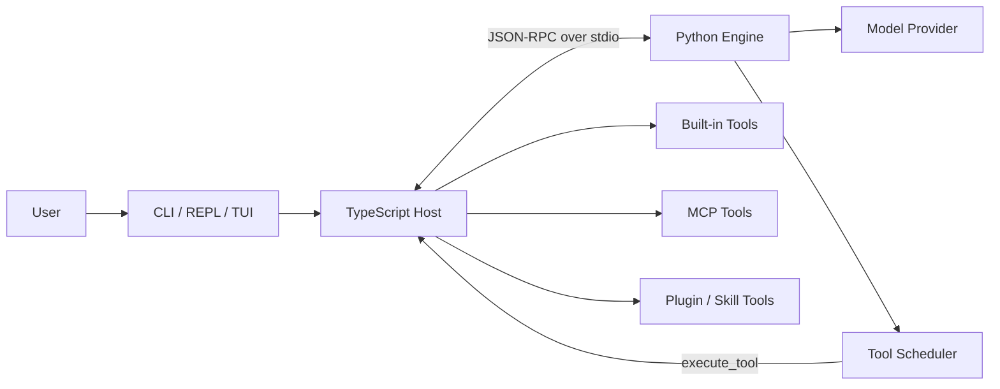

# GOD-code

[](LICENSE)


> 一个可运行、可测试、可扩展的 TypeScript + Python AI Coding Agent 架构骨架。

GOD-code 将命令行宿主、推理引擎、模型 Provider、工具执行和扩展运行时拆分为清晰的模块，用于学习、验证和二次开发 AI Coding Agent。

默认配置使用 deterministic `fake` model，不需要 API key，也不会访问真实模型服务。真实 Provider、MCP Server 和 Plugin 只有在用户显式配置后才会启用。

> [!IMPORTANT]
> GOD-code 当前是实验性项目，不是生产级 AI IDE。启用真实 Provider、MCP 或 Plugin 前，请先阅读 [`SECURITY.md`](SECURITY.md)。

## 目录

- [核心特性](#核心特性)
- [架构概览](#架构概览)
- [项目状态](#项目状态)
- [快速开始](#快速开始)
- [基本用法](#基本用法)
- [配置与扩展](#配置与扩展)
- [项目结构](#项目结构)
- [开发与测试](#开发与测试)
- [文档](#文档)
- [参与贡献](#参与贡献)
- [安全](#安全)
- [许可证](#许可证)

## 核心特性

- **Host / Engine 分层**：TypeScript Host 负责宿主能力，Python Engine 负责 session、turn loop、prompt 和模型调度。
- **统一工具边界**：内置工具、MCP 工具和 Plugin 工具统一进入 Host Tool Registry。
- **宿主侧安全控制**：工具执行经过 permission、path policy、command denylist、audit 和 cancel propagation。
- **默认离线可复现**：内置 deterministic `fake` model，测试和 smoke 不依赖外部网络。
- **可扩展 Provider**：包含 OpenAI-compatible、Responses、Anthropic Messages 和本地 OpenAI-compatible Provider 基础实现。
- **MCP / Plugin / Skill**：支持显式配置的 MCP transport、本地 Plugin Registry 和 `node-subprocess` Plugin Runtime 基础路径。
- **会话与诊断**：提供 transcript、session history、REPL、TUI、doctor 和结构化 JSON 输出。
- **完整验证入口**：统一执行 Python 测试、TypeScript 检查、构建、集成测试和 CLI smoke。

## 架构概览



核心原则：

1. Python Engine 不直接读写宿主文件系统，也不直接运行 shell。
2. 文件、命令、MCP 和 Plugin 工具只在 TypeScript Host 中执行。
3. Provider 细节保留在 Python `providers/` 层，不进入 `TurnEngine` 主循环。
4. TypeScript Host 与 Python Engine 通过稳定的 JSON-RPC wire contract 通信。

更完整的调用链见 [`ARCHITECTURE.md`](ARCHITECTURE.md)。

## 项目状态

| 模块 | 状态 |
| --- | --- |
| CLI、REPL、TUI | 已有可运行基础实现 |
| Python Engine / turn loop | 已实现 |
| JSON-RPC over stdio | 已实现双向 request / notification |
| Built-in tools | `Read`、`Edit`、`Bash`、`ListFiles`、`Search`、`Write` |
| Permission / audit / cancel | 已实现基础策略和生命周期处理 |
| Fake model | 默认启用，可离线测试 |
| Real Provider | 已有多种 Provider 基础实现，需要显式配置 |
| MCP | 支持 stdio、Streamable HTTP 和 legacy SSE 基础路径 |
| Plugin / Skill | 支持本地 manifest、registry 和 subprocess runtime 基础路径 |
| Session history | 支持 transcript、replay、resume、search、archive 和 diagnostics |
| npm 发布 | 暂不发布，`ts-host/package.json` 保留 `"private": true` |

当前已知限制：

- 不提供生产级 SLA、长期维护分支或自动升级保证。
- 不提供账户 billing、价格表、持久 spend ledger 或跨进程 Provider quota。
- 不提供 MCP OAuth/token refresh 或跨命令后台 daemon。
- 不提供远程 Plugin Marketplace、下载安装脚本或系统级 sandbox。
- 不支持同一 session 内多个 active turn 并发。

详细边界和后续方向见 [`PROJECT_PLAN.md`](PROJECT_PLAN.md) 与 [`EXTENSION_POINTS.md`](EXTENSION_POINTS.md)。

## 快速开始

### 环境要求

- Node.js 18.19+
- npm
- Python 3.12+
- Bash 或兼容的 POSIX shell

### 获取源码

```bash
git clone https://github.com/1ceS1amese/GOD-code.git
cd GOD-code
```

### 安装并构建

```bash
cd ts-host
npm ci
npm run build
cd ..
```

Python 测试脚本会在需要时自动创建仓库内的 `.venv-test`。

### 运行 smoke

```bash
./tools/run-cli-smoke.sh
```

成功时最后会输出：

```text
CLI smoke ok
```

## 基本用法

构建完成后，从仓库根目录执行：

```bash
# 环境和配置诊断
node ts-host/dist/cli/main.js doctor
node ts-host/dist/cli/main.js doctor --json

# 查看工具
node ts-host/dist/cli/main.js tools list
node ts-host/dist/cli/main.js tools inspect Read --json

# 使用默认 fake model 发起 turn
node ts-host/dist/cli/main.js run "read README.md"
node ts-host/dist/cli/main.js run --json "bash printf ok"

# 交互入口
node ts-host/dist/cli/main.js repl
node ts-host/dist/cli/main.js tui

# Session history
node ts-host/dist/cli/main.js sessions list
node ts-host/dist/cli/main.js sessions search bash --json
```

### Fake model prompt

默认 `fake` model 只识别固定格式，适合离线验证执行链：

| Prompt | 作用 |
| --- | --- |
| `read <path>` | 读取 UTF-8 文本文件 |
| `edit <path> ::: <find> ::: <replace>` | 替换一次文本 |
| `bash <command>` | 执行 shell 命令 |
| `list <path>` | 列出目录 |
| `search <path> ::: <pattern>` | 搜索普通字符串 |
| `write <path> ::: <content>` | 创建文件，默认不覆盖现有文件 |

示例：

```bash
node ts-host/dist/cli/main.js run "list ."
node ts-host/dist/cli/main.js run "search README.md ::: GOD-code"
node ts-host/dist/cli/main.js run "write fixture.txt ::: hello"
```

## 配置与扩展

所有外部能力默认关闭，必须显式配置。

| 能力 | 配置与示例 | 诊断命令 |
| --- | --- | --- |
| Provider | [`examples/config/provider.env.example`](examples/config/provider.env.example) | `provider inspect-config --json` |
| MCP | [`examples/config/mcp-stdio-servers.json`](examples/config/mcp-stdio-servers.json) | `mcp inspect-config --json` |
| Plugin / Skill | [`examples/plugins/`](examples/plugins/) | `plugins list --json` |
| Transcript | [`examples/config/transcript.env.example`](examples/config/transcript.env.example) | `sessions list --json` |
| Audit | [`examples/config/audit.env.example`](examples/config/audit.env.example) | `audit inspect-config --json` |

诊断命令的完整调用形式：

```bash
node ts-host/dist/cli/main.js provider inspect-config --json
node ts-host/dist/cli/main.js provider contract-test --json
node ts-host/dist/cli/main.js mcp inspect-config --json
node ts-host/dist/cli/main.js plugins list --json
node ts-host/dist/cli/main.js audit inspect-config --json
```

扩展 Provider、工具、MCP 或 Plugin 前，请阅读 [`EXTENSION_POINTS.md`](EXTENSION_POINTS.md)。

## 项目结构

```text
GOD-code/
├── ts-host/          # CLI、JSON-RPC、工具执行、权限、MCP、Plugin
├── py-engine/        # Session、turn engine、prompt、Provider、transcript
├── protocol/         # Wire contract、examples、fixtures、goldens
├── integration/      # CLI 和跨语言集成测试
├── examples/         # Provider、MCP、Plugin、transcript、audit 示例
├── tools/            # 构建、测试、smoke 和清理脚本
├── design/           # 分阶段设计与实现记录
├── ARCHITECTURE.md
├── EXTENSION_POINTS.md
├── INTERNAL_DESIGN.md
└── PROJECT_PLAN.md
```

## 开发与测试

### 完整门禁

```bash
./tools/check.sh
```

该命令依次执行：

1. Python tests
2. TypeScript typecheck 和 Vitest
3. TypeScript build
4. Integration tests
5. CLI smoke

默认测试路径使用 `fake` model 和离线 fixtures，不需要真实 API key。

### 分项检查

```bash
./tools/run-python-tests.sh
./tools/run-ts-tests.sh
cd ts-host && npm run build && cd ..
./tools/run-integration-tests.sh
./tools/run-cli-smoke.sh
```

### 清理本地产物

清理构建输出和测试缓存：

```bash
./tools/clean.sh
```

同时清理 `node_modules`、Python 虚拟环境和 `.god-code` runtime state：

```bash
./tools/clean.sh --all
```

执行 `--all` 后，需要重新运行 `cd ts-host && npm ci`；Python 测试环境会在下次执行测试脚本时自动重建。

## 文档

| 文档 | 内容 |
| --- | --- |
| [`ARCHITECTURE.md`](ARCHITECTURE.md) | 模块、进程和调用链 |
| [`INTERNAL_DESIGN.md`](INTERNAL_DESIGN.md) | 内部设计与维护边界 |
| [`EXTENSION_POINTS.md`](EXTENSION_POINTS.md) | Provider、Tool、MCP、Plugin 扩展方式 |
| [`PROJECT_PLAN.md`](PROJECT_PLAN.md) | 当前状态和后续路线 |
| [`protocol/README.md`](protocol/README.md) | JSON-RPC wire contract |
| [`design/`](design/) | Phase 设计与实现记录 |
| [`CHANGELOG.md`](CHANGELOG.md) | 用户可见变更 |
| [`RELEASE.md`](RELEASE.md) | 版本与发布流程 |

Phase601 后的完整 lifecycle 验收记录见 [`design/FINAL_RELEASE_AUDIT_AFTER_PHASE_601.md`](design/FINAL_RELEASE_AUDIT_AFTER_PHASE_601.md)。

## 参与贡献

欢迎提交 Issue 和 Pull Request。开始前请阅读：

- [`CONTRIBUTING.md`](CONTRIBUTING.md)
- [`CODE_OF_CONDUCT.md`](CODE_OF_CONDUCT.md)
- [`SUPPORT.md`](SUPPORT.md)
- [`GOVERNANCE.md`](GOVERNANCE.md)

提交贡献即表示你有权提交相关内容，并同意该贡献按照项目的 MIT License 发布。

## 安全

安全漏洞不要提交到公开 Issue，也不要公开真实 API key、token、私有路径或敏感日志。请按照 [`SECURITY.md`](SECURITY.md) 使用 GitHub Private Vulnerability Reporting 或 Security Advisory。

## 许可证

GOD-code 使用 [MIT License](LICENSE)。

Copyright (c) 2026 GOD-code contributors.
