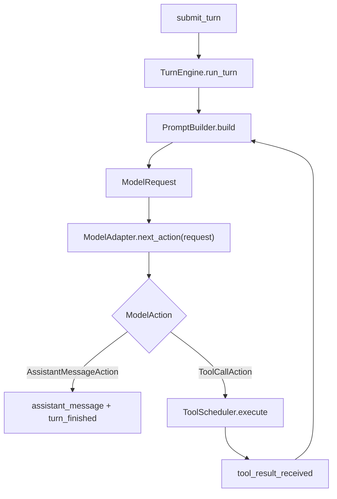
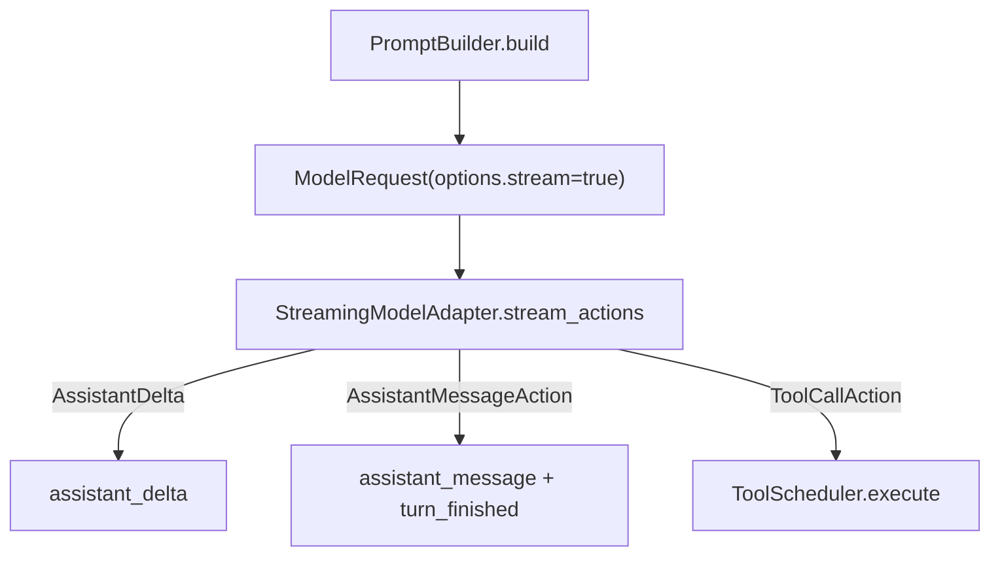

# Phase 2：模型边界运行骨架

这份文档说明 Phase 2 现在已经落下来的代码骨架。

一句话说：

> `TurnEngine` 不再直接把裸 `messages` 丢给模型，而是先通过 `PromptBuilder` 组装成 `ModelRequest`，再交给 `ModelAdapter`。

当前仍然不接真实 Anthropic / OpenAI / 本地模型 SDK。默认跑的还是 deterministic `FakeModelAdapter`。

---

## 1. 目标

Phase 2 解决的是“模型边界放在哪里”：

- 引擎给模型的输入统一成 `ModelRequest`
- 模型输出统一成 `AssistantMessageAction` 或 `ToolCallAction`
- streaming 用 `assistant_delta` 进入事件流
- prompt / context / compaction 有独立入口
- provider 原始响应先走 normalizer，再进入 turn loop

核心原则没有变：

- `TurnEngine` 只管回合状态机
- provider SDK 细节不能进入 `TurnEngine`
- 工具执行仍然只在 TS Host
- Python Engine 只决定下一步 action

---

## 2. 当前已实现

### 2.1 `ModelRequest`

已经在 Python 侧实现：

```python
@dataclass(slots=True)
class ModelOptions:
    stream: bool = False
    max_tokens: int | None = None
    temperature: float | None = None
    provider: str | None = None
```

```python
@dataclass(slots=True)
class ModelRequest:
    messages: Messages
    tools: list[ToolCatalogEntry]
    options: ModelOptions
```

用途：

- `messages`：当前 session 历史
- `tools`：当前 session 的工具目录
- `options`：回合级模型选项

### 2.2 `ModelAdapter`

模型接口已经从旧的：

```python
def next_action(self, messages: Messages) -> ModelAction
```

改成新的：

```python
def next_action(self, request: ModelRequest) -> ModelAction
```

返回值仍然只有两类：

- `AssistantMessageAction`
- `ToolCallAction`

这样 `TurnEngine` 不需要知道模型后面到底接的是什么 provider。

### 2.3 `StreamingModelAdapter`

streaming 接口已经预留并接入 fake model：

```python
class StreamingModelAdapter(ModelAdapter):
    def stream_actions(self, request: ModelRequest) -> Iterator[ModelStreamEvent]:
        raise NotImplementedError
```

`ModelStreamEvent` 当前包含：

- `AssistantDelta`
- `AssistantMessageAction`
- `ToolCallAction`

当前 fake streaming 的规则很简单：

- tool call 不拆流，直接返回 `ToolCallAction`
- final assistant message 会先发一条 `AssistantDelta`
- 最后仍然返回完整 `AssistantMessageAction`

### 2.4 `PromptBuilder`

已经新增 prompt 构造层：

```text
TurnEngine
  -> PromptBuilder
  -> ModelRequest
  -> ModelAdapter
```

当前 `PromptBuilder` 做的事情很轻：

- 复制当前 session messages
- 带上当前 tool catalog
- 解析 `turn_options`
- 调用 compaction strategy

默认不注入复杂 system prompt，也不改写用户内容。

### 2.5 `CompactionStrategy`

已经新增 compaction 接口：

```python
class CompactionStrategy:
    def compact(self, messages: Messages, options: ModelOptions) -> Messages:
        raise NotImplementedError
```

当前默认实现是：

```python
class NoopCompactionStrategy(CompactionStrategy):
    def compact(self, messages: Messages, options: ModelOptions) -> Messages:
        return messages
```

也就是说：入口已经有了，但现在不做真实压缩。

### 2.6 Provider normalizer

已经新增 provider 扩展层：

```python
class ProviderModelAdapter(ModelAdapter):
    provider_name = "base-provider"
```

```python
class ProviderResponseNormalizer:
    def normalize(self, raw: JsonMapping) -> ModelAction:
        raise NotImplementedError
```

当前提供的是 `SimpleProviderResponseNormalizer`，只用于结构测试：

- `{"kind": "assistant", "content": "..."}`
- `{"kind": "tool_call", ...}`

不支持真实 provider SDK。

---

## 3. 当前调用链

非 streaming：



streaming：



如果 `stream=true`，但 adapter 不是 `StreamingModelAdapter`，engine 会自动回退到同步 `next_action(request)`。

---

## 4. 当前不做什么

这些能力只保留接口，不在 Phase 2 展开：

- Anthropic / OpenAI / 本地模型 SDK
- API key 管理
- 真实 HTTP 请求
- CLI 流式渲染
- token 精确预算
- 真实 context compaction
- provider retry / fallback
- 多模型路由
- MCP transport

---

## 5. turn options

当前开始识别这些字段：

```json
{
  "stream": true,
  "max_tokens": null,
  "temperature": null,
  "provider": null
}
```

当前实际参与运行的是：

- `stream`

其他字段会进入 `ModelOptions`，但还没有真实 provider 消费。

---

## 6. 测试覆盖

当前测试覆盖：

- `FakeModelAdapter` 使用 `ModelRequest`
- `FakeModelAdapter` 六类 deterministic prompt 行为不变
- fake streaming 会产出 `AssistantDelta`
- `PromptBuilder` 能组装 `ModelRequest`
- `NoopCompactionStrategy` 默认不改 messages
- `SimpleProviderResponseNormalizer` 能规整 assistant / tool call payload
- `TurnEngine` 非 streaming 事件序列不变
- `TurnEngine` streaming 路径会发 `assistant_delta`
- Phase 1 的权限、审计、取消、工具执行测试继续保留

---

## 7. 后续实现建议

下一步如果要接真实模型，建议按这个顺序：

1. 做一个真实 provider wrapper，但不要让 SDK 进入 `TurnEngine`
2. 扩展 `ProviderResponseNormalizer`
3. 把 provider adapter 挂到 session 创建阶段
4. 再做 CLI 的 `assistant_delta` 流式渲染
5. 最后再做 token budget、compaction、retry / fallback

这样每一步都能单独测试，不会把模型、工具、权限、UI 混在一起。
